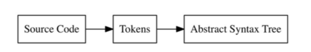
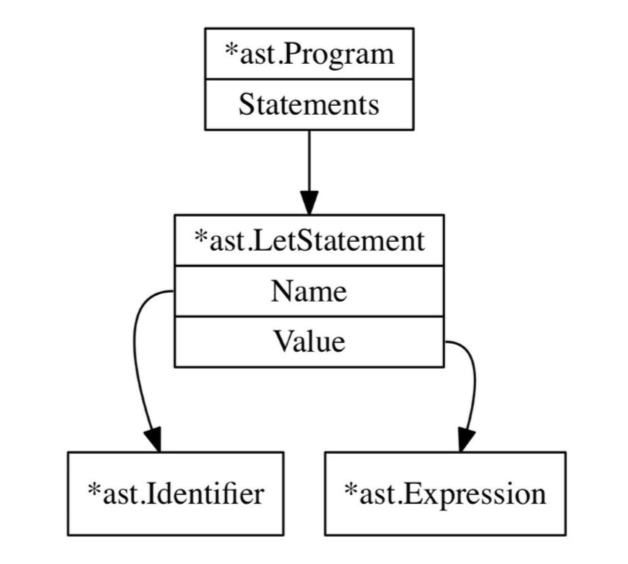
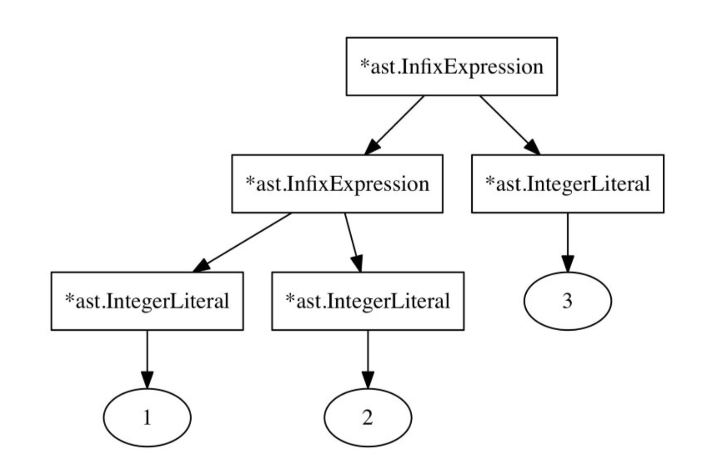
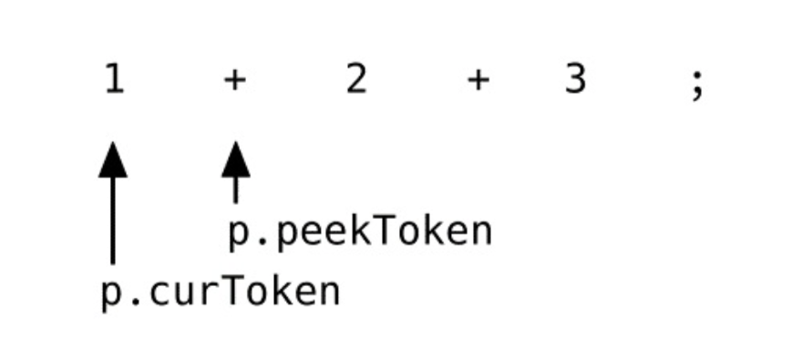
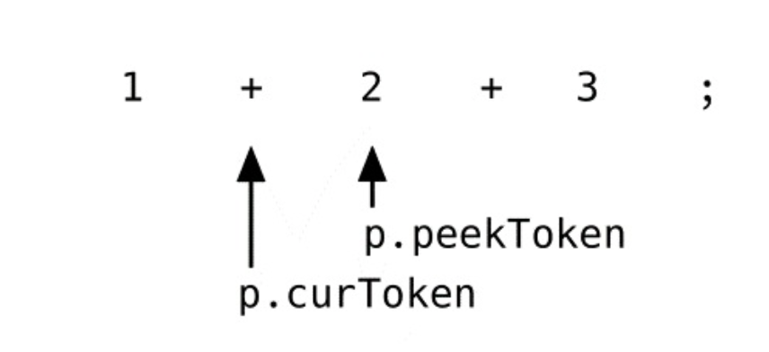
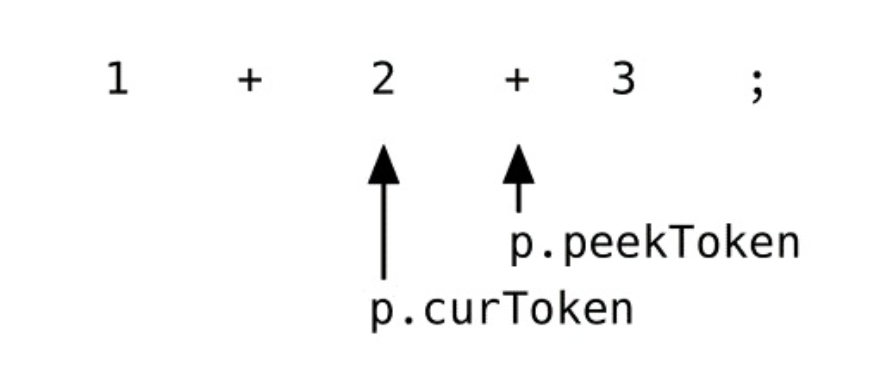
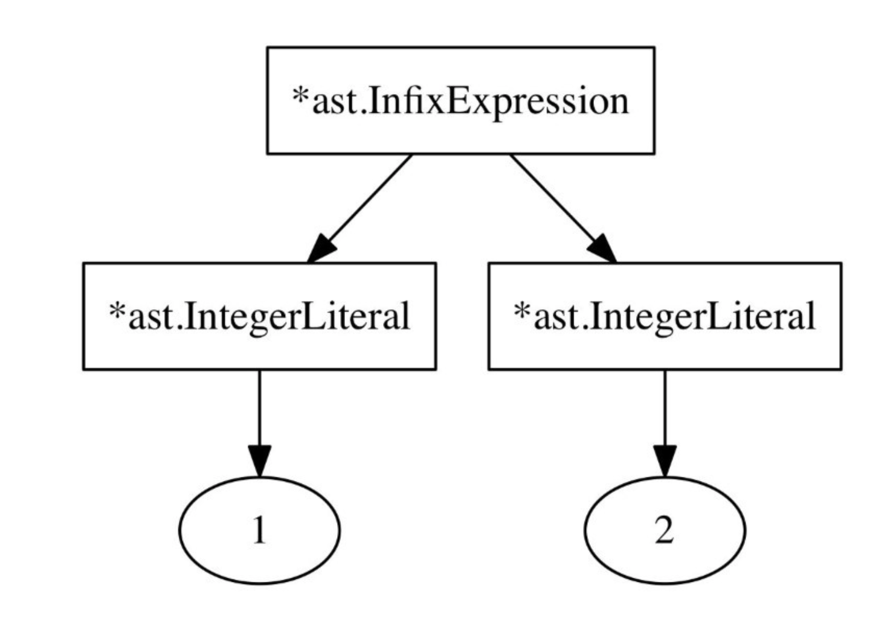
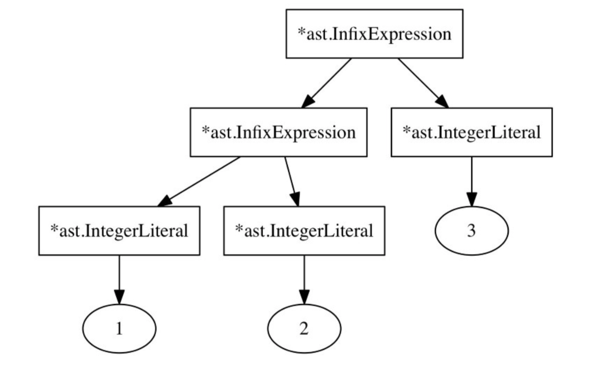
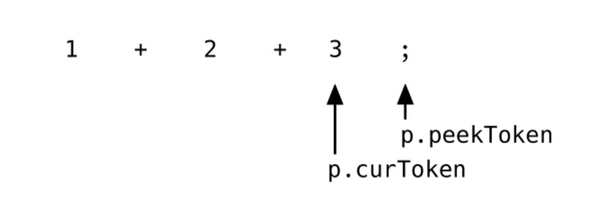

# 用 Go 语言实现解释器

翻译人员

- [gaufung](https://github.com/gaufung)

- [Jehu Lu](https://github.com/lwhile)

目录

- [1 前言](#ch01-introduction)
    - [1.1 Monkey 编程语言和解释器](#ch01-the-monkey-programming-language-and-interpreter)
    - [1.2 为什么使用 Go 语言](#ch01-why-go)
    - [1.3 如何使用这本书](#ch01-how-to-use-this-book)
- [2 词法分析器](#ch02-lexing)
    - [2.1 词法分析](#ch02-lexical-analysis)
    - [2.2 定义Token](#ch02-defining-our-tokens)
    - [2.3 词法分析器](#ch02-the-lexer)
    - [2.4 拓展Token集和词法分析器](#ch02-extending-our-token-set-and-lexer)
    - [2.5 REPL编写](#ch02-start-of-a-repl)
- [3 语法解析](#ch03-parsing)
    - [3.1 语法解析器](#ch03-parsers)
    - [3.2 为何不采用语法生成器](#ch03-why-not-a-parser-generator)
    - [3.3 为Monkey编程语言编写语法解析器](#ch04-writing-a-parser-for-the-monkey-programming-language)
    - [3.4 解析Let语言](#ch03-parsing-let-statement)
    - [3.5 解析Return语句](#ch03-parsing-retrun-statement)
    - [3.6 解析表达式](#ch03-parsing-expression)
    - [3.7 Pratt解析法如何工作](#ch03-how-pratt-parsing-works)
    - [3.8 拓展解析器](#ch03-extending-the-parser)
    - [3.9 REPL](#ch03-read-parse-print-loop)
- [4 执行](#ch04-evaluation)
    - [4.1 符号赋值](#ch04-giving-meaning-to-symbols)
    - [4.2 计算策略](#ch04-strategies-of-evaluation)
    - [4.3 树遍历计算](#ch04-a-tree-walking-interpreter)
    - [4.4 表达对象](#ch04-representing-objects)
    - [4.5 表达式计算](#ch04-evaluaiton-expression)
    - [4.6 条件语句](#ch04-conditionals)
    - [4.7 返回语句](#ch04-return-statement)
    - [4.8 错误处理](#ch04-error-handling)
    - [4.9 绑定和环境](#ch04-binding-and-environment)
    - [4.10 函数和函数调用](#ch04-function-and-function-call)
    - [4.11 垃圾回收](#ch04-trash-out)
- [5 拓展解释器](#ch05-extending-the-interpreter)
    - [5.1 数据类型和函数](#ch05-data-type-and-functions)
    - [5.2 字符串](#ch05-strings)
    - [5.3 内置函数](#ch05-built-in-functions)
    - [5.4 数组](#ch05-array)
    - [5.5 哈希表](#ch05-hashes)
    - [5.6 完结](#ch05-the-grand-finale)
- [6 资源](#ch06-resources)

<h2 id="ch01-introduction">1 前言</h2>

> 解释器是令人着迷的

虽然每个人对上面的观点都有自己的看法，但是我始终认为这是正确的，接下来我将一步步告诉你其中的原因。

表面上来看，解释器非常简单：输入内容，然后得到结果。它就是一个程序，读入其他程序代码，然后生成对应的东西。但是如果你越考虑这个问题，你就觉得它更加迷人。看上去随机组成的字符，包括字符、数字或者其他特殊意义的符号输入到解释器后就变得有意义了。计算机本质上是只能理解 `0` 和 `1` 的机器，但是却能理解我们输入给他的字符并转换成相关的指令，这些都是解释器在读取过程中完成的*翻译*。

我曾经不停地问我自己：解释器到底是如何工作的？最近我才知道只有我自己写一个解释器才能真正明白其中的答案，所以开始着手这件事情。

关于解释器有很多书、文章、博客或者教程，它们大多数划分到下面两种风格中：一种是涉及的主题非常宏大，充斥着理论知识，面向是专业的学术研究者；另一种却是非常简短，仅仅提供简单的基础介绍，将其中很多功能借助外部工具当做黑盒子使用。

这次我想与众不同，我确实想知道解释器细节包括词法解释器和语法解释器如何工作，尤其类 `C` 语言这样有花括号和分号的编程语言。开始的时候我不知道如何下手，需要从那些学术书籍中找到答案，当然从充斥着冗长、理论化的解释和数学符号内容中很难找到我想要答案。

我想要的是一个介于 900 页关于编译器的书和用 `ruby` 50行代码编写的 `Lisp` 解释器的博文之间的内容。我想这本书是为喜欢一探究竟的人亦或者是喜欢知道一切如何工作的人准备的，当然也包括我。

在这本书中，我将从零开始编写一门语言的解释器，而不借助任何第三方工具或者库。这门语言不会在生产实际中使用，也不会过多关注性能上的工作。虽然这个解释器支持的编程语言会或多或少有些功能上缺失，但是我们会从中学到很多。

由于解释器种类繁多而且并没有很大的共性，所以用通用的语句很难去描述解释器。笼统的来讲就是它阅读源代码并且读取它，生成一系列可继续操作的结果。与此同时编译器就恰恰相反，它读取源代码并且生成背后机器理解的代码。

有些解释器非常短小简单，甚至没有包含解析的步骤，仅仅是立马解析输入内容，比如 `Brainfuck` 语言。

在其他精心涉及的解释器中，包含了大量优化。使用先进的解析和计算技术。其中还有一些不计算输入，而且将其编译成字节码的中间码，然后计算这些中间码。还有更先进的是 `JIT` 解释器，它将输入内容编译成本地机器码，最后执行。

还有一种解释器是解析源代码，然后构建一棵抽象语法树(`AST, Abstract Syntax Tree`)，解释器开始计算这棵树，这叫做 `Tree-Walking` 解释器，因为解释的流程好像在这棵树上行走。

本书我们将会构建一个类 `Tree-Walking` 的解释器。除此之外，我们还会构建词法解析器、语法解析器、树表达式和最后的计算器。我们会看到什么是 `token`，什么是抽象语法树、如何去构建这棵树，如何去计算这个树以及如果拓展我们的语言和实现一些内置函数。

<h3 id="ch01-the-monkey-programming-language-and-interpreter">1.1 Monkey 编程语言和解释器</h3>

每一个解释器都是为特定的编程语言设计的，如果没有编译器或者解释器，任何一种编程语言仅仅是一些特定符号组合而已。

我们为设计的编程语言起名叫 `Monkey`, 它包含的语言特性如下：

- `C` 语言类似语法
- 变量绑定
- 整型和布尔型
- 算术表达式
- 内置函数
- 高阶函数
- 闭包
- 字符串类型
- 数组
- 哈希字典

接下来这本书我们将一步步实现上述功能，首先我们先看看 `Monkey` 语言是什么样子。

在 `Monkey` 中，我们可以将值绑定到变量上：

```monkey
let age = 1;
let name = "Monkey";
let result = 10 * (20 /2);
```

除了整型、布尔型和字符串类型，我们的 `Monkey` 语言同样也支持数组和哈希字典，下面看看是如何使用它们：

```monkey
let myArray = [1, 2, 3, 4, 5];
let thorsten = {"name": "Thorsten", "age": 28};
```

可以使用索引和哈希字典中的键访问各自的元素

```monkey
myArray[0]  // => 1
thorsten["name"] // => "Thorsten"
```

`let` 语句可将函数绑定到变量上，下面的例子是将加法函数绑定到变量上

```monkey
let add = fn(a, b) { return a + b; }
```

`Moneky` 还支持不仅仅支持 `return` 语句，还支持隐式返回值，也就是说我们可以不使用 `return` 直接返回。

```monkey
let add = fn(a, b) { a + b; }
```

调用函数函数也非常简单

```monkey
add(1, 2); // => 3
```

接下来展示更复杂函数的例子，比如 `fibonacci` 函数可以返回第 `N` 个斐波那契数。

```monkey
let fibonacci = fn(x){
    if (x == 0) {
        0
    } else {
        if (x == 1) {
            1
        } else {
            fibonacci(x - 1) + fibonacci(x - 2);
        }
    }
};
```

可以看到我们是递归调用 `fibonacci` 函数。

`Monkey` 还支持一种特殊类型函数，叫高阶函数，这写函数能够使用其他函数为参数，下面就是例子

```monkey
let twice = fn(f, x) {
    return f(f(x))
};
let addTwo = fn(x) {
    return x + 2
};
twice(addTwo, 2); // => 6
```

在这里 `twice` 函数接受两个参数：一个叫做 `addTwo` 的函数，另一个是整数 `2`。它调用 `addTwo` 函数两次，第一次用 `2` 作为参数，第二次用第一次调用的返回值作为参数，最终的结果为 `6`。

所以，在 `Monkey` 中可以将函数作为函数调用的参数，函数在 `Monkey` 中也就是值，跟整数和字符串一样，这种功能叫做函数是一等公民。

本书我们将完成的解释器会实现上述的全部功能，在 `REPL` 中，它首先读取源代码中的 `token`，然后解析它，构建出一棵内部表达抽象语法树，最后计算这棵树，它拥有以下主要成分：

- 词法解析器
- 语法解析器
- 抽象语法树
- 内部计算对象
- 执行器

我们会从上到下按照这个顺序完成各个部分，按照源代码到最终结果输出的流程，这个方法的缺点就是我们不能在第一章结束的时候完成一个 `Hello World`，但是我们能够理解上述的成分是如何相互配合工作的，数据流是如何流动的。

<h3 id="ch01-why-go">1.2 为什么使用 Go 语言</h3>

不知道你有没有注意到标题中的 `Go`，第一层意思就是我们开始行动起来编写解释器；另一层意思就是我们会使用 `Go` 语言编写解析器。那么为什么我们使用 `Go` 语言呢？

我喜欢用 `Go` 语言写代码，喜欢这门语言和它提供的标准库以及工具，另一层考虑就是 `Go` 拥有一些特性对编写解释器非常有帮助。

`Go` 代码非常容易阅读和理解，你不需要完全理解本书中使用的 `Go` 语言代码。我打赌你肯定能够理解这本书中的代码，哪怕你从来没有写过一行 `Go` 语言代码。

`Go` 语言提供的工具也是非常棒，在本书中我们重点关注解释器背后的想法和概念。通过 `Go` 语言提供的格式化命令 `gofmt` 和内置的单元测试框架，我们可以专注于我么我们的解释器，不用关心第三方库、工具和依赖。在本书中我们不会使用其他任何工具，仅仅使用 `Go` 语言提供的功能。

我还认为更重要的本书提供的 `Go` 语言代码与那些更底层的代码非常类似，比如`C`, `C++` 和 `Rust`。本书不会涉及任何元编程等相关技巧，虽然这样做的话可以走一些捷径，但是一段时间后只有上帝才能看得懂代码了，而且也没有使用面向对象设计和使用设计模式。

上述的所有的原因都是能够让你更好的理解（概念上和技术层面上）代码和重复使用它们。如果你在读完本书后，打算用其他原因写自己的解释器，将会是非常容易上手。通过本书，我想给你提供一个理解和构造解释的起点。

<h3 id="ch01-how-to-use-this-book">1.3 如何使用这本书</h3>

这本书不是一本参考手册，也不是关于描述实现解释器相关概念的论文集合。使用这本书从头到尾，按照我编写的推荐的顺序阅读，同时输入和修改提供的代码。

每一个章节都是建立在先前的章节之上，主要包含代码和内容。在每一个章节我们一点点构建我们的解释器，为了方便阅读理解。本书提供了一个 `code` 文件，包含了全书的代码。

[https://interpreterbook.com/waiig_cod_1.1.zip](https://interpreterbook.com/waiig_cod_1.1.zip)

`code` 文本有几个子文件构成，每一个章节为一个文件夹，里面是相应章节的内容。

那你现在需要准备哪些工作呢？不多，一个文本编辑器和 `Go` 语言编译器。任何大于 `1.0` 的 `Go` 语言版本即可。

让我们开始吧！

<h2 id="ch02-lexing">2 词法分析器</h2>

<h3 id="ch02-lexical-analysis">2.1 词法分析</h3>

为了让 `Monkey` 源码能够工作，我们需要源码转换为另一种形式，在执行之前，我们会将源代码转换为两次。



首先要做的是将源代码转换为 `token`，这个过程叫做词法分析，它是由词法分析器完成的。

`token` 是非常小、分门别类的数据结构，在第二步过程中将这些 `token` 转换为抽象语法树。

下面是简单的例子，它是词法解析器的输入：

```monkey
"let x = 5 + 5;"
```

那么从词法解析器中的输出是

```monkey
[
    LET,
    IDENTIIER("x"),
    EQUAL_SIGN,
    INTEGER(5),
    PLUS_SIGN,
    INTEGER(5),
    SEMICOLON
]
```

这里的每一个 `token` 对应着源码一部分，`"let"` 对应 `LET`, `"+"` 对应 `PLUS_SIGN` 等等如此。`IDENTIIER` 对于这 `"x"` 而 `IDENTIIER` 对应具体 `5` 而不是 `"5"`，具体的 `token` 构成有着不同的实现。

还有一点要注意的是，空白符都会被忽略，因为在 `Monkey` 语言中空白符是没有意义的。比如下面的输入时没有问题的：

```monkey
let x = 5;
```

亦或者这么输入

```mokey
let x  =   5;
```

在其他语言，比如 `Python`，空白符是由意义的，这也就意味着词法解析器不能吃掉他们，包括换行符。词法解析器也不能将其当做 `token` 输出。

一个好的词法解析器的每个 `token` 也需要包含行号，列号和文件名，为什么要这么做呢？举个例子来讲，后面解析的过程中如果出现错误，可以输出相应的信息，而不是仅仅输出 `"error: expected semicolon token"`，而是这样输出：

```monkey
"error: expected semicolon token. line 42, coloumn 23, program.monkey"
```

但是我们不打算这样做，并不是实现起来困难，而是会导致我们的 `token` 和词法解析器变得复杂起来，更加难以理解。

<h3 id="ch02-defining-our-tokens">2.2 定义 Token</h3>

为了后序编写解析器的需要，我们需要拓展我们的词法解析器以便识别出 `Monkey` 语言中更多的 `token`。所以本小节我们将支持 `==`，`!`，`!=`，`/`，`*`，`<`，`>` 以及关键字 `true`， `false`，`if`，`else` 和 `return`。

需要新增的 `token` 可以分为下面三种

- 单个字符的 `token`，比如 `-`；
- 两个字符的 `token`，比如 `==`；
- 关键词，比如 `return`。

我们已经知道如何处理单个字符和关键词 `token`，所以我们首先要处理这些，然后拓展的解析器来支持两个字符的 `token`。

增加支持 `-`， `/`，`*`，`<` 和 `>` 非常普通， 首先要做的是修改之前 `lexer/lexer_test.go` 中的测试用例，以便包含这些字符。

```go
// lexer/lexer_test.go
func TestNextToken(t *testing.T) {
input := `let five = 5;
let ten = 10;
let add = fn(x, y) { x + y;
};
let result = add(five, ten); !-/*5;
5 < 10 > 5;
`
// [...]
}
```

看上去像是 `Monkey` 语言的代码片段，但是其中有些行是没有意义的，比如 `!-/*5`。词法解析器不关心这些代码是否有意义，这些下一个阶段的工作，词法解析仅仅需要转换为 `token` 就可以了，所以我们的测试用例尽量包含所有的 `token`，而且包含一些错误、边界用例、换行处理和多个数字处理等等。

运行测试得到一些未定义的错误，因为测试包含了一些未定义的 `tokenTypes`。为了修正它们，我们需要在 `token/token.go` 中增加更多的常量：

```go
// token/token.go
const (
// [...]
// Operators
    ASSIGN = "="
    PLUS  = "+"
    MINUS = "-"
    BANG = "!"
    ASTERISK = "*"
    SLASH = "/"

    LT = "<"
    GT = ">"
//[...]
)
```

目前测试还是失败的，因为我们并没有返回期望的 `TokenTypes`。所以我们拓展我们的 `switch` 语句中 `NextToken()` 方法：

```go
// lexer/lexer.go
func (l *Lexer) NextToken() token.Token {
// [...]
    switch l.ch {
    case '=':
        tok = newToken(token.ASSIGN, l.ch)
    case '+':
        tok = newToken(token.PLUS, l.ch)
    case '-':
        tok = newToken(token.MINUS, l.ch)
    case '!':
        tok = newToken(token.BANG, l.ch)
    case '/':
        tok = newToken(token.SLASH, l.ch)
    case '*':
        tok = newToken(token.ASTERISK, l.ch)
    case '<':
        tok = newToken(token.LT, l.ch)
    case '>':
        tok = newToken(token.GT, l.ch)
    case ';':
        tok =  newToken(token.SEMICOLON, l.ch)
    case ',':
        tok = newToken(token.COMMA, l.ch)
// [...]
}
```

新增的 `switch` 语句中的 `case` 条件包含了 `token/token.go` 中定义的常量，现在运行测试全部通过。

```shell
$ go test ./lexer
ok monkey/lexer 0.007s
```

现在单个字符的 `token` 已经成功解析，下一步我们增加关键词 `true`，`false`，`if`，`else` 和 `return` 的解析。

再一次我们拓展测试以便包含这些新的关键词，在这里我们的希望在 `TestNextToken` 中 `input` 是这样的：

```go
// lexer/lexer_test.go
func TestNextToken(t *testing.T) {
    input := `let five = 5;
let ten = 10;
let add = fn(x, y) { x + y;
};
let result = add(five, ten); !-/*5;
5 < 10 > 5;
if (5 < 10) { return true;
} else {
return false;
}`
// [...]
}
```

这个测试甚至不能编译，因为测试中期待的类型并没有定义，为了修正它，不仅仅需要增加新的类型，还需要在 `LookupIdent` 查找表增加。

```go
const (
//[...]
    FUNCTION  = "FUNCTION"
    LET       = "LET"
    TRUE      = "TRUE"
    FALSE     = "FALSE"
    IF        = "IF"
    ELSE      = "ELSE"
    RETURN    = "RETURN"
)

// reversed keywords
var keywords = map[string]TokenType{
    "fn":     FUNCTION,
    "let":    LET,
    "true":   TRUE,
    "false":  FALSE,
    "if":     IF,
    "else":   ELSE,
    "return": RETURN,
}
```

现在测试通过

```shell
$ go test ./lexer
ok monkey/lexer 0.007s
```

现在我们开始解析两个字符的 `token`，在 `Monkey` 中增加 `==` 和 `!=` 两种 `token`。

你可能会想：为什么我们不通过仅仅增加 `switch` 语句中的 `case` 条件来达到目的呢？我们现在重用已有的 `case` 分支 `=` 和 `!`，并拓展它们。首先我们现在测试中增加测试用例，看它们是否返回 `=` 和 `==`。

```go
// lexer/lexer_test.go
func TestNextToken(t *testing.T) {
input := `let five = 5;
let ten = 10;
let add = fn(x, y) { x + y;
};
let result = add(five, ten); !-/*5;
5 < 10 > 5;
if (5 < 10) { return true;
} else {
return false;
}
10 == 10; 10 != 9; `
// [...]
}
```

在进入 `NextToken` 方法之前，我们需要增加一个辅助方法 `peekChar()`。

```go
// lexer/lexer.go
func (l *Lexer) peekChar() byte {
    if l.readPosition >= len(l.input) {
        return byte(0)
    } else {
        return l.input[l.readPosition]
    }
}
```

除了不增加 `l.position` 和 `l.readPosition`之外，`peekChar` 和 `readChar` 方法非常像，它仅仅是像前查看一个字符而不是移动它。大部分词法解析器都有类似和解析器都会有类似 `peek` 方法，它仅返回下一个字符，难点在于在源码中需要向前看多少字符才有意义。

现在增加 `TokenType` 常量。

```go
// token/token.go
const (
//[...]
    EQ = "=="
    NOT_EQ = "!="
)
```

即使有了定义的 `token.EQ` 和 `token.NOT_EQ`，我们测试仍然没有通过。当词法解析器遇到 `==` 的时候，它创建两个 `token.ASSIGN` 而不是一个 `token.EQ`。解决方法就是在 `=` 和  `!` 分支中使用刚刚 `peekChar()` 方法，如果下一个字符为 `=`，则返回 `token.EQ` 和 `token.NOT_EQ`。

```go
//lexer/lexer.go
func (l *Lexer) NextToken() token.Token {
    // [...]
    switch l.ch {
    case '=':
        if l.peekChar() == '=' {
            ch := l.ch
            l.readChar()
            tok = token.Token{Type: token.EQ, Literal: string(ch) + string(l.ch)}
        } else {
            tok = newToken(token.ASSIGN, l.ch)
        }
// [...]
    case '!':
        if l.peekChar() == '=' {
            ch := l.ch
            l.readChar()
            tok = token.Token{Type: token.NOT_EQ, Literal: string(ch) + string(l.ch)}
        } else {
            tok = newToken(token.BANG, l.ch)
        }
// [...]
}
```

注意我们在调用 `l.readChar()` 之前，我们将 `l.ch` 保存到局部变量中。这种方式不会丢掉当前的字符而且可以很安全的前进字符，词法解析器也需要更新 `l.position` 和 `l.readPosition`。如果我们需要支持更多两个字符的 `token`，我们需要抽象出方法 `makeTwoCharToken` 来进行分析。

现在测试通过过了

```shell
$ go test ./lexer
ok monkey/lexer 0.006s
```

现在我们的词法解析器能够生成拓展后的 `token` 集，我们要开始准备编写解析器，但是之前，还有一件事要做。

<h3 id="ch02-the-lexer">2.3 词法分析器</h3>

在开始写代码之前，我们先交代一下本小节的目标。我们将要编写自己的词法解析器，它将源代码作为输入，然后输出整个源代码的 `token`。我们遍历整个输入，然后输出每一个 `token`，这里我们不需要缓冲区保存 `token`，我们只有一个方法叫做 `NextToken()` 方法，它每次输出下一个 `token`。

这意味着我们通过源码初始化词法分析器，然后对源码调用 `NextToken()` 函数，一个 `token` 接着一个 `token`，一个字符接着一个字符。它将整个源码视为字符串，这个做能够简化处理的过程。但是在生产实际环境中，会将文件名和行号添加到 `token` 中，因为这样能更好地跟踪解析的过程和错误分析。最好不使用 `io.Reader` 和文件名来初始化词法分析器，它们会增加我们处理的复杂度，所以我们将从最简单的地方开始，只使用字符串并忽略文件名和行号。

目标已经相当名明确，我们的词法分析器能够做什么已经清楚了。我们创建一个新包，并且添加一个可以持续运行的测试，以获得词法分析器工作状态的反馈。我们可以从最小的地方开始，然后随着词法分析的功能完善再不断添加测试用例。

```go
// lexer/lexer_test.go
package lexer

import (
    "testing"
    "monkey/token"
)

func TestNextToken1(t *testing.T) {
    input := `=+(){},;`

    tests := []struct {
        expectedType    token.TokenType
        expectedLiteral string
    }{
        {token.ASSIGN, "="},
        {token.PLUS, "+"},
        {token.LPAREN, "("},
        {token.RPAREN, ")"},
        {token.LBRACE, "{"},
        {token.RBRACE, "}"},
        {token.COMMA, ","},
        {token.SEMICOLON, ";"},
        {token.EOF, ""},
    }
    l := New(input)
    for i, tt := range tests {
        tok := l.NextToken()
        if tok.Type != tt.expectedType {
            t.Fatalf("tests[%d] - tokentype wrong, expected=%q, got=%q", i, tt.expectedType, tok.Type)
        }
        if tok.Literal != tt.expectedLiteral {
            t.Fatalf("tests[%d] - Literal wrong, expected=%q, got=%q", i, tt.expectedLiteral, tok.Literal)
        }
    }
}
```

当然现在的测试肯定是不能通过的，因为我们还有添加任何代码。接下以一个返回 `*Lexer` 的函数 `New()` 开始词法解析器的旅途。

```go
package lexer

type Lexer struct{
    position     int    //current character position
    readPosition int    //next character position
    ch           byte   //current character
    characters   []byte //byte slice of input string
}

func New(input string) *Lexer {
    l := &Lexer{input:input}
    return l
}
```

`Lexer` 结构中的 `position` 和 `readPosition` 两个字段比较特殊，它们都是用作于访问 `input` 中字符的下标，比如 `l.input[l.readPosition]`。使用两个指针的原因是我们进一步查看下一步字符，以便接下里怎么处理。`readPosition` 永远指向 `input` 中下一个字符，而 `position` 指向 `input` 中和 `ch` 关联的的字符。

第一个辅助函数 `readChar()` 可以让接下来几个字段更加容易理解：

```go
// lexer/lexer.go
func (l *Lexer) readChar(){
    if l.readPosition >= len(l.characters) {
        l.ch = byte(0)
    } else {
        l.ch = l.characters[l.readPosition]
    }
    l.position = l.readPosition
    l.readPosition += 1
}
```

`readChar` 方法的功能是读取下一个字符，以及更新我们在 `input` 字符串的位置。首先它检查我们是否到达 `input` 的末尾，这样无法再继续读取任何支付，如果是的话将 `l.ch` 设置为 `0`，对于我们来讲这代表了 `NULL` 字符。如果我们还没有到达输入的结尾，我们将 `l.ch` 设置为下一个字符，然后将 `l.position` 更新到刚刚使用的 `l.readPosition`，并且将 `l.readPosition` 增加 `1`。通过这种方式 `l.readPosition` 永远指向我们将要读取的下一个位置，而 `l.position` 则永远指向我们读过的最后一个位置。

在讨论 `readChar` 的时候，更要说明的是只支持 `ASCII` 码而不是整个 `Unicode` 集合。为什么呢？主要是我想把事情搞得简单点，并且将主要精力放在解释器重点，为了支持 `Unicode` 和 `UTF-8`，我们需要将 `l.ch` 类型从 `byte` 改为 `rune`，因为它们可能包含多个字节，那么 `l.input[l.readPosition]` 也无法再继续工作，接下来也会看到其他的方法和函数也需要作出一些修改，那么 `Monkey` 完整支持 `Unicode` 以及 `Emoji` 作为读者的练习。

`New()` 函数会调用 `readChar` 函数，如此一来在调用 `NextToken()` 之前，我们就已经初始化好 `l.position` 和 `l.readPosition`，`*Lexer` 进入工作状态。

```go:n
func New(input string) *Lexer{
    l := &Lexer{input:input}
    l.readChar()
    return l
}
```

现在我们的测试中 `New(input)` 没有问题，但是 `NextToken()` 方法还没有实现，接下来我们添加第一个版本，

```go
// lexer/lexer.go
func (l *Lexer) NextToken() token.Token{
    //TODO: add more code here
}
```

这是 `NextToken` 方法的基本结构，我们查看当前检查的字符，并根据字符串返回一个 `token`。在返回 `token` 之前需要更新我们的指针在 `input` 中的位置，所以当我们下次调用 `NextToken` 的时候，`l.ch` 已经是最新值。在这 `newToken` 小函数可以帮助我们初始化这些 `token`。

现在我们可以通过刚刚的测试

```shell
$ go test ./lexer
ok monkey/lexer 0.007s
```

接下来我们拓展测试用例

```go
//lexer/lexer_test.go
func TestNextToken1(t *testing.T) {
    input := `=+(){},;`

    tests := []struct {
        expectedType    token.TokenType
        expectedLiteral string
    }{
        {token.ASSIGN, "="},
        {token.PLUS, "+"},
        {token.LPAREN, "("},
        {token.RPAREN, ")"},
        {token.LBRACE, "{"},
        {token.RBRACE, "}"},
        {token.COMMA, ","},
        {token.SEMICOLON, ";"},
        {token.EOF, ""},
    }
    l := New(input)
    for i, tt := range tests {
        tok := l.NextToken()
        if tok.Type != tt.expectedType {
            t.Fatalf("tests[%d] - tokentype wrong, expected=%q, got=%q", i, tt.expectedType, tok.Type)
        }
        if tok.Literal != tt.expectedLiteral {
            t.Fatalf("tests[%d] - Literal wrong, expected=%q, got=%q", i, tt.expectedLiteral, tok.Literal)
        }
    }
}
```

值得注意的是，在这个测试中，`input` 已经发生变化，它看上去像是 `Monkey` 语言的子集。它包含了所有已经转换为 `token` 的符号，但是新增加的内容导致我们的测试失败了，主要包含：标识符、关键字和数字。

我们以标识符和关键字作为我们解析的开始，`lexer` 所需的工作就是识别当前你的字符是否为字母，如果是就需要读取剩下的标识符和关键字，直到遇到一个非标识符或关键字。为了正确解析 `token` 类型，首先要做的事拓展我们的 `switch` 语句。

```go
//lexer/lexer.go
func (l *Lexer) NextToken() token.Token {
    var tok token.Token

    switch l.ch {
    default:
        if isLetter(l.ch) {
            tok.Literal = l.readIdentifier()
            return tok
        } else {
            tok = newToken(token.ILLEGAL, l.ch)
        }
    }
    l.readChar()
    return tok
}

func (l *Lexer) readIdentifier() string {
    position := l.position
    for isIdentifier(l.ch) {
        l.readChar()
    }
    return l.input[position:position]
}

func isLetter(ch byte) bool {
    return 'a' <= ch && ch <= 'z' || 'A' <= ch && ch <= 'Z' || ch == '_'
}
```

我们为 `switch` 语句增加了一个默认分支，因此只要 `l.ch` 是识别出的字符之一，我们可以检查是否为标识符。同样我们可以添加 `token.ILLEGAL` 类型。到目前为止，当我们不知道如何处理当前字符，一律声明为 `token.ILLEGAL`。

辅助函数 `isLetter` 检查字符是否为一个字母。听上去很简单，但是要注意的是这个函数对我们解析器的功能有显著的影响。正如这上面的代码中，我们检查了 `ch == '_'`，意味着我们将 `_` 设置为视为字母，并且允许出现在标识符和关键字中。这也就是说明了 `foo_bar` 也可以作为变量名，其他语言甚至允许 `!` 和 `?` 作为标识符，如果你想增加支持其他字符为标识符，对这个函数做出修改。

`readIdentifier()` 的功能正如名字所描述的，其读取一个标识符并更新词法分析器的读取位置，直到遇到一个非字母的字符。

在 `switch` 语句的默认分支中，使用 `readIndentifer` 读到的是当前 `token` 中的 `Literal` 字段，那么 `Type` 呢？ 目前我们已经读取了像 `let`, `fn` 或者 `foobar`，除了语言的关键字，我们还需要知道用户定义的标识符类型。因此我们需要知道一个函数来判断返回 `token` 的 `TokenType` 字段。

```go
var keywords = map[string]TokenType{
    "fn":     FUNCTION,
    "let":    LET
}

// LookupIdentifier used to determinate whether identifier is keyword nor not
func LookupIdentifier(identifier string) TokenType {
    if tok, ok := keywords[identifier]; ok {
        return tok
    }
    return IDENT
}
```

`LookupIdentifier` 函数检查标识符是否为给定的关键字，如果是，则返回关键字常量 `TokenType`；如果不是，则返回所有默认的标识符 `token.IDENT`。

```go
// lexer/lexer.go
func (l *Lexer) NextToken() token.Token {
    var tok token.Token
    switch l.ch {
    // [...]
    default:
        if isLetter(l.ch) {
            tok.Literal = l.readIdentifier()
            tok.Type = token.LookupIdent(tok.Literal)
            return tok
        } else {
            tok = newToken(token.ILLEGAL, l.ch)
        }
    }
}
```

这里使用 `return tok` 提前结束，因为当调用 `readIdentifier()` 的时候，我们会重复调用 `readChar()` 函数并更新我们的 `readPosition` 和 `position` 字段的值直到最后一个，所以不需要在 `switch` 语句后面调用 `NextToken()` 函数。

还有一点，在 `Monkey` 语言中不需要关注空格，所以需要跳过它们。

```go
// lexer/lexer.go
func (l *Lexer) NextToken() token.Token {
    var tok token.Token
    l.skipWhitespace()
    switch l.ch {
        // [...]
    }
}

func (l *Lexer) skipWhitespace() {
    for l.ch == ' ' || l.ch == '\t' || l.ch == '\n' || l.ch == '\r' {
        l.readChar()
    }
}
```

在很多词法分析器中都能找到这个辅助函数，有的称为 `eatWhitespace`，有的叫做 `consumeWhitespace` 或者其他名字。哪些字符需要跳过取决于被分析的语言。例如在有些语言实现中为为每个换行符创建 `token`，如果它们不在 `token` 流中正确的位置，就会抛出错误。为了接下来步骤简单些，我们暂时跳过换行符的分析。

和之前一样，我们还需要为 `switch` 语句默认的分支中增加更多的功能。

```go
// lexer/lexer.go
func (l *Lexer) NextToken() token.Token() {
    var tok token.Token
    l.skipWhitespace()
    switch l.ch {
    default:
        if isLetter(l.ch) {
            tok.Literal = l.readIdentifier()
            tok.TYpe = token.LookupIdent(tok.Literal)
            return ok
        } else if isDigit(l.ch) {
            tok.Type = token.INT
            tok.Literal = l.readNumber()
        } else {
            tok = newToken(token.ILLEGAL, l.ch)
        }
    }
}

func (l *Lexer) readNumber() string {
    position := l.position
    for isDigit(l.ch) {
        l.readChar()
    }
    return l.input[position:l.position]
}

func isDigit(ch byte) bool {
    return '0' <= ch && ch <= '9'
}
```

这个增加了 `readNumber` 函数，它和 `readIdentifer` 函数一样，只不过使用 `isDigit` 代替 `isLetter` 实现相应的功能。为了表示明确，我们为每一个功能单独设置函数。`isDigit` 函数和 `isLetter` 函数一样，它只返回传入的字节是否为 `0~9` 阿拉伯数字。

添加该函数后，我们可以通过测试了：

```shell
$ go test ./lexer
ok monkey/lexer 0.000s
```

不知你是否注意到，我们在 `readNumber` 函数中简化了很多，比如只读了整数类型，那么浮点型呢？亦或者 `16/8` 进制数字呢？在这里 `Monkey` 语言都忽略了它们，如果读者有兴趣可以拓展它们。

上面是词法分析器的基础，我们可以很容易拓展它们来标记更多的 `Monkey` 源代码。

<h3 id="ch02-extending-our-token-set-and-lexer">2.4 拓展Token集和词法分析器</h3>

为了后序编写解析器的需要，我们需要拓展我们的词法解析器以便识别出 `Monkey` 语言中更多的 `token`。所以本小节我们将支持 `==`，`!`，`!=`，`/`，`*`，`<`，`>` 以及关键字 `true`， `false`，`if`，`else` 和 `return`。

需要新增的 `token` 可以分为下面三种

- 单个字符的 `token`，比如 `-`；
- 两个字符的 `token`，比如 `==`；
- 关键词，比如 `return`。

我们已经知道如何处理单个字符和关键词 `token`，所以我们首先要处理这些，然后拓展的解析器来支持两个字符的 `token`。

增加支持 `-`， `/`，`*`，`<` 和 `>` 非常普通， 首先要做的是修改之前 `lexer/lexer_test.go` 中的测试用例，以便包含这些字符。

```go
// lexer/lexer_test.go
func TestNextToken(t *testing.T) {
input := `let five = 5;
let ten = 10;
let add = fn(x, y) { x + y;
};
let result = add(five, ten); !-/*5;
5 < 10 > 5;
`
// [...]
}
```

看上去像是 `Monkey` 语言的代码片段，但是其中有些行是没有意义的，比如 `!-/*5`。词法解析器不关心这些代码是否有意义，这些下一个阶段的工作，词法解析仅仅需要转换为 `token` 就可以了，所以我们的测试用例尽量包含所有的 `token`，而且包含一些错误、边界用例、换行处理和多个数字处理等等。

运行测试得到一些未定义的错误，因为测试包含了一些未定义的 `tokenTypes`。为了修正它们，我们需要在 `token/token.go` 中增加更多的常量：

```go
// token/token.go
const (
// [...]
// Operators
    ASSIGN = "="
    PLUS  = "+"
    MINUS = "-"
    BANG = "!"
    ASTERISK = "*"
    SLASH = "/"

    LT = "<"
    GT = ">"
//[...]
)
```

目前测试还是失败的，因为我们并没有返回期望的 `TokenTypes`。所以我们拓展我们的 `switch` 语句中 `NextToken()` 方法：

```go
// lexer/lexer.go
func (l *Lexer) NextToken() token.Token {
// [...]
    switch l.ch {
    case '=':
        tok = newToken(token.ASSIGN, l.ch)
    case '+':
        tok = newToken(token.PLUS, l.ch)
    case '-':
        tok = newToken(token.MINUS, l.ch)
    case '!':
        tok = newToken(token.BANG, l.ch)
    case '/':
        tok = newToken(token.SLASH, l.ch)
    case '*':
        tok = newToken(token.ASTERISK, l.ch)
    case '<':
        tok = newToken(token.LT, l.ch)
    case '>':
        tok = newToken(token.GT, l.ch)
    case ';':
        tok =  newToken(token.SEMICOLON, l.ch)
    case ',':
        tok = newToken(token.COMMA, l.ch)
// [...]
}
```

新增的 `switch` 语句中的 `case` 条件包含了 `token/token.go` 中定义的常量，现在运行测试全部通过。

```shell
$ go test ./lexer
ok monkey/lexer 0.007s
```

现在单个字符的 `token` 已经成功解析，下一步我们增加关键词 `true`，`false`，`if`，`else` 和 `return` 的解析。

再一次我们拓展测试以便包含这些新的关键词，在这里我们的希望在 `TestNextToken` 中 `input` 是这样的：

```go
// lexer/lexer_test.go
func TestNextToken(t *testing.T) {
    input := `let five = 5;
let ten = 10;
let add = fn(x, y) { x + y;
};
let result = add(five, ten); !-/*5;
5 < 10 > 5;
if (5 < 10) { return true;
} else {
return false;
}`
// [...]
}
```

这个测试甚至不能编译，因为测试中期待的类型并没有定义，为了修正它，不仅仅需要增加新的类型，还需要在 `LookupIdent` 查找表增加。

```go
const (
//[...]
    FUNCTION  = "FUNCTION"
    LET       = "LET"
    TRUE      = "TRUE"
    FALSE     = "FALSE"
    IF        = "IF"
    ELSE      = "ELSE"
    RETURN    = "RETURN"
)

// reversed keywords
var keywords = map[string]TokenType{
    "fn":     FUNCTION,
    "let":    LET,
    "true":   TRUE,
    "false":  FALSE,
    "if":     IF,
    "else":   ELSE,
    "return": RETURN,
}
```

现在测试通过

```shell
$ go test ./lexer
ok monkey/lexer 0.007s
```

现在我们开始解析两个字符的 `token`，在 `Monkey` 中增加 `==` 和 `!=` 两种 `token`。

你可能会想：为什么我们不通过仅仅增加 `switch` 语句中的 `case` 条件来达到目的呢？我们现在重用已有的 `case` 分支 `=` 和 `!`，并拓展它们。首先我们现在测试中增加测试用例，看它们是否返回 `=` 和 `==`。

```go
// lexer/lexer_test.go
func TestNextToken(t *testing.T) {
input := `let five = 5;
let ten = 10;
let add = fn(x, y) { x + y;
};
let result = add(five, ten); !-/*5;
5 < 10 > 5;
if (5 < 10) { return true;
} else {
return false;
}
10 == 10; 10 != 9; `
// [...]
}
```

在进入 `NextToken` 方法之前，我们需要增加一个辅助方法 `peekChar()`。

```go
// lexer/lexer.go
func (l *Lexer) peekChar() byte {
    if l.readPosition >= len(l.input) {
        return byte(0)
    } else {
        return l.input[l.readPosition]
    }
}
```

除了不增加 `l.position` 和 `l.readPosition`之外，`peekChar` 和 `readChar` 方法非常像，它仅仅是像前查看一个字符而不是移动它。大部分词法解析器都有类似和解析器都会有类似 `peek` 方法，它仅返回下一个字符，难点在于在源码中需要向前看多少字符才有意义。

现在增加 `TokenType` 常量。

```go
// token/token.go
const (
//[...]
    EQ = "=="
    NOT_EQ = "!="
)
```

即使有了定义的 `token.EQ` 和 `token.NOT_EQ`，我们测试仍然没有通过。当词法解析器遇到 `==` 的时候，它创建两个 `token.ASSIGN` 而不是一个 `token.EQ`。解决方法就是在 `=` 和  `!` 分支中使用刚刚 `peekChar()` 方法，如果下一个字符为 `=`，则返回 `token.EQ` 和 `token.NOT_EQ`。

```go
//lexer/lexer.go
func (l *Lexer) NextToken() token.Token {
    // [...]
    switch l.ch {
    case '=':
        if l.peekChar() == '=' {
            ch := l.ch
            l.readChar()
            tok = token.Token{Type: token.EQ, Literal: string(ch) + string(l.ch)}
        } else {
            tok = newToken(token.ASSIGN, l.ch)
        }
// [...]
    case '!':
        if l.peekChar() == '=' {
            ch := l.ch
            l.readChar()
            tok = token.Token{Type: token.NOT_EQ, Literal: string(ch) + string(l.ch)}
        } else {
            tok = newToken(token.BANG, l.ch)
        }
// [...]
}
```

注意我们在调用 `l.readChar()` 之前，我们将 `l.ch` 保存到局部变量中。这种方式不会丢掉当前的字符而且可以很安全的前进字符，词法解析器也需要更新 `l.position` 和 `l.readPosition`。如果我们需要支持更多两个字符的 `token`，我们需要抽象出方法 `makeTwoCharToken` 来进行分析。

现在测试通过过了

```shell
$ go test ./lexer
ok monkey/lexer 0.006s
```

现在我们的词法解析器能够生成拓展后的 `token` 集，我们要开始准备编写解析器，但是之前，还有一件事要做。

<h3 id="ch02-start-of-a-repl">2.5 REPL 编写</h3>

`Monkey` 语言需要 `REPL`，它是 `Read Eval Print Loop` 的简称，这个在解释型语言中都存在，`Python` 中有 `REPL`，`Ruby` 中也有。有时候 `REPL` 也称为控制台，也叫做交互模式，概念都是一样的，`REPL` 读入输入，把它发送到解释器中执行，打印结果和输出，如此循环往复：`Read, Eval, Print, Loop`。

目前我们还不知道 `Eval` `Monkey` 中的代码，我们只知道 `Eval` 是接下来的过程：我们能够将 `Monkey` 源代码转换为 `token`。

下面是一个 `REPL`

```go
// repl/repl.go
package repl
import (
    "bufio"
    "fmt"
    "io"
    "monkey/lexer"
    "monkey/token"
)
const PROMPT = ">> "
func Start(in io.Reader, out io.Writer) {
    scanner := bufio.NewScanner(in)
    for {
        fmt.Printf(PROMPT)
        scanned := scanner.Scan()
        if !scanned {
            return
        }
        line := scanner.Text()
        l := lexer.New(line)
        for tok := l.NextToken(); tok.Type != token.EOF; tok = l.NextToken() {
            fmt.Printf("%+v\n", tok)
        }
    }
}
```

代码直截了当，从输入中读到新的一行，将得到的新的行传递到词法解析器中，最终输出所有得到的 `token` 直到遇到 `EOF`。

在 `main.go` 文件中，添加使用 `REPL` 的欢迎用语。

```go
// main.go
package main
import (
    "fmt"
    "os"
    "os/user"
    "monkey/repl"
)
func main() {
    user, err := user.Current()
    if err != nil {
        panic(err)
    }
    fmt.Printf("Hello %s! This is the Monkey programming language!\n", user.Username)
    fmt.Printf("Feel free to type in commands\n")
    repl.Start(os.Stdin, os.Stdout)
}
```

现在我们使用交互模式生成 `token`

```shell
$ go run main.go
Hello mrnugget! This is the Monkey programming language! Feel free to type in commands
>> let add = fn(x, y) { x + y; };
{Type:let Literal:let}
{Type:IDENT Literal:add}
{Type:= Literal:=}
{Type:fn Literal:fn}
{Type:( Literal:(}
{Type:IDENT Literal:x}
{Type:, Literal:,}
{Type:IDENT Literal:y}
{Type:) Literal:)}
{Type:{ Literal:{}
{Type:IDENT Literal:x}
{Type:+ Literal:+}
{Type:IDENT Literal:y}
{Type:; Literal:;}
{Type:} Literal:}}
{Type:; Literal:;}
>>
```

现在可以解析这些 `token`。

<h2 id="ch03-parsing">3 语法解析</h2>

<h3 id="ch03-parsers">3.1 语法解析器</h3>

每一个写过代码的人都听说过解析器，其中大部分是 `parser error` 或者说“我们需要解析它”，“在解析后”，“解析器无法理解输入”。每个开发者都知道解析器的存在，但是他们对着理解正确吗？

但是什么才是真正的解析器呢？它的作用是什么，应该要做什么？下面是[维基百科的定义](https://en.wikipedia.org/wiki/Parsing#Parser):
> 解析器是软件的组成部分，它接受输入数据（通常为文本）然后构建数据结构，往往是一棵解析树、抽象语法树或者其他继承体系结构。它们给出输入结构过程中也会检查其中的语法错误。解析器的先前步骤通常是词法分析器，它的输出是字符串构成的一些列 `token`。

维基百科上的摘录非常容易理解，甚至提到了我们之前提及的词法解析器。

解析器将输入转换成一个数据结构，听上去非常抽象，让我们用简单的`javascript` 例子来说明：

```js
> var input = '{"name": "Thorsten", "age": 28}'
> var output = JSON.parse(input)
> output
{name: 'Thorsen', age: 28}
> output.name
'Thorsen'
> output.age
28
```

这里我们输入一些文本字符串，将其传递给隐藏在 `JSON.parse` 函数后面的解析器，然后得输出值。输出内容用 `Javascript` 对象代表了输入文本，它包含两个字段 `name` 和 `age`，它们的值对应各自的输入，现在我们可以很轻松地使用这个数据结构访问 `name` 和 `age` 字段。

你可能呢会说：
> `JSON` 解析器和编程语言的解析器是不一样的

但是从概念上将本质内容是一样的，一个 `JSON` 解析器用一个数据结构表示输入，而编程语言的解析器也是同样如此；不同点就是 `JSON` 解析器可以从输入看到数据结构，但是换成下面的代码，这个数据结构一下子是看不出来的

```js
if ((5+2*3)==91) { return compterStuff(input1, intput2); }
```

这是为什么呢？因为代码表示的数据结构在概念上更加抽象，而平时工作对于编程语言的解析器输出不是特别熟悉，因为我们很少接触解析后的源代码以及中间的表示形式。`Lisp` 程序员却是个例外，因为在 `Lisp` 代码中，源码和源码表示的数据结构是一样的，这就是所说的 *代码就是数据，数据就是代码*。

在大多数解析器或者编译器中，源代码的中间表示形式的数据结构叫做语法树或者抽象语法树。*抽象*的概念基于这样一个事实：在抽象语法书中，代码的详细细节被忽略。分号、换行、空白、注释、花括号、中括号和括号都是依赖于具体的语言，解析器不会再抽象语法树中表示它们，它们仅仅辅助如何去构建这棵树。

需要承认的是没有一个正确的、通用的抽象语法树适用于每一个解析器。它们实现都是概念上的类似，细节上不同，具体实现依赖于它要解析的编程语言。

假如使用 `javascript` 也包含一个 `MagicLexer` 解析器，它能构建出以一棵用 `javascript` 对象表示的抽象语法树，那么解析的过程之后就会生成如下的内容：

```js
> var input = `if (3 * 5 > 10) { return "hello";} else { reutrn "goodby" ;}`
> var tokens = MagicLexer.parse(input)
> MagicLexer.parser(tokens);
{
    type: "if-statement",
    condition :{
        type: "operator-expression",
        operator : ">",
        left: {
            type: "operator-exression",
            operator: "*",
            left: {
                type: "integer-literal", value : 3
            },
            right :{
                type: "integer-literal", value: 5
            }
        },
        right:{
            type:"integer-literal", value: 10
        }
    },
    consequence: {
        type: "return-statement",
        returnValue: {type: "string-literal", value: "hello"}
    },
    alternative:{
        type: "return-statement",
        returnValue: {type: "string-literal", value: "goodbye"}
    }
}
```

上述例子中，解析器输出了抽象语法树，结果相当抽象。这里没有括号，没有冒号也没有花括号。但是它很精确地表示出源代码。这就是解析器所做的工作，它将源代码作为输入（文本和 `token` 都可以），然后输出表示输入的数据结构。在构建数据结构的时候，不可避免地分析输入，检查它们是否满足期待的数据结构，因此解析的过程也称为语法解析。

在本章中，我们将为我们的 `Monkey` 编程语言编写解析器，它的输入时我们前面章节定义好的 `token`，它是由词法分析器完成。然后输出由这些 `token` 定义出来的抽象语法树。

<h3 id="ch03-why-not-a-parser-generator">3.2 为何不采用语法生成器</h3>

或许你已经听说过解析器生成器，比如 `yacc`，`bison` 或者 `ANLTR` 等等。解析器生成器是一种通过阅读语言的描述形式，将解析器输出的工具。输出的代码可以被编译或者解释，然后生成语法树。

解析器生成器有很多种，主要不同点在于输入的形式和输出的语言。它们大部分使用上下文无关语法（CFG，Context Free Grammer)作为输入，`CFG` 是一列规则，它描述了如何构建正确的语句，最长江的 `CGF` 形式是 `BNF, Backus-Nau Form` 或者 `EBNF，Extend Backus-Nau Form`。

```bnf
PrimaryExpression ::= "this"
                    | ObjectLiteral
                    | ("(" Exression ")")
                    | Identifier
                    | ArrayLiteral
                    | Literal
Literal ::=( <DECIMAL_LITERAL>
        | <HEX_INTEGER_LITERAL>
        | <STRING_LITERAL>
        | <BOOLEAN_LITERAL>
        | <NULL_LITERAL>
        | <REGULAR_EXPRESSION_LITERAL> )
Identifier ::= <IDENTIFIER_NAME>
ArrayLiteral ::= "[" ( ( Elision )? "]"
            | ElementList Elision "]"
            | ( ElementList )? "]" )
ElementList ::= ( Elision )? AssignmentExpression
                ( Elision AssignmentExpression )*
Elision ::= ( "," )+
ObjectLiteral ::= "{" ( PropertyNameAndValueList )? "}"
PropertyNameAndValueList ::= PropertyNameAndValue ( "," PropertyNameAndValue
                        | "," )*
PropertyNameAndValue ::= PropertyName ":" AssignmentExpression
PropertyName ::= Identifier
                | <STRING_LITERAL>
                | <DECIMAL_LITERAL>
```

这是 `EcmaScript` 语言使用的[ `BNF` 描述](http://tomcopeland.blogs.com/EcmaScript.html)，解析器生成器可以将这些类似描述转换为 `C` 代码。

你可能认为我们应该使用解析器生成器而不是自己手动写，那么就可跳过本章节，问题就已经基本上解决了。解析的过程是计算机科学中最容易理解的部分，很多聪明的人在这个上面花费了大量的时间，都很多已有的成果，为什么不站在巨人的肩膀上呢？

但是我认为学习编写自己的解析过程不是浪费时间，而是包含巨大的价值。只有自己写过解析器，至少尝试过就能看到这些解析器提供的便利性已经包含的缺陷。对我而言，只有我自己写过第一个解析器，它们的概念才会想鼠标单机一样让人容易理解，才会知道代码是如何转换的。

如果有人建议你使用解析器生成器，我想他们肯定自己之前写过解析器，或者他们知道需要自己完成什么目标工作，因为在工作生产环境中，解析器的正确性和健壮性是优先考虑的。

这里我们将会学习如何编写解析器，我们想知道解析器是如何工作的。还是同样的观点，只有自己手动去完成一个解析器，才知道它是如何工作。

<h3 id="ch04-writing-a-parser-for-the-monkey-programming-language">3.3 为Monkey编程语言编写语法解析器</h3>

在编写解析器有两种策略：自顶向下和自底向上。每个不同的策略都有微小的不同，比如递归下降解析、提前解析或者预测解析都是自顶向下的变种。

这里采用的策略是递归下降解析，更确切的说是一种*自顶向下操作符优先级*解析器，也叫做 `Pratt` 解析器，根据算法的发明人 `Vaughan Pratt` 命名的。

我这里不会涉及到不同策略的细节中，因为这样既占用空间而且无法精确地描述它们。对我而言，指定向下解析和自底向上解析的不同点在于前者从抽象语法树的跟节点开始，而后者恰恰相反。递归下降解析器常常被推荐给新手，因为它和我们想象中构建抽象语法树是一致的。尽管它需要在理解概念之前先编写代码，这也是我为什么开始编写代码而不是详细探究解析策略。

自己动手编写解析器，需要作出一些取舍，我们的解析器不是最快的，也没有正式的证明解析器正确性，而且不提供错误恢复和语法错误。最后需要澄清的是如果没有额外的相关理论学习，弄清解析器非常困难。不管怎样，我们拥有了一个能够完全工作的解析器，而且保留了拓展部分，如果你对这部分内容感兴趣，可以奠定坚实的基础。

首先我们从解析 `let` 和 `return` 开始，当我们能够理解解析语句和基本结构，就会转向表达式解析并且学习如何解析它们（这也是 `Vaughan Pratt` 发挥作用的时候）。最后我们拓展解析器，使它能够解析 `Monkey` 语言更大的子集，最终形成一棵抽象语法树。

<h3 id="ch03-parsing-let-statement">3.4 解析 Let 语句</h3>

在 `Monkey` 语言中，变量绑定语句的形式如下：

```monkey
let x = 5;
let y = 10;
let foobar = add(5, 5);
let barfoo = 5 * 5 / 10 + 18 - add(5, 5) + mulitply(12, 4);
let anotherName = barfoo;
```

上面的语句都叫做 `let` 语句，将一个值绑定到变量上， `let x = 5` 语句将值 `5` 绑定到变量名 `x` 上，本小节的目标就是能正确解析 `let` 语句。我们先跳过解析表达式的过程，它是通过给定的变量获得相应值的过程，在我们知道如何解析表达式之后再来关注这些。

什么叫做正确地解析 `let` 语句呢？它意味着解析能够正确得到一棵语法树，完全正确地表示原先的 `let` 语句的全部信息。听上去还不错，但是我们还没有任何抽象语法树，也不知道这东西看上去是怎样的。首先的任务是近距离看看 `Monkey` 语言，看看它的结构如何，定义抽象语法树的必要组成结构，以便它能正确表示 `let` 语句。

下面都是合法的 `Monkey` 语句：

```monkey
let x = 10;
let y = 15;
let add = fn(a, b){
    return a + b;
};
```

在上面的例子中都有三个语句，绑定到三个变量。 `let` 语句有如下的形式：

```monkey
let <identifier> = <expression>;
```

一个 `let` 语句包含两个可变部分：标识符和表达式。在上面的例子中，`x`, `y` 和 `add` 都是标识符；`10`， `5` 和函数都是表达式。

在继续之前还要进一步说明语句和表达式之间不同是必要的，表达式能够生成值，而语句则不会。`let x = 5` 不会生成值，然后 `5` 却可以生成值 `5`。`return 5` 是语句所以不会生成值，但是 `add(5, 5)` 可以生成 `10`。

语句和表达式区分在于是否生成值取决于编程语言，在一些编程语言中函数 `fn(x, y){return x+Y;}` 是表达式，它可以用在表达式可以使用的任何地方。在其他编程语言中，字面函数只能作为编程语言函数声明的一部分。一些编程语言有 `if` 表达式，它是条件表达式并且能够生成值。这些都取决于编程语言设计者怎么考虑的，正如你看到的，在 `Monkey` 语言中，大部分是表达式，包含字面函数。

回到我们的抽象语法树上，看看上述的例子，我们需要定义两种不同类型的节点：表达式和语句，让我们看看抽象语法树如何开始的：

```go
// ast/ast.go
package ast
type Node interface {
    TokenLiteral() string
}
type Statement interface {
    Node
    statementNode()
}
type Expression interface {
    Node
    expressionNode()
}
```

在这里定义了三个接口，分别为 `Node`, `Statement` 和 `Expression`。抽象语法树每一个节点必须实现 `Node` 接口，也就意味着它必须要提供 `TokenLiteral` 方法，返回该节点关联的 `token` 的字面值，它将会用在调试和测试中。抽象语法树全部由 `Node` 组成，它们互相连接在一起。其中一些节点实现了 `Statement` 接口，另外一些实现了 `Expression` 接口。这些接口包含了各自哑方法 `statementNode` 和 `expressionNode`。它们不是严格要求的，但是能够帮助我们知道 `Go` 编译器能够抛出可能的异常，如何在应该使用 `Expression` 地方使用了 `Statement`，反之同理。

下面是 `Node` 的第一个实现

```go
//ast/ast.go
type Program struct {
    Statements []Statement
}
func (p *Program) TokenLiteral() string {
    if len(p.Statements) > 0 {
        return p.Statement[0].TokenLiteral()
    }else{
        return ""
    }
}
```

`Program` 节点是抽象语法树的根节点，每一个合法的 `Monkey` 程序都是一系列语句，这些语句被保存在 `Program.Statement` 中，它是一系列实现 `Statement` 接口的节点组成的。

有了这些抽象语法树基础模块的定义，想想什么样的节点能够表示 `let x = 5;`，包含哪些字段？定义一个变量的名称，同样我们也需要一个字段来表示等号右边的表达式，它可以指向任何表达式。它不单单是字面值，任何合法的表达式都是合法的。比如 `let x = 5 * 5;` 和 `let y = add(2,2) * 5 / 10;` 都是有效的。为了记录抽象语法树中的每一个节点，还需要事项 `TokenLiteral()` 方法，它有三个字段构成：标识符、表达式和 `token`。

```go
// ast/ast.go
import "monkey/token"
// [...]
type LetStatement struct {
    Token token.Token
    Name *Identifier
    Value Expression
}
func (ls *LetStatement) statementNode() {}
func (ls *LetStatement) TokenLiteral() string { return ls.Token.Literal}

type Identifier struct {
    Token token.Token // the token.IDENT token
    Value string
}
func (i *Identifier) expressionNode() {}
func (i *Identifier) TokenLiteral() string { return i.Token.Literal }
```

`LetStatement` 拥有下面的字段：`Name` 用来保存绑定的标识符；`Value` 用来保存表达式生成的值，`statementNode` 和 `TokenLiteral` 方法用来实现 `Statement` 和 `Node` 接口。

为了保存标识符绑定的值，比如 `let x = 5;` 中的 `x`，我们需要定义 `Identifier` 结构，它实现 `Expression` 接口，但是在 `let` 语句中不生成值，那为什么我们定义成 `Expression` 接口呢？主要为了简化问题，标识符在 `Monkey` 语言其他地方会生成值，比如 `let x= valueProducingIndentifier;` 中，为了减少数据类型，我们使用 `Identifier` 来表示被绑定的值，以便后面重用它们，所以标识符实现了 `expression` 接口。

`Program`，`LetStatement` 和 `Identifier` 构成 `Monkey` 语言的源代码一部分。

```go
let x = 5;
```

用抽象语法树表示如下：


现在已经知道它应该长什么样，下一个任务就是构建一棵抽象语法树，首先我们的解析器是这样的：

```go
//parser/parser.go
package parser
import (
    "monkey/ast"
    "monkey/lexer"
    "monkey/token"
)
type Parser struct {
    l *lexer.Lexer
    curToken token.Token
    peekToken token.Token
}
func New(l *lexer.Lexer) *Parser {
    p := &Parser{l: l}
    //Read two tokens, so curToken and peekToken are both set
    p.nextToken()
    p.nextToken()
    return p
}
func (p *Parser) nextToken(){
    p.curToken = p.peekToken
    p.peekToken= p.l.NextToken()
}
func (p *Parser) ParserProgram() *ast.Program{
    return nil
}
```

`Parser` 拥有三个字段，分别为 `l`，`curToken` 和 `peekToken`。其中 `l` 指向词法分析器的一个实例，通过它可以不停调用 `NextToken` 方法获取输入的下一个 `token`。`curToken` 和 `peekToken`就像我们词法分析器中两个指针 `position` 和 `peekPosition`，但是它们不是指向输入字符而且指向当前的 `token` 和下一个 `token`。这些是非常重要的，我们需要检查当前输入的 `token` 确定下一步需要做什么；当当前的 `token` 不能确定做什么，需要检查检查下一个 `token` 来决策。比如考虑单行语句 `5;`，当前的 `curToken` 是 `token.INT`，我们需要 `peekToken` 来决定是处于一行代码的末尾还是仅仅是算术表达式的开始。

`New` 函数创建一个新的 `Parser` 实例，`nextToken`是一个辅助方法，用来前进 `curToken` 和 `peekToken` 指针，目前 `ParseProgram` 是空的。

在我们编写 `ParseProgram` 方法之前，我先向你展示一下递归下降分析背后的基础思想和结构。它可以帮助我们很好地理解后面的分析器，下面是解析器的伪代码，仔细阅读它们并且去理解 `parseProgram` 函数里究竟发生了什么。

```js
function parseProgram() {
    program = newProgramASTNode()
    advanceTokens()
    for (currentToken() != EOF_TOKEN) {
        statement = null
        if (currentToken() == LET_TOKEN) {
            statement = parseLetStatement()
        } else if (currentToken() == RETURN_TOKEN) {
            statement = parseReturnStatement()
        } else if (currentToken() == IF_TOKEN) {
            statement = parseIfStatement()
        }
        if (statement != null) {
            program.Statements.push(statement)
        }
        advanceTokens()
    }
    return program
}
function parseLetStatement() {
    advanceTokens()
    identifier = parseIdentifier()
    advanceTokens()
    if currentToken() != EQUAL_TOKEN {
        parseError("no equal sign!")
        return null
    }
    advanceTokens()
    value = parseExpression()
    variableStatement = newVariableStatementASTNode()
    variableStatement.identifier = identifier
    variableStatement.value = value
    return variableStatement
function parseIdentifier() {
    identifier = newIdentifierASTNode()
    identifier.token = currentToken()
    return identifier
}
function parseExpression() {
    if (currentToken() == INTEGER_TOKEN) {
        if (nextToken() == PLUS_TOKEN) {
            return parseOperatorExpression()
        } else if (nextToken() == SEMICOLON_TOKEN) {
            return parseIntegerLiteral()
        }
    } else if (currentToken() == LEFT_PAREN) {
        return parseGroupedExpression()
    }
        // [...]
}
function parseOperatorExpression() {
    operatorExpression = newOperatorExpression()
    operatorExpression.left = parseIntegerLiteral()
    operatorExpression.operator = currentToken()
    operatorExpression.right = parseExpression()
    return operatorExpression()
}
// [...]
```

虽然上面的伪代码有很多省略的部分，但是足够理解递归下降解析的基础思想。入口是 `parseProgram` 函数，它构造抽象语法树的跟节点，然后通过调用其他函数构建孩子节点。这些抽象语法树是基于当前 `token`，其他函数也是相互调用递归执行。

递归调用的部分在 `parseExpression` 中，但是我们已经知道了解析表达式 `5 + 5`，我们首先解析 `5 +` 然后再一次调用 `parseExpression` 来解析剩下的部分，因为在 `+` 后面可能会有其他操作符表达式，比如 `5+5*10`。我们接下来会仔细查看解析该表达式的详细细节，它是解析中最复杂同样最精彩的部分，也就是 `Pratt` 解析。

目前为止，我们已经知道解析器需要做什么，它不停地读取 `token` 然后检查挡墙 `token` 来决定接下来需要做什么：是调用其他解析函数还是抛出一个异常，每一个解析函数都有各自的任务，来创建抽象语法树的节点。所以在 `parseProgram()` 中的主循环可以不停前进 `token` 来决定接下来工作。

在开始编写 `parseProgram` 方法之前，我们写编写测试，下面的测试可以确保我们的 `let` 语句正确解析。

```go
// parser/parser_test.go
package parser

import (
    "fmt"
    "monkey/ast"
    "monkey/lexer"
    "testing"
)

func TestLetStatements(t *testing.T) {
    tests := []struct {
        input              string
        expectedIdentifier string
        expectedValue      interface{}
    }{
        {"let x =5;", "x", 5},
        {"let z =1.3;", "z", 1.3},
        {"let y = true;", "y", true},
        {"let foobar=y;", "foobar", "y"},
    }
    for _, tt := range tests {
        l := lexer.New(tt.input)
        p := New(l)
        program := p.ParseProgram()
        checkParserErrors(t, p)
        if len(program.Statements) != 1 {
            t.Fatalf("program.Statements does not contain 1 statements. got=%d",
                len(program.Statements))
        }
        stmt := program.Statements[0]
        if !testLetStatement(t, stmt, tt.expectedIdentifier) {
            return
        }
        val := stmt.(*ast.LetStatement).Value
        if !testLiteralExpression(t, val, tt.expectedValue) {
            return
        }
    }
}

func testLetStatement(t *testing.T, s ast.Statement, name string) bool {
    if s.TokenLiteral() != "let" {
        t.Errorf("s.TokenLiteral not 'let'. got %q", s.TokenLiteral())
        return false
    }
    letStmt, ok := s.(*ast.LetStatement)
    if !ok {
        t.Errorf("s not *ast.LetStatement. got=%T", s)
        return false
    }
    if letStmt.Name.Value != name {
        t.Errorf("s.Name not '%s'. got=%s", name, letStmt.Name.Value)
        return false
    }
    if letStmt.Name.TokenLiteral() != name {
        t.Errorf("s.Name not '%s'. got=%s", name, letStmt.Name.Value)
        return false
    }
    return true
}
```
测试用例和我们之前词法解析器测试用例相同：我们提供 `Monkey` 源代码作为输入，然后设置我们想要的的抽象语法树的期待值，抽象语法树是由解析器生成，我们将会尽可能检查抽象语法树的节点，确保我们没有丢失任何东西。

使用源码而不是 `tokens` 作为输入的目的是增加我们测试的可读性。如果我们的词法解析器中有 `bug` 会让测试变得面目全非外加很多噪声，但是我尽量将这个风险降到最低。

测试用例中有两点需要特别注意，第一是我们忽略了 `*ast.LetStatement` 中的 `Value` 字段。为什么不去检查这个字段是否解析正确呢？答案是还是需要的，但是首先要保证 `let` 语句正确执行，所以忽略了 `Value` 字段；第二个是辅助函数 `testLetStatement`，它看上去使用独立的函数而且还有点过度设计，但是我们将来会重用这个函数，能够帮助我们的测试用例变得可读而不是一行行类型转换。

毫无疑问，目前运行测试是失败的

```shell
$ go test ./parser
--- FAIL: TestLetStatement (0.00s)
parser_test.go:20: ParseProgram() return nil
FAIL
FAIL monkey/parser 0.007s
```

开始填充我们的 `ParseProgram()` 方法！

```go
// parser/parser.go
func (p *Parser) ParseProgram() *ast.Program{
    program := &ast.Program{}
    program.Statements = []ast.Statement{}
    for p.curToken.Type != token.EOF {
        stmt := p.parseStatement()
        if stmt != nil {
            program.Statements = append(program.Statements, stmt)
        }
        p.nextToken()
    }
    return program
}
```

看上去是不是和 `parseProgram()` 伪代码很像？`ParseProgram()` 首先要构建抽象语法树的根节点：`*ast.Prgram`，然后他迭代每一个 `token` 直到遇到 `token.EOF`。它重复调用 `nextToken` 方法，前进 `p.curToken` 和 `p.peekToken` 两个指针。每次迭代调用 `parseStatement` 方法，它负责解析语句。如果返回值不是 `nil` 而是 `ast.Statement`，那么返回值就会添加到根节点 `Statements` 中， 当没有任何 `token` 可供解析，那么 `*ast.Program` 将会被返回。

那么 `parseStatement` 方法看上去是这样的

```go
// parser/parser.go
func (p *Parser) parseStatement() *ast.Statement{
    switch p.curToken.Type{
    case token.LET:
        return p.parseLetStatement()
    default:
        return nil
    }
}
```

接下来 `switch` 语句将会得到更多的分支，但是现在只调用了 `parseLetStatement` 方法来解析 `token.LET`。`parseLetStatement` 方法具体如下：

```go
//parser/parser.go
func (p *Parser) parseLetStatement() *ast.LetStatement {
    stmt := &ast.LetStatement{Token: p.curToken}
    if !p.expectPeek(Token.IDENT){
        return nil
    }
    stmt.Name = &ast.Identifer{Token:p.curToken, Value: p.curToken.Literal}
    if !p.expectPeek(toekn.ASSIGN) {
        return nil
    }
    // TODO: We're skipping the expression util we
    // encoutner a semicolon
    for !p.curTokenIs(token.SEMICOLON){
        p.nextToken()
    }
    return stmt
}
func (p *Parser) curTokenIs(t token.TokenType) bool {
    return p.curToken.Type == t
}
func (p *Parser) peekTokenIs(t token.TokenType) bool {
    return p.peekToken.Type == t
}
func (p *Parser) expectPeek(t token.TokenType) bool {
    if p.peekTokenIs(t) {
        p.nextToken()
        return true
    } else {
        return false
    }
}
```

现在我们的测试通过了

```shell
$ go test ./parser
ok monkey/parser 0.007s
```

现在可以解析 `let` 语句了，接下分析一下它是怎么工作的。从 `parseLetStatement` 开始，它使用当前指向的 `token(token.LET)` 构建了 `*ast.LetStatement` 节点，然后调用 `expectPeek` 方法确保下一个 `token` 是否符合预期。首先它首先期待 `token.IDENT`，然后使用它来构建 `*ast.Identifier` 节点，接着期待一个等号，最后挑错等号后买你的表达式解析，一直到达冒号。当我们知道如何解析表达式，跳过的内容就能补上。

`curTokenIs` 和 `peekTokenIs` 方法不需要太多解释，它们非常有用，以至于在解析器后面实现过程一次次看到它们。我们可以使用 `!p.curTokenIs(token.EOF)` 替换 `for` 循环中 `p.curToken.Type != token.EOF` 条件。

如果我们遇到的 `token` 在 `expectPeek` 方法中不是期待的类型该如何处理呢？目前直接返回 `nil`，在 `ParseProgram` 方法中就会忽略该空值，导致该语句被忽略。这样会调试变得非常困难，没有人想接触那些没有错误信息的解析器。

幸运地是我们可以做一些微小的改动解决这个问题：

```go
// parser/parser.go
type Parser struct {
// [...]
errors []string
// [...]
}
func New(l *lexer.Lexer) *Parser {
    p := &Parser{
        l: l,
        errors: []string{}
    }
// [...]
}
func (p *Parser) Errors() []string {
    return p.errors
}
func (p *Parser) peekError(t token.TokenType) {
    msg := fmt.Sprintf("expected next token to be %s, got %s instead", t, p.peekToken.Type)
    p.errors = append(p.errors, msg)
}
```

现在解析器有了 `errors` 字段，为字符串切片形式，该字段在 `New` 函数时候初始化。当 `peekToken` 不匹配的时候，辅助函数 `peekError` 将错误添加到 `errors` 中，通过 `Errors` 方法可以检查我们的解析器是否遇到错误。

拓展我们的测试用例来确保这个功能和我们期望地一样

```go
// parser/parser_test.go
func TestLetStatements(t *testing.T) {
// [...]
    program := p.ParseProgram() checkParserErrors(t, p)
// [...]
}
func checkParserErrors(t *testing.T, p *Parser) {
    errors := p.Errors()
    if len(errors) == 0 {
        return
    }
    t.Errorf("parser has %d errors", len(errors))
    for _, msg := range errors {
        t.Errorf("parser error: %q", msg)
    }
    t.FailNow()
}
```

新的 `checkParserErrors` 辅助函数仅仅是判断解析器中的错误，一旦发现错误就输出错误并且停止当前的测试。

现在解析器中没有生成任何错误，通过改变 `expectPeek` 函数当遇到错误的 `token` 就自动增加一个错误。

```go
// parser/parser.go
func (p *Parser) expectPeek(t token.TokenType) bool {
    if p.peekTokenIs(t) {
        p.nextToken()
        return true
    } else {
        p.peekError(t)
        return false
    }
}
```

<h3 id="ch03-parsing-retrun-statement">3.5 解析 Return 语句</h3>

本小节我们将要解析 `return` 语句，在解析之前我们要在 `ast` 包中定义好必要的类型，以便能够在抽象语法树中表示它们。

接下就是 `Monkey` 语言中 `return` 语句的示例：

```monkey
return 5;
return 10;
return add(1, 5);
```

有了 `let` 语句的经验，可以很容易地看出 `return` 语句的结构：

```monkey
return <expression>;
```

`return` 语句由单个 `return` 关键字和一个表达式组成，这样定义 `asr.RetrunStatement` 非常简单。

```go
// ast/ast.go
type ReturnStatement struct {
    Token token.Token // the 'return' token
    ReturnValue Expression
}
func (rs *ReturnStatement) statementNode() {}
func (rs *ReturnStatement) TokenLiteral() string { return rs.Token.Literal }
```

上述的节点定义和之前 `let` 语句非常相似：用一个字段来初始化 `token`， `ReturnValue` 字段用来表示将要返回的表达式。现在我们会跳过解析表达式的过程，只处理分号。`statementNode` 和 `TokenLiteral` 方法用来实现 `Node` 和 `Statement` 接口。

接下来的测试内容和之前 `let` 语句也差不多：

```go
// parser/parser_test.go
func TestReturnStatements(t *testing.T) {
    input := `
return 5;
return 10;
return 993322; `
    l := lexer.New(input) p := New(l)
    program := p.ParseProgram() checkParserErrors(t, p)
    if len(program.Statements) != 3 {
        t.Fatalf("program.Statements does not contain 3 statements. got=%d", len(program.Statements))
    }
    for _, stmt := range program.Statements {
    returnStmt, ok := stmt.(*ast.ReturnStatement)
    if !ok {
        t.Errorf("stmt not *ast.returnStatement. got=%T", stmt)
        continue
    }
    if returnStmt.TokenLiteral() != "return" {
        t.Errorf("returnStmt.TokenLiteral not 'return', got %q", returnStmt.TokenLiteral())
    }
}
```

现在测试是失败的，没关系因为在 `ParseProgram` 方法中还没有考虑 `token.RETURN` 考虑进去。

```go
// parser/parser.go
func (p *Parser) parseStatement() ast.Statement {
    switch p.curToken.Type {
    case token.LET:
        return p.parseLetStatement()
    case token.RETURN:
        return p.parseReturnStatement()
    default:
        return nil
    }
}
```

接下来是 `parseReturnStatement` 方法，该方法也是非常简单：

```go
// parser/parser.go
func (p *Parser) parseReturnStatement() *ast.ReturnStatement {
    stmt := &ast.ReturnStatement{Token: p.curToken}
    p.nextToken()
    // TODO: We're skipping the expressions until we
    // encounter a semicolon
    for !p.curTokenIs(token.SEMICOLON) {
        p.nextToken()
    }
    return stmt
}
```

它唯一做的事就是构建一个 `ast.ReturnStatement` 实例，当前 `token` 就会作为 `Token` 字段，然后调用 `nextToken` 方法来解析表达式，这个现在暂时省略了，直到遇到一个分号。现在测试已经通过了：

```shell
$ go test ./parser
ok monkey/parser 0.009s
```

现在已经解析了 `Monkey` 语言中全部语句，接下来就是解析表达式。

<h3 id="ch03-parsing-expression">3.6 解析表达式</h3>

主观来讲，解析表达式是编写解析器中最有趣的部分，正如我们看看看到的，解析器语句比较直接：从左到右处理每一个 `token`，期待或者拒绝下一个 `token` 直到返回抽象语法树的节点。

另一方面，解析表达式有更多的挑战。操作符优先级是第一个需要考虑的，接下来就是例子：

```monkey
5 * 5 + 10
```

用抽象语法树表示如下

```monkey
((5 * 5) + 10)
```

也就是说 `5 * 5` 在抽象语法树中要更低一点，比加法更早执行。为了生成这样的抽象语法树，解析器需要知道操作符的优先级，也即是说 `*` 的优先级比 `+` 要高。这个先决条件非常重要，比如下面的形式：

```monkey
5 * (5 + 10)
```

在这里括号将 `5 + 10` 表达式组合在一起，使它们的优先级得到提升，现在加法在乘法之前执行，因为括号比 `*` 有更高的优先级。接下来我们会看到更多的例子，优先级扮演者重要的角色。

另一个挑战是在表达式中，同样的 `token` 可能会出现在不同的位置，而 `let` 只能出现 `let` 语句开始的地方，这样很容易帮助我们决定剩下的语句应该是什么。比如下面的表达式：

```monkey
-5-10
```

这里的 `-` 操作符出现在表达式开始的地方，作为前缀操作符，然后作为中缀操作符出现在中间。同样的挑战如下：

```monkey
5 * (add(2, 3) + 10)
```

尽管你可能不会认为括号也是操作符，但是同样的问题也出现在刚刚的 `-` 中。最外卖你的括号表示组合表达式，里面的括号表示调用表达式。 `token` 位置是否有效取决于上下文，借此来确定它们之间的优先级。

## `Monkey` 中的表达式

在 `Monkey` 语言中，除了 `let` 和 `return` 语句外， 其余地都是表达式，这些表达式都有不同的形式。

`Monkey` 语言中的中缀表达式：

```monkey
-5
!true
!false
```

当然还有中缀表达式：

```monkey
5 + 5
5 - 5
5 / 5
5 * 5
```

除了基础的算术操作符，也有一些比较操作符：

```monkey
foo == bar
foo != bar
foo < bar
foo > bar
```

跟之前遇到一样，可以使用括号表达爱是组合起来影响执行顺序：

```monkey
5 * (5 + 5)
((5 + 5) * 5) * 5
```

还有调用表达式：

```moneky
add(2, 3)
add(add(2, 3), add(5, 10)) max(5, add(5, (5 * 5)))
```

标识符同样也是表达式

```monkey
foo * bar / foobar
add(foo, bar)
```

函数在 `Monkey` 语言中是一等公民，字面函数也是表达式。我们可以使用 `let` 语句将一个函数绑定到一个标识符上，字面函数就是语句形式的表达式：

```monkey
let add = fn(x, y) { return x + y; };
```

也可以使用字面函数代替标识符：

```monkey
fn(x, y) { return x +y; }(5, 5)
(fn(x){ return x}(5) + 10) * 10
```

和其他语言一样，`Monkey` 语言中也有 `if` 表达式：

```monkey
let result = if (10 > 5) {true} else {false};
result // => true
```

看到上述所有的不同形式的表达式，我们非常清楚需要很好的方法来正确解析器它们。之前基于 `Token` 的方法解析语句的方法不再适用，这时候就轮到 `Vaughan Patt` 方法大显神威的时候。

<h3 id="ch03-how-pratt-parsing-works">3.7 Pratt解析法如何工作</h3>

`parseExpression` 背后的算法和解析函数与优先级共同组合完整描述了 `Vaughan Pratt` 在 `Top Down Operator Precedence` 论文中的主要思想，但是我们的实现与这个算法还是有一点点不同。

`Pratt` 没有使用 `Parser` 结构和 `*Parser` 相关的方法，没有使用字典，当然更不会使用 `Go` 语言。在名称上也有一点点不同： `prefixParserFn` 在 `Pratt` 方法中叫做 `nuds` (`null denotations` 的简称)，`infixParseFns` 叫做 `leds` (`left denoataions` 的简称)。

`Pratt` 方法虽然由伪代码完成，但是我们的 `parseExpression` 方法看上去和 `Pratt` 论文中给出的十分相似，它几乎没有做任何修改。

我们打算跳过它正确性的理论部分，而是说明它是如何工作的和不同组件是如何组织在一起的。假设我们要解析下面的表达式语句：

```monkey
1 + 2 + 3;
```

最大的难题是不是如何用抽象语法树表示每一个操作符和操作数，而是将不同的抽象语法树节点嵌套在一起，我们想要抽象语法树看上去是这样的（字符串表示）：

```monkey
((1+2) + 3)
```

这棵抽象语法树需要两个 `*ast.InfixExpression` 节点，位置更高的 `*ast.InfixExpression` 节点的右边是整数 `3`, 左边是另一个 `*ast.InfixExpression` 节点，该节点的左右两边分别为 `1` 和 `2` 。


上述结果就是解析器的输出，那么是如何做到的呢？接下来我们就一层层剥开这个问题的面纱。

`parseExressionStatement` 调用 `parseExpression(LOWEST)`，`p.curToken` 和 `p.peekToken` 分别指向当前的 `1` 和第一个 `+`



首先 `parseExpression` 检查是否有 `parseParseFn` 关联当前的 `p.curToken.Type`, 此时为 `Token.INT`，所以调用 `parseIntegerLiteral` 方法。该方法返回一个 `*ast.IntegerLiteral.Expression` 并赋值给 `leftExp`。

接下来是 `parseExpression` 中的循环部分，这个条件结果为 `true`。

```go
for !p.peekTokenIs(token.SEMICOLON) && precedence < p.peekPrecedence() {
    // [...]
}
```

`p.peekToken` 不是 `token.SEMICOLON` 而且 `peekPrecedence` （它返回 `+` 的优先级）比当前的函数的传递过来的 `LOWEST` 要高。下面是定义好的优先级：

```go
// parser/parser.go
const (
    _ int = iota
    LOWEST
    EQUALS // ==
    LESSGREATER // > or <
    SUM // +
    PRODUCT // *
    PREFIX // -X or !X
    CALL // myFunction(X)
)
```

所以判断条件为 `true`, 执行 `parseExpression` 循环体部分，看上去的结果是这样的：

```go
infix := p.infixParseFns[p.peekToken.Type]
if infix == nil {
    return leftExp
}
p.nextToken()
leftExp = infix(leftExp)
```

它获取 `p.peekToken.Type` 关联的 `infixParseFn`, 也就是在 `*Parser` 中定义的 `parseInfixExpression` 方法，在调用该函数和将返回值赋值给 `leftExp` 之前，将 `Token` 位置前进。



在当前 `token` 的状态下，它调用 `parseInfixExpression` 方法，将已经解析好的 `*ast.IntegerLiteral` 传递给它。接下就是 `parseInfixExpression` 中最有趣的部分：

```go
func (p *Parser) parseInfixExpression(left ast.Expression) ast.Expression {
    expression := &ast.InfixExpression{
        Token:    p.curToken,
        Operator: p.curToken.Literal,
        Left:     left,
    }
    precedence := p.curPrecedence()
    p.nextToken()
    expression.Right = p.parseExpression(precedence)
    return expression
}
```

值得注意的是 `left` 是我们已经解析的 `*ast.IntegerLiteral`，也就是字面值 `1`。

`parseInfixExpression` 保存了 `p.curToken` 的优先级，也就是第一个 `+` 的优先级，然后前进 `token` 并且调用 `parseExpression` 方法，将之前保存的优先级作为参数传递给 `parseExpression`，现在 `parseExression` 第二次被调用，此时的 `token` 状态是这样的



首先 `parseExpression` 再一次查询 `p.curToken` 对应的 `prefixParsefn` 方法，仍然是 `parseIntegerLiteral` 方法。但是现在循环判断条件不是 `true`, 因为 `1+2+3` 中第一个 `+` 的优先级并不比第二个 `+` 的优先级低，而是相同的。所以循环体不会被执行，`*ast.IntegerLiteral` 将代表 `2` 返回。

现在回到 `parseInfixExpression` 中，`parseExpression` 的返回值将赋值给新创建的 `*ast.InfixExpression` 中的 `Right` 字段。



`*ast.InfixExpression` 通过调用 `parseInfixExpression` 方法返回，现在回到我们最外面调用的 `parseExpression` 方法，在这里优先级仍然是 `LOWEST`，继续执行循环部分。

```go
for !p.peekTokenIs(token.SEMICOLON) && precedence < p.peekPrecedence() {
    // [...]
}
```

现在执行结果为 `true`，因为 `precedence` 是 `LOWEST`,而且 `peekPrecedence` 返回的表达式是第二个加法的优先级。`parseExression` 在一次执行循环体，不同的是现在 `leftExp` 不再是 `*ast.IntegerLiteral` 中的 `1`, 而是 `praseInfixExpression` 返回的 `*ast.InfixExpression`，表示 `1+2`。

在 `parseExpression` 循环中获取 `p.peekToken.Type` 关联的 `parseInfixExpression` 方法， 前进 `token` 并且调用该方法，这里的 `leftExp` 参数是上一步得到的 `*ast.InfixExpression`。 `parseInfixExpression` 再次调用 `parseExpression`方法，这个时候返回最后的 `*ast.IntegerLiteral`（表达式中的 `3`)。

在循环体的最后， `leftExp` 看上去是这样的：



这的确是我们想要的，操作符和操作数正确地嵌套在一起，我们的 `token` 看上去是这样的：



```go
for !p.peekTokenIs(token.SEMICOLON) && precedence < p.peekPrecedence() {
    // [...]
}
```

现在 `p.peekTokenIs(token.SEMICOLON)` 为 `true`，它将停止执行循环体内部。我们回到 `parseExpressionStatement` 中，拥有了正确的 `*ast.InfixExpression`，然后将它当做正确的 `Expression` 存放到 `ast.ExpressionStatement` 中去。

现在我们知道解析器如何去正确解析 `1+2+3`，看上去非常神奇，但是我认为最有趣的地方在于 `precedence` 和 `peekPrecedence` 的使用。

但是优先级的真正关系究竟是什么？在我们的例子中，每一个操作符 `+` 都有仙童的优先级，那么如果操作符拥有不同的优先级是怎样的？能不能将 `LOWEST` 作为默认值，将所有的操作符设置为 `HIGHEST` 呢？

当然不行，这样会导致生成错误的抽象语法树，表达式的抽象语法树中更高优先级的操作符的深度要比优先级低的操作符深度大。当 `parseExpression` 被调用的时候， `precedences` 代表当前 `parseExpression` 的*右绑定*能力，什么叫做*右绑定*能力呢？也就是当前表达式对右边的 `token`，操作数和操作符的绑定能力。

假设我们当前右绑定能力最高，那么当前解析的部分将不会传递给下一个操作数对应的 `infixParseFn` 方法。因为循环条件为 `false`，所以将会终止于一个左孩子节点。

与之相反的叫做*左绑定*能力，什么值能够表示*左绑定*能力呢？因为在 `parseExpression` 方法中，`precedence` 参数代表当前的右绑定能力，那么洗衣啊个操作数的*左绑定*能力来自哪里？简单来讲就是调用 `peekPrecedence` 方法得到的结果，表面下一个操作符的*左绑定*能力。

在循环判断条件 `precedence < p.peekPrecedence()` 中，我们检查下一个操作符或者 `token` 的*左绑定*是否比当前的*右绑定*值高。如果是，我们解析陷入下一个操作符，从左到右结束于下一个操作符对应的 `infixParseFn` 方法。

在解析 `-1+2` 的时候，我们想要的抽象语法树表达式是这样的 `(-1) + 2` 而不是 `-(1+2)`。第一个方法结束于 `token.MINUS` 绑定的 `prefixParseFn` 对应的 `parsePrefixExpression` 方法，让我们看看 `parsePrefixExpression` 方法的全部代码：

```go
func (p *Parser) parsePrefixExpression() ast.Expression {
    expression := &ast.PrefixExpression{
        Token:    p.curToken,
        Operator: p.curToken.Literal,
    }
    p.nextToken()
    expression.Right = p.parseExpression(PREFIX)
    return expression
}
```

它将 `PREFIX` 传递给 `parseExpresson`，它是当前的 `parseExpression` 占据的*右绑定*能力。在我们之前的定义中，`PREFIX` 的优先级非常高。这也导致了 `parseExpression(PREFIX)` 永远不会将 `-1` 中的 `1` 传递给其他的 `infixParseFn`，这里会将 `1` 返回给之前的前缀表达式的右孩子。

回到最外面的 `parseExpression` 方法，在第一个 `leftExp := prefix()` 之后，`precedence` 仍然是 `LOWEST`，而现在的 `p.peekToken` 是指向 `1+2` 中的 `+` 号。现在的 `+` 操作数的优先级比当前的*右绑定*值高，我们已经解析出 `-1` 表达式，并将它传递给 `+` 关联的 `infixParseFn`。 `+` 的*左绑定*能力吸住了目前我们已经解析好的的内容作为它在抽象语法树中的左孩子。

`+` 关联的 `infixParseFn` 是 `parseInfixExpression`，它现在使用 `+` 的优先级作为它的*右绑定*能力，而没有使用 `LOWEST`，避免另外一个 `+` 拥有更高的*左绑定*值。这样表达式 `a+b+c` 将会返回 `(a+(b+c))` 而不是期望的 `((a+b)+c)`。

将前缀操作符设置为高优先级是正确的，它和中缀表达式能够很好地配合工作。经典的例子中: `1+2*3`，`*` 的左绑定能力比 `+` 的又绑定能力高，所以在解析的过程中将 `2` 作为参数传递给 `*` 关联的 `infixParseFn` 方法。

值得注意的是我们的解析器中，每个 `token` *左右绑定值*是相同的，我们仅仅用同一个值赋给它们两个，具体的值取决于上下文环境。如果我们的操作符必须是右结合的而不是左结合，那么我们在解析操作符表达式右孩子的时候必须要用较小的右绑定值，比如在其他语言中的 `++` 或者 `--` 操作符，它们可以用在前缀和后缀表达式，在这里要区分*左右绑定值*是非常重要的。

```go
// parser/parser.go
func (p *Parser) parseInfixExpression(left ast.Expression) ast.Expression {
    expression := &ast.InfixExpression{
        Token: p.curToken,
        Operator: p.curToken.Literal,
        Left: left,
    }
    precedence := p.curPrecedence()
    p.nextToken()
    expression.Right = p.parseExpression(precedence)
    //decrement here for right-associativtiy
    return expression
}
```

为了让我们更加深入了解 `parseExpression` 方法，我们将解析的过程打印出来，在随书本章中的 `./parser/parse_tracing.go` 中包含下面的代码，这里面包含了两个定义函数 `trace` 和 `untrace` 函数可以很好的帮助我们掌握解释器所做的工作。

```go
// parser/parser.go
func (p *Parser) parseExpressionStatement() *ast.ExpressionStatement {
    defer untrace(trace("parseExpressionStatement"))
// [...]
}
func (p *Parser) parseExpression(precedence int) ast.Expression {
    defer untrace(trace("parseExpression"))
// [...]
}
func (p *Parser) parseIntegerLiteral() ast.Expression {
    defer untrace(trace("parseIntegerLiteral"))
// [...]
}
func (p *Parser) parsePrefixExpression() ast.Expression {
    defer untrace(trace("parsePrefixExpression"))
// [...]
}
func (p *Parser) parseInfixExpression(left ast.Expression) ast.Expression {
    defer untrace(trace("parseInfixExpression"))
// [...]
}
```

通过增加的输出的记录，可以清楚地看到解释器是如何工作的，下面是解析 `-1*2+3` 过程中的输出：

```shell
$ go test -v -run TestOperatorPrecedenceParsing ./parser
=== RUN TestOperatorPrecedenceParsing
BEGIN parseExpressionStatement
    BEGIN parseExpression
        BEGIN parsePrefixExpression
            BEGIN parseExpression
                BEGIN parseIntegerLiteral
                END parseIntegerLiteral
            END parseExpression
        END parsePrefixExpression
        BEGIN parseInfixExpression
            BEGIN parseExpression
                BEGIN parseIntegerLiteral
                END parseIntegerLiteral
            END parseExpression
        END parseInfixExpression
        BEGIN parseInfixExpression
            BEGIN parseExpression
                BEGIN parseIntegerLiteral
                END parseIntegerLiteral
            END parseExpression
        END parseInfixExpression
    END parseExpression
END parseExpressionStatement
--- PASS: TestOperatorPrecedenceParsing (0.00s) PASS
ok monkey/parser 0.008s
```

<h3 id="ch03-extending-the-parser">3.8 拓展解析器</h3>

接下来拓展我们的解释器，首先要拓展清理和拓展测试套件，这里不会将所有的改变列出来，只会展示一些辅助函数，以便让知识更容易理解。

已经有了 `testIntegerLiteral` 辅助函数，第二个 `testIdentifier` 可以帮助清理掉很多测试：

```go
// parser/parser_test.go
func testIdentifier(t *testing.T, exp ast.Expression, value string) bool {
    ident, ok := exp.(*ast.Identifier)
    if !ok {
        t.Errorf("exp not *ast.Identifier. got=%T", exp)
        return false
    }
    if ident.Value != value {
        t.Errorf("ident.Value not %s. got=%s", value, ident.Value)
        return false
    }
    if ident.TokenLiteral() != value {
        t.Errorf("ident.TokenLiteral not %s. got=%s", value, ident.TokenLiteral())
        return false
    }
    return true
}
```

最有趣的是使用 `testIntegerLiteral` 和 `testIdentifier` 可以构建出很多泛化的辅助函数：

```go
func testLiteralExpression(t *testing.T, exp ast.Expression, expected interface{}) bool {
    switch v := expected.(type) {
    case int:
        return testIntegerLiteral(t, exp, int64(v))
    case int64:
        return testIntegerLiteral(t, exp, v)
    case string:
        return testIdentifier(t, exp, v)
    }
    t.Errorf("type of exp not handled. got=%T", exp)
    return false
}
func testInfixExpression(t *testing.T, exp ast.Expression, left interface{},
    operator string, right interface{}) bool {
    opExp, ok := exp.(*ast.InfixExpression)
    if !ok {
        t.Errorf("exp is not ast.InfixExpression. got=%T(%s)", exp, exp)
        return false
    }
    if !testLiteralExpression(t, opExp.Left, left) {
        return false
    }
    if opExp.Operator != operator {
        t.Errorf("exp.Operator is not '%s'. got=%q", operator, opExp.Operator)
        return false
    }
    if !testLiteralExpression(t, opExp.Right, right) {
        return false
    }
    return true
}
```

现在我们可以按照如下方式编写测试代码：

```go
testInfixExpression(t, stmt.Expression, 5, "+", 10)
testInfixExpression(t, stmt.Expression, "alice", "*", "bob")
```

#### 布尔字面值

在 `Monkey` 中我们也可以使用布尔型变量：

```monkey
true;
false;
let foobar = true;
let barfoo = false;
```

和标识符和整数字面值一样，它在抽象语法树中表示也非常简单：

```go
type Boolean struct {
    Token token.Token
    Value bool
}
func (b *Boolean) expressionNode()      {}
func (b *Boolean) TokenLiteral() string { return b.Token.Literal }
func (b *Boolean) String() string       { return b.Token.Literal }
```

`Value` 字段可以保留 `bool` 值，也就是 `Go` 语言中的 `true` 或者 `false`。有了抽象语法树节点，就可以增加测试，测试函数 `TestBooleanExpression` 和 `TestIdentifierExpression` 以及 `TestIntegerLiteralExpression` 非常一致，这里就不展示具体实现，目前测试还不能通过。

当然需要为 `token.TRUE` 和 `token.FALSE` 注册 `prefixParseFn`。

```go
// parser/parser.go
func New(l *lexer.Lexer) *Parser {
// [...]
    p.registerPrefix(token.TRUE, p.parseBoolean)
    p.registerPrefix(token.FALSE, p.parseBoolean)
// [...]
}
```

`parseBoolean` 方法和之前一样：

```go
//parser/parser.go
func (p *Parser) parseBoolean() ast.Expression {
    return &ast.Boolean{Token: p.curToken, Value: p.curTokenIs(token.TRUE)}
}
```

其中最有趣的部分是内联的 `p.curTokenIs(token.TRUE)` 方法调用，它的调用并不是很直接，但是解释器能够正确的工作，这也是 `Pratt` 方法精彩的部分。

现在测试通过：

```shell
$ go test ./parser
ok monkey/parser 0.006s
```

但是更有趣的地方时我们现在拓展几个测试用例来完成刚刚实现的布尔字面值，第一个选择就是 `TestOperatorPrecedenceParsing`，它使用字符串比较机制：

```go
//parser/parser_test.go
func TestOperatorPrecedenceParsing(t *testing.T) {
    tests := []struct {
        input    string
        expected string
    }{
        //[...]
        {"true", "true"},
        {"false", "false"},
        {"3>5==false", "((3 > 5) == false)"},
        {"3<5==true", "((3 < 5) == true)"},
        {"1+(2+3)+4", "((1 + (2 + 3)) + 4)"},
        {"(5+5)*2", "((5 + 5) * 2)"},
        {"2/(5+5)", "(2 / (5 + 5))"},
        {"-(5+5)", "(-(5 + 5))"},
        //[...]
}
```

通过 `testBooleanLiteral` 函数，沃恩可以拓展 `testLiteralExpression` 函数来测试布尔型字面值。

```go
// parser/parser_test.go
func testLiteralExpression(t *testing.T, exp ast.Expression, expected interface{}) bool {
    switch v := expected.(type) {
    //[...]
    case bool:
        return testBooleanLiteral(t, exp, v)
    //[...]
    }
}
func testBooleanLiteral(t *testing.T, exp ast.Expression, value bool) bool {
    bo, ok := exp.(*ast.Boolean)
    if !ok {
        t.Errorf("exp not *ast.Boolean. got=%T", exp)
        return false
    }
    if bo.Value != value {
        t.Errorf("bo.Value not %t, got=%t", value, bo.Value)
        return false
    }
    if bo.TokenLiteral() != fmt.Sprintf("%t", value) {
        t.Errorf("bo.TokenLiteral not %t, got=%s",
            value, bo.TokenLiteral())
        return false
    }
    return true
}
```

只需要在 `switch` 语句中增加一个 `case` 分支和新的辅助函数，那么就可以拓展 `TestParsingInfixExpressions` 。

```go
// parser/parser_test.go
func TestParsingInfixExpressions(t *testing.T) {
    infixTests := []struct {
        input string
        leftValue interface{}
        operator string
        rightValue interface{}
}{
// [...]
    {"true == true", true, "==", true},
    {"true != false", true, "!=", false},
    {"false == false", false, "==", false},
}
// [...]
if !testLiteralExpression(t, exp.Left, tt.leftValue) {
    return
}
if !testLiteralExpression(t, exp.Right, tt.rightValue) {
    return
}
//[...]
```

同样拓展 `TestParsingPrefixExpressions` 函数，只需要在测试表中增加新的入口：

```go
// parser/parser_test.go
func TestParsingPrefixExpressions(t *testing.T) {
    prefixTests := []struct {
        input string
        operator string
        value interface{}
    }{
    // [...]
    {"!true;", "!", true},
    {"!false;", "!", false}, }
    // [...]
}
```

#### 分组表达式

接下来是要如何去解析分组表达式，当然在 `Monkey` 中，我们可以通过添加括号对表达式分组从而修改优先级，以便适应它们的执行环境，下面是这个例子：

```monkey
(5+5)*2
```

使用括号将 `5+5` 表达式分组，那么它就拥有更高的优先级，在抽象语法树中位置更低，因而保证执行结果和数学表达式相同。或者你现在想
> 该死的优先级怎么又来了，头都大了！

如果你想跳过本章节，可以直接到达最后，但是我还是不建议你这么做。我们打算不为分组表达式编写专门的单元测试，因为他们不是由抽象语法树节点构成，不需要改变抽象语法树以便正确解析分组表达式。我们需要做的是拓展 `TestOperatorPrecedenceParsing` 测试函数，来确保括号正确地将表达式分组。

```go
// parser/parser_test.go
func TestOperatorPrecedenceParsing(t *testing.T) {
    tests := []struct {
        input    string
        expected string
    }{
        //[...]
        {"1+(2+3)+4", "((1 + (2 + 3)) + 4)"},
        {"(5+5)*2", "((5 + 5) * 2)"},
        {"2/(5+5)", "(2 / (5 + 5))"},
        {"-(5+5)", "(-(5 + 5))"},
        {"!(true==true)", "(!(true == true))"},
        //[...]
    }
}
```

现在测试是失败的，接下来需要增加下面的代码：

```go
// parser/parser.go
func New(l *lexer.Lexer) *Parser {
    // [...]
    p.registerPrefix(token.LPAREN, p.parseGroupedExpression)
    // [...]
}
func (p *Parser) parseGroupedExpression() ast.Expression {
    p.nextToken()
    exp := p.parseExpression(LOWEST)
    if !p.expectPeek(token.RPAREN) {
        return nil
    }
    return exp
}
```

现在测试通过了，而且括号正如我们期望的那样，这些都是用 `token` 关联相关函数完成。

#### 条件表达式

在 `Monkey` 语言中，我们可以使用 `if` 和 `else` 语句，用法和其他编程语言一样：

```monkey
if (x > y) {
    return x;
}else{
    return y;
}
```

其中 `else` 分支是可选的：

```monkey
if (x > y){
    return x;
}
```

在 `Monkey` 中叫做 `if-else-conditional`条件表达式，也就意味着它能生成值，哪怕 `if` 表达式最后执行，甚至都不需要使用 `return` 语句。

```monkey
let foobar = if (x>y) {x} else {y};
```

为了更好的表示条件语句，我们对它们各个部分进行重新命名：

```monkey
if (<condition>) <consequence> else <alternative>
```

使用方括号包含起来的是 `consequence` 和 `alternative` 语句块，语句块也就是意味着它们是一系列的语句。下面是抽象语法树 `ast.IfExpression` 的定义：

```go
type IfExpression struct {
    Token       token.Token
    Condition   Expression
    Consequence *BlockStatement
    Alternative *BlockStatement
}

func (ie *IfExpression) expressionNode()      {}
func (ie *IfExpression) TokenLiteral() string { return ie.Token.Literal }
func (ie *IfExpression) String() string {
    var out bytes.Buffer
    out.WriteString("if")
    out.WriteString(ie.Condition.String())
    out.WriteString(" ")
    out.WriteString(ie.Consequence.String())
    if ie.Alternative != nil {
        out.WriteString("else")
        out.WriteString(ie.Alternative.String())
    }
    return out.String()
}
```

我们的 `*ast.IfExpression` 实现了 `ast.Expression` 接口，包含了三个字段来表示 `if-else-conditional`。`Condition` 保存了 `condition`，它可以是任何表达式；`Consequence` 和 `Alternative` 分别指向 `consequence` 和 `alternative`，它们引用的新类型是 `ast.BlockStatement`，代表了条件语句中的花括号包含的语句块。

```go
type BlockStatement struct {
    Token      token.Token
    Statements []Statement
}

func (bs *BlockStatement) statementNode()       {}
func (bs *BlockStatement) TokenLiteral() string { return bs.Token.Literal }
func (bs *BlockStatement) String() string {
    var out bytes.Buffer
    for _, s := range bs.Statements {
        out.WriteString(s.String())
    }
    return out.String()
}
```

首先增加我们的测试：

```go
func TestIfExpression(t *testing.T) {
    input := `if(x<y){x}`
    l := lexer.New(input)
    p := New(l)
    program := p.ParseProgram()
    checkParserErrors(t, p)
    if len(program.Statements) != 1 {
        t.Fatalf("program.Body does not contain %d statements. got=%d\n",
            1, len(program.Statements))
    }
    stmt, ok := program.Statements[0].(*ast.ExpressionStatement)
    if !ok {
        t.Fatalf("program.Statements[0] is not ast.ExpressionStatement. got=%T",
            program.Statements[0])
    }
    exp, ok := stmt.Expression.(*ast.IfExpression)
    if !ok {
        t.Fatalf("stmt.Expression is not ast.IfExpression. got=%T",
            stmt.Expression)
    }
    if !testInfixExpression(t, exp.Condition, "x", "<", "y") {
        return
    }
    if len(exp.Consequence.Statements) != 1 {
        t.Errorf("consequence is not 1 statements. got=%d\n",
            len(exp.Consequence.Statements))
    }
    consequence, ok := exp.Consequence.Statements[0].(*ast.ExpressionStatement)
    if !ok {
        t.Fatalf("Statements[0] is not ast.ExpressionStatement. got=%T",
            exp.Consequence.Statements[0])
    }
    if !testIdentifier(t, consequence.Expression, "x") {
        return
    }
    if exp.Alternative != nil {
        t.Errorf("exp.Alternative.Statement was not nil. got=%+v", exp.Alternative)
    }
}
```

也增加了 `TestIfElseExpression` 测试函数，然后使用下面的测试输入：

```monkey
if (x < y) { x } else { y }
```

在 `TestIfElseExpression` 中有额外判断 `Alternative` 字段，在 `*ast.IfExpression` 节点判断使用了辅助函数 `testInfixExpression` 和 `testIdentifer`。这样我们专注于表达式本身，来确保解析器剩下的部分能正确解析出来。

现在测试肯定是失败的，我们需要为 `Token.IF` 注册函数 `prefixParseFn` 函数。

```go
// parser/parser.go
func New(l *lexer.Lexer) *Parser {
// [...]
    p.registerPrefix(token.IF, p.parseIfExpression)
// [...]
}
func (p *Parser) parseIfExpression() ast.Expression {
    expression := &ast.IfExpression{Token: p.curToken}
    if !p.expectPeek(token.LPAREN) {
        return nil
    }
    p.nextToken()
    expression.Condition = p.parseExpression(LOWEST)
    if !p.expectPeek(token.RPAREN) {
        return nil
    }
    if !p.expectPeek(token.LBRACE) {
        return nil
    }
    expression.Consequence = p.parseBlockStatement()
    return expression
}
```

在解析函数中频繁调用 `expectPeek`， 这个是的确需要的，`expectPeek` 中期望的 `token` 不符合预期，那么它将会生成一个解析错误；如果期望满足，则前进一个 `token`，之后就是 `{`，它标志着语句块的开始。`token` 前进到 `parseBlockStatement` 开始的地方，当前 `p.curToken` 位于 `{` 处。

```go
// parser/parser.go
func (p *Parser) parseBlockStatement() *ast.BlockStatement {
    block := &ast.BlockStatement{Token: p.curToken}
    block.Statements = []ast.Statement{}
    p.nextToken()
    for !p.curTokenIs(token.RBRACE) {
        stmt := p.parseStatement()
        if stmt != nil {
            block.Statements = append(block.Statements, stmt)
        }
        p.nextToken()
    }
    return block
}
```

`parseBlockStatement` 调用 `parseStatement` 方法一直遇到 `}`，它标记着语句块的结束。它和顶层的 `parseProgram` 方法非常像，在 `parseProgram` 中，结束的 `token` 是 `token.EOF`。

现在 `TestIfExpression` 测试通过，但是 `TestIfElseExpression` 并没有通过。现在为了支持 `if-else-condition` 中的 `else` 分支，需要检查该分支是否存在，以便能够在 `else` 分支解析它们。

```go
// parser/parser.go
func (p *Parser) parseIfExpression() ast.Expression {
//[...]
    expression.Consequence = p.parseBlockStatement()
    if p.peekTokenIs(token.ELSE) {
        p.nextToken()
        if !p.expectPeek(token.LBRACE) {
            return nil
        }
        expression.Alternative = p.parseBlockStatement()
    }
    return expression
}
```

该方法允许可选的 `else` 分支，在解析`consequence-block-statement` 后，我们检查是否出现 `token.ELSE`，如果存在则跳过两个 `token`，第一次调用 `nextToken` 的是已经知道 `p.peekToken` 是 `else`，然后调用 `expectPeek` 原因是下一个 `token` 是一个语句块开始 `{`，否则这个程序是非法的。

解析的过程非常容易出错，容易忘记前进 `token` 或者错误地调用 `nextToken` 方法，好在我们有严格的协议保证如何去前进这些 `token`，外加良好的测试用例保证每一步工作都是正确的。

```shell
$ go test ./parser
ok monkey/parser 0.007s
```

#### 字面函数

你已经注意到 `parseIfExpression` 方法中增加了很多代码，这个比 `prefixParseFn` 和 `infixParseFn` 方法还要多。因为我们针对不同的 `token` 和表达式类型不得不做很多额外的工作。接下来要做的工作难度和之前差不多，而且涉及到更多的 `token`，接下来我们要解析字面函数。

在 `Moneky` 中，使用字面来定义函数，包含了函数的参数和函数体所有的内容，函数看上去是这样的：

```monkey
fn(x, y) {
    return x+y;
}
```

它开始于关键字 `fn`，紧接着是参数列表，然后是语句块也就是函数体，函数在调用的时候，函数体就会被执行，抽象结构如下：

```monkey
fn <parameters><block statement>
```

我们已经知道如何解析语句块，之前没有遇到参数列表，但是解析它们也不困难，它们仅仅是一系列由逗号隔开的标识符，最外面包含括号。

```monkey
(<parameter one>, <parameter two>, <parameter three>, ...)
```

这个列表也可以是空的

```monkey
fn(){
    return foobar + barfoo;
}
```

它们就是字面函数，那么它们属于抽象语法树中的哪一个节点呢？当然是表达式，将字面函数放在任何表达式位置都是有效的。举个例子，下面将字面函数作为 `let` 语句的表达式部分：

```monkey
let myFunction = fn(x, y) { return x + y; }
```

下面是将字面函数作为 `return` 语句的表达式部分，而且也在其他函数内部：

```monkey
fn(){
    return fn(x, y) { return x > y; }
}
```

也可以将一个字面函数作为其他函数调用的参数：

```monkey
myFunc(x, y, fn(x, y) {return x > y;});
```

虽然看上去很复杂，但是只要解析器将它作为表达式解析成功，剩下的工作自然而然就能完成。

我们已经知道字面函数有两个主要部分组成：参数类表和函数体语句块，在定义抽象语法树节点要注意到这点。

```go
type FunctionLiteral struct {
    Token      token.Token
    Parameters []*Identifier
    Body       *BlockStatement
}

func (fl *FunctionLiteral) expressionNode()      {}
func (fl *FunctionLiteral) TokenLiteral() string { return fl.Token.Literal }
func (fl *FunctionLiteral) String() string {
    var out bytes.Buffer
    params := make([]string, 0)
    for _, p := range fl.Parameters {
        params = append(params, p.String())
    }
    out.WriteString(fl.TokenLiteral())
    out.WriteString("(")
    out.WriteString(strings.Join(params, ", "))
    out.WriteString(") ")
    out.WriteString(fl.Body.String())
    return out.String()
}
```

`Parameters` 字段是 `*ast.Identifier` 切片，`Body` 字段是 `*ast.BlockStatement`。下面就是单元测试，这里也同样使用了 `testLiteralExpression` 和 `testInfixExpression` 辅助函数。

```go
func TestFunctionLiteralParsing(t *testing.T) {
    input := `fn(x,y){x+y;}`
    l := lexer.New(input)
    p := New(l)
    program := p.ParseProgram()
    checkParserErrors(t, p)
    if len(program.Statements) != 1 {
        t.Fatalf("program.Body does not coantin %d statement. got=%d",
            1, len(program.Statements))
    }
    stmt, ok := program.Statements[0].(*ast.ExpressionStatement)
    if !ok {
        t.Fatalf("program.Statements[0] is not ast.ExpressionStatement. got=%T",
            program.Statements[0])
    }
    function, ok := stmt.Expression.(*ast.FunctionLiteral)
    if !ok {
        t.Fatalf("stmt.Expression is not ast.FunctionLiteral. got=%T",
            stmt.Expression)
    }
    if len(function.Parameters) != 2 {
        t.Fatalf("stmt.Expression is not ast.FunctionLiteral. got=%T",
            stmt.Expression)
    }
    testLiteralExpression(t, function.Parameters[0], "x")
    testLiteralExpression(t, function.Parameters[1], "y")
    if len(function.Body.Statements) != 1 {
        t.Fatalf("function.Body.Statements has not 1 Statements. got=%d\n",
            len(function.Body.Statements))
    }
    bodyStmt, ok := function.Body.Statements[0].(*ast.ExpressionStatement)
    if !ok {
        t.Fatalf("function body stmt is not ast.ExpressionStatement. got=%T",
            function.Body.Statements[0])
    }
    testInfixExpression(t, bodyStmt.Expression, "x", "+", "y")
}
```

测试分为三个主要部分：检查 `*ast.FunctionLiteral` 是否存在；检查参数列表是否正确；检查函数体是否报站正确的语句。最后一个检查不是严格执行的，因为在 `IfExpression` 中已经测试了语句块解析。

现在测试不能通过，需要我们为 `token.FUNCTION` 注册新的 `prefixParseFn`。

```go
// parser/parsr.go
func New(l *lexer.Lexer) *Parser {
// [...]
    p.registerPrefix(token.FUNCTION, p.parseFunctionLiteral)
// [...]
}
func (p *Parser) parseFunctionLiteral() ast.Expression {
    lit := &ast.FunctionLiteral{Token: p.curToken}
    if !p.expectPeek(token.LPAREN) {
        return nil
    }
    lit.Parameters = p.parseFunctionParameters()
    if !p.expectPeek(token.LBRACE) {
        return nil
    }
    lit.Body = p.parseBlockStatement()
    return lit
}
```

使用 `parseFunctionParameter` 方法看上去是这样的：

```go
//parser/parser.go
func (p *Parser) parseFunctionParameters() []*ast.Identifier {
    identifiers := make([]*ast.Identifier, 0)
    if p.peekTokenIs(token.RPAREN) {
        p.nextToken()
        return identifiers
    }
    p.nextToken()
    ident := &ast.Identifier{Token: p.curToken, Value: p.curToken.Literal}
    identifiers = append(identifiers, ident)

    for p.peekTokenIs(token.COMMA) {
        p.nextToken()
        p.nextToken()
        ident := &ast.Identifier{Token: p.curToken, Value: p.curToken.Literal}
        identifiers = append(identifiers, ident)
    }
    if !p.expectPeek(token.RPAREN) {
        return nil
    }
    return identifiers
}
```

`parseFunctionParameter` 方法的和兴是构建参数切片，不同从逗号分隔的列表中创建标识符，如果这里为空则退出。这个方法值得我们增加单元测试来检查边界用例，一个空的参数列表，只有一个参数和多个参数等不同情况。

```go
func TestFunctionParameterParsing(t *testing.T) {
    tests := []struct {
        input            string
        expectedParameer []string
    }{
        {"fn(){}", []string{}},
        {"fn(x){}", []string{"x"}},
        {"fn(x,y){}", []string{"x", "y"}},
    }
    for _, tt := range tests {
        l := lexer.New(tt.input)
        p := New(l)
        program := p.ParseProgram()
        checkParserErrors(t, p)
        stmt := program.Statements[0].(*ast.ExpressionStatement)
        function := stmt.Expression.(*ast.FunctionLiteral)
        if len(function.Parameters) != len(tt.expectedParameer) {
            t.Errorf("length parameters wrong. want %d, got=%d\n",
                len(tt.expectedParameer), len(function.Parameters))
        }
        for i, ident := range tt.expectedParameer {
            testLiteralExpression(t, function.Parameters[i], ident)
        }
    }
}
```

现在测试通过了：

```shell
$ go test ./parser
ok monkey/parser 0.007s
```

#### 调用表达式

之前我们已经知道如何解析字面函数，下一步就是解析函数调用：调用表达式，下面就是这个结构：

```monkey
<expression>(<comma separated expression>)
```

调用表达式正常使用如下：

```monkey
add(2, 3)
```

如果你认为 `add` 是标识符，那么它既是表达式，参数 `2` 和 `3` 都是表达式，参数就是一系列表达式。

```monkey
add(2+2, 3*3*3)
```

这个也是同样合法的函数调用，第一个参数是中缀表达式 `2+2`，第二个是 `3*3*3`。现在看看这里的函数调用，在这个例子中，函数被绑定到标识符 `add`，这个标识符在执行的时候就返回该函数，也即是我们可以跳过标识符，替换掉 `add` 字面值。

```monkey
fn(x, y){x+y; }(2, 3)
```

也可以使字面函数作为参数：

```monkey
callsFunction(2, 3, fn(x, y) { x + y; });
```

所以再看一下这个结构

```monkey
<expression>(<comma separated expressions>)
```

调用表达式是由一个表达式（执行时候返回一个函数）和一系列表达式组成（函数调动的参数），所以抽象语法树上的节点看上去是这样的。所以抽象语法树看上去是这样的：

```go
// ast/ast.go
type CallExpression struct {
    Token     token.Token
    Function  Expression
    Arguments []Expression
}

func (ce *CallExpression) expressionNode()      {}
func (ce *CallExpression) TokenLiteral() string { return ce.Token.Literal }
func (ce *CallExpression) String() string {
    var out bytes.Buffer
    args := make([]string, 0)
    for _, a := range ce.Arguments {
        args = append(args, a.String())
    }
    out.WriteString(ce.Function.String())
    out.WriteString("(")
    out.WriteString(strings.Join(args, ", "))
    out.WriteString(")")
    return out.String()
}

type StringLiteral struct {
    Token token.Token
    Value string
}
```

单元测试对 `*ast.CallExpression` 结构进行判断：

```go
// parser/parser_test.go
func TestCallExpressionParsing(t *testing.T) {
    input := `add(1, 2*3, 4+5)`
    l := lexer.New(input)
    p := New(l)
    program := p.ParseProgram()
    checkParserErrors(t, p)
    if len(program.Statements) != 1 {
        t.Fatalf("program.Statements doest not contain %d statements. got=%d\n",
            1, len(program.Statements))
    }
    stmt, ok := program.Statements[0].(*ast.ExpressionStatement)
    if !ok {
        t.Fatalf("stmt is not ast.ExpressionStatement. got=%T",
            program.Statements[0])
    }
    exp, ok := stmt.Expression.(*ast.CallExpression)
    if !ok {
        t.Fatalf("stmt.Expression is not ast.CallExpression. got=%T",
            stmt.Expression)
    }
    if !testIdentifier(t, exp.Function, "add") {
        return
    }
    if len(exp.Arguments) != 3 {
        t.Fatalf("wrong length of arguments. got=%d", len(exp.Arguments))
    }
    testLiteralExpression(t, exp.Arguments[0], 1)
    testInfixExpression(t, exp.Arguments[1], 2, "*", 3)
    testInfixExpression(t, exp.Arguments[2], 4, "+", 5)
}
```

目前单元还是不能通过，虽然在调用表达式没有增加新的 `token`，那我们接下来怎么算呢？举个例子来看：

```monkey
add(2, 3);
```

`add` 是由 `prefixParseFn` 解析的标识符，在标识符之后是 `token.LPAREN`，在标识符和参数列表中间，我们需要为 `token.LPAREN` 注册 `infixParseFn` 方法，然后查找关联 `token.LPAREN` 的 `infixParseFn`，调用该函数和解析出来的参数表达式一起使用。

```go
// parser/parser.go
func New(l *lexer.Lexer) *Parser {
    // [...]
    p.registerInfix(token.LPAREN, p.parseCallExpression)
    // [...]
}
// parse function call
func (p *Parser) parseCallExpression(function ast.Expression) ast.Expression {
    exp := &ast.CallExpression{Token: p.curToken, Function: function}
    exp.Arguments = p.parseExpressionList(token.RPAREN)
    return exp
}

// parse hash literal
func (p *Parser) parseHashLiteral() ast.Expression {
    hash := &ast.HashLiteral{Token: p.curToken}
    hash.Pairs = make(map[ast.Expression]ast.Expression)
    for !p.peekTokenIs(token.RBRACE) {
        p.nextToken()
        key := p.parseExpression(LOWEST)
        if !p.expectPeek(token.COLON) {
            return nil
        }
        p.nextToken()
        value := p.parseExpression(LOWEST)
        hash.Pairs[key] = value
        if !p.peekTokenIs(token.RBRACE) && !p.expectPeek(token.COMMA) {
            return nil
        }
    }
    if !p.expectPeek(token.RBRACE) {
        return nil
    }
    return hash
}
```

`parseCallExpression` 接受一个已经解析出来的 `function` 作为参数，然后使用它构建 `*ast.CallExpression` 节点。为了解析参数列表，调用 `parseCallArguments`，它看上去和 `parseFunctionParameters` 非常类似，除了看上去更加通用，因为它返回 `ast.Expression` 切片而不是 `*ast.Identifier`。

现在测试还是不能通过，因为还没有注册新的 `infixParseFn`，在 `(` 在 `add(1,2)` 中，作为中缀操作符，我们还没有赋予优先级，它还没有右结核性。所以在 `parseExpression` 不会返回期望的结果，但是调用表达式有最高级别的优先级，所以修改我们的优先级非常重要。

```go
// parser/parser.go
var precedences = map[token.TokenType]int{
    // [...]
token.LPAREN: CALL,
}
```

为了确保我们额调用表达式拥有最高的优先级，我们拓展我们的`TestOperatorPrecedenceParsing`测试函数

```go
//parser/parser_test.go
func TestOperatorPrecedenceParsing(t *testing.T) {
    tests := []struct {
        input    string
        expected string
    }{
        //[...]
        {"a + add(b*c)+d", "((a + add((b * c))) + d)"},
        {"a*[1,2,3,4][b*c]*d", "((a * ([1, 2, 3, 4][(b * c)])) * d)"},
    }
}
//[...]
}
```

现在测试通过：

```shell
$ go test ./parser
ok monkey/parser 0.008s
```

#### 移除 `TODO`

我们在编写解析 `let` 和 `return` 语句的时候，我们跳过了解析表达式部分：

```go
func (p *Parser) parseLetStatement() *ast.LetStatement {
    stmt := &ast.LetStatement{Token: p.curToken}
    if !p.expectPeek(token.IDENT) {
        return nil
    }
    stmt.Name = &ast.Identifier{Token: p.curToken, Value: p.curToken.Literal}
    if !p.expectPeek(token.ASSIGN) {
        return nil
    }
    //TODO: We're skipping the expression until we
    // encounter a semicolon
    for !p.curTokenIs(token.SEMICOLON) {
        p.nextToken()
    }
    return stmt
}
```

同样的 `TODO` 也出现了 `parseRetrunStatement`，是时候清除它们了。首先需要拓展已经存在的测试来确保正确解析了 `let` 或者 `return` 语句中的表达式部分，这里借助辅助函数，避免过多的分散过度的注意力。下面是 `TestLetStatement` 函数。

```go
func TestLetStatements(t *testing.T) {
    tests := []struct {
        input              string
        expectedIdentifier string
        expectedValue      interface{}
    }{
        {"let x =5;", "x", 5},
        {"let z =1.3;", "z", 1.3},
        {"let y = true;", "y", true},
        {"let foobar=y;", "foobar", "y"},
    }
    for _, tt := range tests {
        l := lexer.New(tt.input)
        p := New(l)
        program := p.ParseProgram()
        checkParserErrors(t, p)
        if len(program.Statements) != 1 {
            t.Fatalf("program.Statements does not contain 1 statements. got=%d",
            len(program.Statements))
        }
        stmt := program.Statements[0]
        if !testLetStatement(t, stmt, tt.expectedIdentifier) {
            return
        }
        val := stmt.(*ast.LetStatement).Value
        if !testLiteralExpression(t, val, tt.expectedValue) {
            return
        }
    }
}
```

在 `TestReturnStatement` 也有同样的需求，修正测试非常明了，我们之前做了好多这样的工作。仅仅需要关注在 `parseReturnStatement` 和`parseLetStatement` 中的 `parseExpression` 。而且只需要关注可选的分号，这个中间的 `parseExpressionStatement` 中已经知道了。新版的`parseReturnStatement` 和 `parseLetStatement` 看上去如下：

```go
func (p *Parser) parseLetStatement() *ast.LetStatement {
    stmt := &ast.LetStatement{Token: p.curToken}
    if !p.expectPeek(token.IDENT) {
        return nil
    }
    stmt.Name = &ast.Identifier{Token: p.curToken, Value: p.curToken.Literal}
    if !p.expectPeek(token.ASSIGN) {
        return nil
    }
    p.nextToken()
    stmt.Value = p.parseExpression(LOWEST)
    for !p.curTokenIs(token.SEMICOLON) {
        p.nextToken()
    }
    return stmt
}

// parse RETURN Statement
func (p *Parser) parseReturnStatement() *ast.ReturnStatement {
    stmt := &ast.ReturnStatement{Token: p.curToken}
    p.nextToken()
    stmt.ReturnValue = p.parseExpression(LOWEST)
    for !p.curTokenIs(token.SEMICOLON) {
        p.nextToken()
    }
    return stmt
}
```

<h3 id="ch03-read-parse-print-loop">3.9 REPL</h3>

到目前为止，我们的 `REPL` 应该叫做 `RLPL(Reading-Lex-Print-Loop)`，因为我们还不知道如何执行代码，也就是还没有完成 `evaluate` 去代替 `lex` 这个步骤。目前用 `parse` 代替 `lex` 来构建 `RPPL`。

```go
// repl/repl.go
func Start(in io.Reader, out io.Writer) {
    scanner := bufio.NewScanner(in)
    for {
        fmt.Printf(PROMPT)
        scanned := scanner.Scan()
        if !scanned {
            return
        }
        line := scanner.Text()
        l := lexer.New(line)
        p := parser.New(l)
        program := p.ParseProgram()
        if len(p.Errors()) != 0 {
            printParserErrors(out, p.Errors())
            continue
        }
        io.WriteString(out, program.String())
        io.WriteString(out, "\n") }
    }
    func printParserErrors(out io.Writer, errors []string) {
        for _, msg := range errors {
            io.WriteString(out, "\t"+msg+"\n")
        }
    }
}
```

现在拓展我们的解析的循环部分，对输入的每一行进行解析。输出的结果是解析出来的 `*ast.Program` 使用 `String()` 方法来打印输出，它递归调用每一句中 `String` 方法，就可以在命令行中使用解析器。

```shell
$ go run main.go
Hello mrnugget! This is the Monkey programming language! Feel free to type in commands
>> let x = 1 * 2 * 3 * 4 * 5
let x = ((((1 * 2) * 3) * 4) * 5);
>> x * y / 2 + 3 * 8 - 123
((((x * y) / 2) + (3 * 8)) - 123)
>> true == false
(true == false)
```

除了调用 `String` 方法，可以调用任何抽象语法树代表字符串类型，也可以增加 `PrettyPrint` 方法输出抽象语法树的节点和内部孩子节点。

但是我们 `RPPL` 还有一个巨大缺陷，当遇到错误的时候：

```shell
$ go run main.go
Hello mrnugget! This is the Monkey programming language! Feel free to type in commands
>> let x 12 * 3;
expected next token to be =, got INT instead
```

这不是好的错误消息，虽然能够完成工作，但是不够友好。为了让 `Monkey` 语言值得更好的体验，提供 `printParserError` 方法，增加我们的用户体验：

```go
// repl/repl.go
func printParserErrors(out io.Writer, errors []string) {
    io.WriteString(out, "Woops! We ran into some monkey business here!\n")
    io.WriteString(out, " parser errors:\n")
        for _, msg := range errors { io.WriteString(out, "\t"+msg+"\n")
    }
}
```

现在我们能够得到的错误信息如下：

```shell
$ go run main.go
Hello mrnugget! This is the Monkey programming language! Feel free to type in commands
>> let x 12 * 3
Woops! We ran into some monkey business here! parser errors:
expected next token to be =, got INT instead
>>
```

<h2 id="ch04-evaluation">4 执行</h2>

<h3 id="ch04-giving-meaning-to-symbols">4.1 符号赋值</h3>

终于达到这一章：执行。在 `REPL` 中的 `E` 就是解释器在处理源代码的过程中的最后一步。在这一步骤中，源代码就会变得有意义。如果没有计算，比如 `1+2` 这样的表达式仅仅是一连串字符、`token` 或者表达式的树状结构，而没有一任何意义。当然我们都知道 `1+2` 变成 `3`，`3.5 > 1` 是 `true`，`5<1` 是 `false`，`put("Hello World!")` 将会输出 `Hello World!` 消息。

执行的过程就是定义解释器如何将编程语言解释后的结果：

```monkey
let num = 5;
if (num) {
    return a;
} else {
    return b;
}
```

是否返回 `a` 或者 `b` 取决于解释器在计算整数 `5` 是否为真。在一些语言中，它是真值，但是在其他语言中，我们需要一个表达式来生成布尔值，比如 `5!=0`。

考虑如下：

```monkey
let one = fn() {
    printLine("one");
    return 1;
};

let two = fn() {
    printLine("two");
    return 2;
};
add(one(), two())
```

输出的结果是 `one` 还是 `two` 亦或者其他取决于特定的编程语言，最终取决于解释器的实现：它是如何在一个函数调用的表达式中计算参数的的顺序。

在本章中包含了大量这种细节，我们在 `Monkey` 语言实现完成解释器工作流程。

<h3 id="ch04-strategies-of-evaluation">4.2 计算策略</h3>

无论哪一种语言实现，执行这一部分是实现解释器过程中变化最多的部分。当执行源代码的时候，有很多不同策略的以供选择。现在我们手边已经有了抽象语法树（`AST`），那么问题来了，接下来我们需要做什么，如果去计算这棵树？接下来看看不同的观点。

在开始之前，值得注意的是解释器和编译器的界限非常模糊，往往来讲，解释器离不开可执行的环境，与之相反编译器可以脱离执行环境，而且解释器没有现实中高级优化的编程语言那么快。

经典的处理抽象语法树的方法就是解释它，遍历整个语法树，访问树中每个节点，计算出每个节点的意义，比如输出字符串，加两个数字，执行一个函数体等等。解释器这种工作方式也叫做**树的遍历**，这也是解释器的原型。有时候在执行的过程中也做一些优化处理，来重写抽象语法树（比如移除未使用的变量）或者将其改变成另一种中间表示形式，对于递归或者循环非常适用。

其他解释器同样遍历整个抽象语法树，与解释抽象语法树本身不同，它们首先将其转换成字节码。字节码同样也是抽象语法树的中间表现形式。这样的特定的格式代码各式各样，主要取决于前端和宿主机的编程语言。这种中间代码与汇编语言非常相似，可以肯定的是这样的字节码中包含的 `push` 和 `pop` 等相关栈操作符。但是字节码不是原生的机器码或者汇编语言。它不能被操作系统直接执行，`CPU` 也不能解释运行。它仅仅能够被虚拟机解释，它也是一个解释器，就跟 `VMWare` 和 `VirtualBox` 一样模拟真正的机器和 `CPU`。虚拟机是一个能理解这个特定的字节的机器，这样处理方式在性能上能够提供很好的性能上的有时。

这样不同的策略一定不影响抽象语法树，除了构建一棵抽象语法树，然后解析器直接生成字节码，那么是否还是我们仍然还在套路你的解释器或者编译器？难道生成字节码然后解释它（准确的讲叫执行）不是一种编译的形式？我想说明的是：解释器和编译之间的界限非常模糊，甚至令人感到困惑。在一些编程语言中是这样解析源代码的，构建抽象语法树，然后将抽象语法树转换成字节码。但不是在虚拟机上执行生成的字节码，而且将虚拟机的字节码编译成原生的机器码，这个过程在运行之前完成，这种方式叫做 `JIT` 解释器或者编译器。

选择哪一种策略很大一部分取决于性能和可移植性的需要，以及你想要让这个语言如何被解释。遍历整个语法树和递归去执行可能是其中最慢的一种，但是很容易去构建、拓展以及提高可适配性。

将代码转换成字节码的编译器在处理字节码时候非常快，但是创建这种编译也会变得非常复杂和困难。将 `JIT` 转换成混合模式也需要支持不同的计算机体系结构，因为需要让解释器同时运行在 `ARM` 和 `x86` 结构的 `CPU` 上。

以上所有的实现方法在现实的编程语言都能找到，大部分时候实现方式随着编程语言的发展改变而改变， `Ruby` 就是这样的例子，在 `1.8` 以及之前的版本，`Ruby` 的解释器是遍历树，边遍历边抽象语法树边执行，但是从 `1.9` 版本之后开始变成虚拟机架构，现在 `Ruby` 解释器解析源代码，构建抽象语法树后将抽象语法树编译成字节码，并在虚拟机中执行，这样在性能上有了很大的提高。

`WebKit Javascritpt` 的引擎 `JavaScriptCore` 和 `Squirrelfish` 同样也是采用抽象语法树遍历和执行的方式，在 `2008` 年后它转向了虚拟机和字节码解释执行。现在该引擎拥有是 `4` 不同阶段的 `JIT`  编译，这些都是为了在性能上提高做出的改变。

另一个例子就是 `Lua`，主要实现方式将其编译成字节码，然后在寄存器为基础的虚拟上执行，在 `12` 年后，`LuaJIT` 作为另一种实现方式出现了，作者 `Mike Pall` 的目标是创建一个尽可能快的 `Lua` 编译器，事实上同样如此，通过 `JIT` 的方式将繁琐的字节码格式转换成不同基础架构的机器码。从各个性能测试上来看，`LuaJIT` 比原生的 `Lua` 解释器要快，而且不是快一点点。

所以所有的编译器、解释器都是从很小的改进空间开始，这也是我们现在选择的策略的原因，虽然有很多方式构建更快的解释器，但是会出现不易理解的问题，我们的侧重点在于理解解释器上。

<h3 id="ch04-a-tree-walking-interpreter">4.3 树遍历计算</h3>

我们将要构建一棵树遍历解释器，对之前解析步骤完成的抽象语法树边遍历边解释，跳过预处理和编译的步骤。

我们的解释器和进店的 `Lisp` 解释器一样，其设计受到《计算机程序结构和描述》（`The Structure and Interpretation of Computer Program`) 中描述的解释器影响很大，由于是关于环境的使用。但是这并不意味着我们去复制这个特定的解释器，如果你足够了解的话，你会从中看到很多解释器的影子。这也是我们这样设计的原因，它很容易理解也很容易的拓展。

整个过程包含两部分工作：一是遍历整个数执行；另一个是用我们的宿主语言 `Go` 来表达 `Monkey` 中的值。执行这个过程听上去很强大，但是它仅仅是一个 `eval` 函数的调用，这函数的唯一作用是计算抽象语法树的值，下面的伪代码就是用来表示解释器在上下文是怎么执行和遍历树。

```monkey
function eval(astNode){
    if (astNode is integerliteral){
        return astNode.integerValue
    }else if (astNode is booleanLiteral){
        return astNode.booleanValue
    }else if (astNode is infixExpression) {
        leftEvaluated = eval(astNode.Left)
        rightEvaluated = eval(astNode.Right)
        if astNode.Operator == "+" {
            return leftEvaluated + rightEvalueated
        }esle if astNode.Operator == "-" {
            return leftEvaluated - rightEvalueted
        }
    }
}
```

正如你所见的，`eval` 函数是递归的， 如果 `astNode` 是 `infixExpression`，那么调用 `eval` 自身两次分别计算左右两边的操作数，它将会引起另外其他中缀表达式计算或者整型计算或者布尔型计算。在构建和测试抽象语法树的过程中我们也看到这种递归的形式，在这里也是同样的概念，唯一的区别是在这我们计算而不是构建这棵抽象语法树。

从伪代码的片段中，我们可以大致想想对这函数扩展是非常简单的，这也是我们非常擅长的工作。在这我们会一点点构建自己的 `eval` 函数，随着解释器的拓展，我们一点点增加新的分支和功能。

在这片段中最有趣的是返回语句，它们到底返回什么？下面的两行是将函数调用的返回值绑定到相应的变量中

```monkey
leftEvaluated = eval(astNode.Left)
rightEvaluated = eval(astNode.Right)
```

那么它返回的是什么？返回值的类型又是很么？也就说我们的解释器中拥有哪些内存对象系统？

<h3 id="ch04-representing-objects">4.4 表达对象</h3>

你可能会疑问从来没有说过 `Monkey` 是面向对象的编程语言啊！是的，我从来没有说过并且它也不是面向对象的编程语言。那么为什么需要一个**对象系统**呢，亦或者是**值系统**或者**对象描述**？答案是我们需要定义计算的返回值，需要一个系统来描述我们抽象语法树中的值或者在内存计算中生成的内容。

让我们来看看接下来 `Monkey` 代码中如何计算的：

```monkey
let a = 5;
// [...]
a + a;
```

正如你看到的，我们将一个字面整数绑定到 `a` 变量中。接下来无论发生什么，比如我们遇到一个 `+` 的表达式，需要提取 `a` 绑定的值。为了计算 `a+a`，需要获取 `5`。在抽象语法树中，它使用 `*ast.IntegerLiteral` 对象表示，那么我们该如何去记录这些表达式形式在计算其他的抽象语法树的时候呢？

构建一门解释器语言内部值表示有很多选择，这方面主题的内容在全世界关于解释器和编译器的代码库中导出都有。每个解释器都有自己的实现方式，为了适应解释器语言的要求，它们往往各自不同。

在解释型语言中，可以使用宿主语言来表示一些原生类型（比如整型、布尔型等），但是不能完整地表示，比如在其他语言中值和对象只能使用指针来表示，有些是用原生和指针混合使用。

为什么会有这么多类型呢？其中之一的原因是宿主语言不通，如何在你的解释器中描述一个字符串取决于你是如何实现解释器的，一个用 `Ruby` 编写的解释器不能用同样的方式 `C` 语言描述。除此之外，解释器相互之前是不同的，一些解释语言只需要描绘原始数据类型，比如整型、字符型或者字节，但是在其他解释型语言你需要列表、字典、函数以及其他复合数据类型。这些不同点导致了在类型表示上提出了不同的需求。

除了宿主语言和被解释器的语言，在设计和实现类型描述影响最大的是在计算执行过程中的速度和内存消耗。如果你想要构建一个高效的解释器就不能使用膨胀的类型系统或；如果你想自己编写垃圾收集就需要考虑在系统中如何跟踪每一个对象。换句话说，如果性能不是最关心的东西，那么保持解释器简单明了是非常重要的。

在宿主语言中的解释语言有很多不同的类型描述方法，最好或者是唯一的方法是了解和阅读这些流行的解释器的源代码，这里推荐 [Wren_source_code](https://github.com/munificent/wren)，它包含了两种不同的类型描述方法，可以通过编译条件打开它们。

除了考虑宿主语言在类型的问题，还需要考虑如何公开这些类型描述给解释语言的使用者，也就是公开的 API 接口长什么样？以 `JAVA` 语言为例，提供了基础数据类型（整型、字节、短整型、长整型、单精度浮点型、双精度浮点型、布尔型和字符）和相关引用数据类型，基础类型没有在 `JAVA` 实现中过度描述，它们与原生的一一对应，但是引用数据类型是宿主语言中复合数据类型的引用。

`Ruby` 语言的使用者不要接触基础数据类型，类似原生值类型也是不存在的，因为在 `Ruby` 中所有的都是对象，因此它们都被封装到内部实现中。在 `Ruby` 内部不区分一个字节类型和一个 `pizza` 类的实例对象，它们都是值类型，区别只在于封装了不同的值。

有很多方法将数据类型暴露给使用者，具体方式取决于语言的设计者。再一次我们需要强调的是这是性能方面的考虑，如果你不考虑这个问题，一切都好办了。

#### 对象系统基础

目前我们对 `Monkey` 解释器的性能暂时没有考虑，所以我们选择一种简单的方式：我们为每一个遇到的类型描述为一个 `Object` 对象，它是设计的接口，每个值都表示的结构都实现 `Object` 接口。

在性的 `object` 包中，我们先定义 `Object` 接口和 `ObjectType` 类型：

```go
//object/object.go
package object
type ObjectType string

type Object interface {
    Type() ObjectType
    Inspect() string
}
```

和之前 `token` 包和 `Token` 和 `TokenType` 类型相同，不同点在于 `token` 是一个结构，而 `Object` 是一个接口，原因是每个值都需要不同的内部表示。目前 `Monkey` 解释器中有三种数据类型：`null`，布尔型和整型。接下来我们事先整型并且构建我们的值系统：

##### Integers

`object.Integer` 类型比较简单：

```go
import (
    "fmt"
)
type Integer struct {
    Value int64
}
func (i *Integer) Inpsect() string { return fmt.Sprintf("%d", i.Value) }
```

在源代码中遇到整型字面值，我们首先将其转换一个 `*ast.IntegerLiteral`，然后在计算这个抽象语法树的节点的时候，我们将其转为一个 `object.Integer`，将它的值存入到结构中然后这这个引用返回出去。

为了让 `object.Integer` 结构实现 `object.Object` 接口，需要增加一个 `Type` 方法返回 `ObjectType`，就像我们`token.TokenType` 一样，我们为每一个 `ObjectType` 定义一个常量：

```go
// object/object.go
import "fmt"
type ObjectType string
const (
    INTEGER_OBJ = "INTEGER"
)
```

现在可以在 `*object.Integer` 结构中添加 `Type()` 方法:

```go
//object/object.go
func (i *Integer) Type() ObjectType { return INTEGER_OBJ }
```

到目前为止，我们完成了 `Integer` 类型，接下来就是布尔型数据。

##### Booleans

```go
//object/object.go
const (
//[...]
    BOOLEAN_OBJ = "BOOLEAN"
)

type Boolean struct {
    Value bool
}
func (b *Boolean) Type() ObjectType { return BOOLEAN_OBJ }
func (b *Boolean) Inpsect() string { return fmt.Sprintf("%t", b.Value)}
```

`object.Boolean` 也是非常简单，仅仅是封装了 `bool` 型变量的结构。

##### null

1965 奶奶 `Tony Hoare` 在 `ALGOL W` 语言中引入空引用，也叫做[百万美元的错误](https://www.infoq.com/presentations/Null-References-The-Billion-Dollar-Mistake-Tony-Hoare)。由于空类型引用导致了无数次系统崩溃，在描述空值的时候， `NULL` 不是一个号的类型。

我也思考过，`Monkey` 语言中是否应该引入空引用，一方面来讲，引入空引用将会将变得不安全；但是我们并不是重新发明一个轮子，而是去学习知识。于是在 `Monkey` 语言中包含了空引用，这也提醒我在设计过程中充分考虑这个因素。

```go
//object/object.go
const (
// [...]
    NULL_OBJ = "NULL"
)
type Null struct {}

func (n *Null) Type() ObjectType { return NULL_OBJ }
func (N *Null) Inspect() string { return "null" }
```

`object.Null` 与 `object.boolean` 和 `object.Integer` 除了没有封装任何东西，其余的都是一样，它表示了缺失值。

有了 `object.Null`，我们的对象系统可以表示布尔型、整型和空类型，对于实现 `Eval` 函数足够了。

<h3 id="ch04-evaluaiton-expression">4.5 表达式计算</h3>

开始编写我们的 `Eval` 函数，现在已经拥有了抽象语法树和崭新的对象系统，这些帮助我们记录在执行 `Monkey` 代码时候得到的结果，是时候考虑计算抽象语法树。

这些 `Eval` 函数签名第一版：

```go
func Eval(node ast.Node) object.Object
```

函数以 `ast.Node` 作为输入，返回一个 `object.Object` 对象，要注意的是在 `ast` 包中的定义的每个节点都实现了 `ast.Node` 接口，因此它们都可以传递个 `Eval` 函数，这也保证了在计算抽象语法树的时候递归调用自己。抽象语法树的节点需要不同形式的计算方法，而 `Eval` 内部决定如何去判别这些形式。举个例子，当传递一个 `*ast.Program` 节点到 `Eval`，那么 `Eval` 应该去计算每个 `*ast.Program.Statements`，通过自身调用每个语句，返回值就是 `Eval` 中最后一个返回值。

我们以实现自计算表达式开始，也就是字面计算，简单来讲就是布尔型和整数型。它们是 `Monkey` 语言的基础，所以非常容易计算。如果我在 `REPL` 中输入 `5`，就输出 `5`；如果我输出 `true`，那么我将得到 `true`。

#### Integer Literals

在开始写代码之前，想想它究竟需要完成什么工作？这里我们将一个表达式语句作为输入，它只有一个整型字面值，然后将它计算出来并返回。转换成 `Monkey` 语言就是：提供一个 `*ast.IntegerLiteral`，然后 `Eval` 函数应该返回一个 `*object.Integer` 对象，该对象包含一个 `Value` 字段，而且该值等于 `*ast.IntegerLiteral.Value` 中整型值。

现在为 `evaluator` 包写出单元测试框架

```go
// evaluator/evalutator_test.go

import (
    "monkey/lexer"
    "monkey/object"
    "monkey/parser"
    "testing"
)
func TestEvalIntegerExpression(t *testing.T){
    tests := [] struct {
        input string
        expected int64
    }{
        {"5", 5},
        {"10", 10},
    }
    for _, tt:=range tests{
        evaluated := testEval(tt.input)
        testIntegerObject(t, evaluated, tt.expected)
    }
}
func testEval(input string) object.Object {
    l := lexer.New(input)
    p := parser.New(l)
    program:=p.ParseProgram()
    return Eval(program)
}

func testIntegerObject(t *testing.T, obj object.Object, expected int64) bool{
    result, ok := obj.(*object.Integer)
    if !ok {
        t.Errorf("object is not Integer, got=%T (%+v)", obj, obj)
        return false
    }
    if result.Value != expected {
        t.Errorf("object has wrong value. got=%d, want=%d", result.VAlue, expected)
        return false
    }
}
```

现在单元测试肯定不能通过，因为 `Eval` 函数返回是 `nil` 而不是 `*object.Integer`。在 `Eval` 中没有遍历整个抽象语法树，我们应当从树的顶端开始，接受一个 `*ast.Program`，然后递归遍历每一个节点。

```go
// evalutor/evalutor.go
func Eval(node ast.Node) object.Object {
    switch node := node.(type){

        //Statements
        case *ast.Program:
            return evalStatements(node.Statements)
        case *ast.ExpressionStatement:
            return Eval(node.Expression)

        //Expressions
        case *ast.IntegerLiteral:
            return &object.Integer{Value: node.Value}
    }
    return nil
}

func evalStatements(stmts []ast.Statement) object.Object {
    var result object.Object
    for _, statements := range stmt {
        result = Eval(statements)
    }
    return result
}
```

在 `Monkey` 程序中计算每一个语句，如果语句是一个 `*ast.ExpressionStatement`，我们计算它的表达式，它反映是从一行输入如 `5` 的抽象语法树，它是只包含语句的程序。

```shell
$ go test ./evalutor
ok  monkey/evalutor 0.006s
```

现在测试铜鼓哦，我们可以计算整型字面值，虽然这个和我想象中还不是很像，不过这仅仅简单的开始。接下来拓展我们的计算器，`Eval` 结构不变，我们仅仅是增加和拓展它。

在完成布尔型之前，先完成 `REPL` 功能。

#### 完成 REPL

到现在为止，我们的 `REPL` 中的 `E` 是缺失的，而且我们也仅仅只是完成了 `RPPL(Read-Parse-Print-Loop)`，这一章节中将会实现 `Eval`，这将是构建真正的 `REPL`。

```go
//repl/repl.go
import (
// [...]
    "monkey/evaluator"
)
//[...]
func Start(in io.Reader, out io.Writer){
    scanner := buffio.NewScanner(in)
    for {
        fmt.Printf(PROMPT)
        scanned := scanner.Scan()
        if !scanned {
            return
        }
        line := scanner.Text()
        l := lexer.New(line)
        p := parser.New(l)
        program := p.ParseProgram()
        if len(p.Erros()) != 0 {
            printParseErrors(out, p.Error()
            continue
        }
        evaluated := evalutor.Eval(program)
        if evaluated != nil {
            io.WriteString(out, evaluated.Inspect())
            io.WriteString(out, "\n")
        }
    }
}
```

将 `program` 传递给 `Eval` 方法，如果返回返回值非空，也就是 `*ast.Object` 对象，那么就调用 `Inspect` 方法将其输出，比如 `*object.Integer` 输出的内容就是封装整数值的字符串。使用 `REPL` 可以这样工作：

```shell
$ go run main.go
Hello mrnugget! This is the monkey programming language!
Feel free to type in commands
>>5
5
>>10
10
>>999
999
```

#### 布尔型字面值

布尔字面值跟我们刚刚遇到的整型一样，`true` 计算返回 `true`，`false` 计算返回 `false`。在 `Eval` 中实现也是非常简单，下面是单元测试：

```go
// evaluator/evaluator_test.go
func TestEvalBooleanExpression(t *testing.T) {
    tests := []struct {
        input string
        expected bool
    }{
        {"true", true},
        {"false", false},
    }
    for _, tt := range tests {
        evaluated := testEval(tt.intput)
        testBooleanObject(t, evaluated, tt.expected)
    }
}
func testBooleanObject(t *testing.T, obj object.Object, expected bool) bool {
    result, ok := obj.(*object.Boolean)
    if !ok {
        t.Errorf("object has wrong value. got=%T(%+V)", obj, obj)
        return false
    }
    if result.Value != expected {
        t.Errorf("object has wrong value. got=%t, want=%t", result.Value, expected)
        return false
    }
    return true
}
```

以后我们会拓展 `tests` 切片以便支持更多的表达式而不仅仅是布尔型，目前只要保证输入 `true` 和 `false` 能够得到正确的结果即可。

目前单元还不能通过，为了测试通过只需要将 `*ast.IntegerLiteral` 分支拷贝过来并做一些简单的修改

```go
//evaluator/evalutor.go
func Eval(node ast.Node) object.Object {
//[...]
    case *ast.Boolean:
        return &object.Boolean{Value: node.Value}
}
```

让我们看看 `REPL` 是如何工作的：

```shell
$ go run main.go
Hello mrnugget! This is the monkey programming language!
Feel free to type in commands
>> true
true
>> false
false
>>
```

现在没有问题，但是我们在每个 `true` 或者 `false` 时候都创建一个 `object.Boolean` 对象，这个有点不对劲。两个 `true` 或者 `false` 内部并没有什么不同，但是我们为什么每次都用新的实例对象呢？这里只有两个不同的值，每次引用不同的值即可，而不是新建一个。

```go
// evaluator/evalutor.go
var (
    TRUE = &object.Boolean{Value: true}
    FALSE = &object.Boolean{Value: false}
)
func Eval(node ast.Node) object.Object {
// [...]
    case *ast.Boolean:
        return nativeBoolToBooleanObject(node.Value)
// [...]
}
func nativeBoolToBooleanObject(input bool) *object.Boolean {
    if input{
        return TRUE
    }
    return FALSE
}
```

现在包中只有两个 `object.Boolean` 对象实例：`TRUE` 和 `FALSE`，我们直接引用它们而不是申请空间去创建它们，这个对我们性能上有小小的提高，同样在 `Null` 类型也是同样处理的。

#### Null

就跟布尔型 `true` 和 `false` 只有一个一样，对于 `null` 类型也应该只有一个，没有其他空类型的变种，一个对象要么为空要么不为空。所以我们首先创建一个 `NULL` 对象，以便在整个计算过程中都能应用它。

```go
// evaluator/evaluator.go
var (
    NULL = &object.NUll{}
    TRUE = &object.Boolean{Value:true}
    FALSE = &object.Boolean{Value:false}
)
```

现在有了整数字面值和三个 `NULL`， `TRUE` 和 `FALSE`，就可以开始准备计算表达式了。

#### 前缀表达式

在 `Monkey` 中最简单的操作符表达式是前缀表达式，即单操作数表达式，也就是操作数紧跟在操作符之后。在先前的解析过程总表示过，很多语言喜欢采用前缀表达式，因为解析它们很简单。`Monkey` 语言支持两种前缀操作符：`!` 和 `-`。

计算操作符表达式并不难，我们一点点实现构建我们设计出来的行为，但是要注意的是，我们想要达到的目标远远超出我们的预期。

首先开始实现支持 `!` 操作符，下面是测试用例：

```go
// evaluator/evalutor_test.go

func TestBangOperator(t *testing.T){
    tests := []struct{
        input string
        expected bool
    }{
        {"!true", false},
        {"!false", true},
        {"!5", false},
        {"!!true", true},
        {"!!false", false},
        {"!!5", true}
    }
    for _, tt := range tests {
        evaluated := testEval(tt.input)
        testBooleanObjec(t, "evaluted", tt.expected)
    }
}
```

`!true` 和 `!false` 表达式和它们期望值一样合理，但是 `!5` 其他语言设计觉得返回一个错误，但是我想说的是 `5` 行为上表现就是 `truthy`。

这个测试肯定不能通过，因为 `Eval` 返回一个 `nil` 而不是 `TRUE` 或者 `FALSE`，计算前缀表达式第一个就是计算它的操作数，然后用它的操作符来计算结果。

```go
// evalutor/evalutor.go
func Eval(node ast.Node) object.Object {
//[...]
    case *ast.PrefixExpression:
        right :=Eval(node.Right)
        return evalPrefix(node.Operator, right)
}
```

在第一步调用后，右边的值可能是 `*object.Integer` 后者 `*object.Boolean` 甚至是一个 `NULL` 。然后按照右边的操作数传递到 `evalPrefixExpression` 函数中，用来检查这个操作符是否支持。

```go
// evalutor/evaluator.go
func evalPrefixExpression(operator string, right object.Object)object.Object{
    switch operator{
        case "!":
            return evalBangOperatorExpression(right)
        default:
            return NULL
    }
}
```

如果操作符不支持就返回 `NULL`，这是最好的选择吗？这个还不确定，不过目前来看是最好的方式。`evalBangOperatorExpression` 函数即是 `!` 操作符的具体实现。

```go
func evalBangOperatorExpression(right object.Object) object.Object {
    switch right {
    case TRUE:
        return FALSE
    case FALSE:
        return TRUE
    case NULL:
        return TRUE
    default:
        return FALSE
    }
}
```

现在所有的测试全部通过

```shell
$ go test ./evalutor
ok  monkey/evaluator 0.007s
```

接下来继续 `-` 前缀操作符，我们可以拓展 `TestEvalIntegerExpression` 测试函数以增加测试用例：

```go
//evalutor/evalutor_test.go
func TestEvalIntegerExpression(t *testing.T){
    tests := []struct {
        input string
        expected int64
    }{
        {"5", 5},
        {"10", 10},
        {"-5", -5},
        {"-10", -10},
    }
// [...]
}
```

为了测试 `-` 前缀表达式，我们选择拓展测试而不是重新编写测试函数，主要原因有两个：一是整型是唯一支持 `-` 操作符的前缀操作数；二是测试方法应该包含所有整型的运算方法以便达到清晰的目的。我们已经提前拓展了 `evalPrefixExpression` 方法以便让测试通过，只需要在 `switch` 语句下添加新的分支。

```go
// evaluator/evalutor.go
func evalPrefixExpression(operator string, right object.Object) object.Object {
    switch operator{
    case "!":
        return evalBangOperatorExpression(right)
    case "-":
        return evalMinusPrefixOperatorExpression(right)
    default:
        return NULL
    }
}
```

`evalMinusPrefixOperatorExpresion` 函数实现如下：

```go
// evalutor/evalutor.go
func evalMinusPrefixOperatorExpression(right object.Object)object.Object {
    if right.Type() != object.INTEGER_OBJ {
        return NULL
    }
    val := right.(*object.Integer).Value
    return &object.Integer{Value : -value}
}
```

首先检查操作数是否为正数，如果不是返回 `NULL`；如果是，我们提取 `*object.Integer` 中的值，然后重新分配一个对象封装它的相反值。

现在测试通过了：

```shell
$ go test ./evaluator
ok  monkey/evalutor 0.0007s
```

在继续中缀表达式之前，我们可以在 `REPL` 中计算出前缀表达式的值：

```shell
$ go run main.go
Hello mrnugget! This is the Monkey programming language！
Feel free to tyoe in comamnds
>> -5
5
>> !true
false
>> !-5
false
>> !! -5
true
>> !!!! -5
true
>> -true
null
```

#### 中缀表达式

下面是 `Monkey` 语言支持的八种中缀表达式

```monkey
5 + 5;
5 - 5;
5 * 5;
5 / 5;

5 > 5;
5 < 5;
5 == 5;
5 != 5;
```

这八个操作符可以分为两组，一是操作符生成布尔型值结果；另一种是生成另外的值。我们开始实现第二组操作符 `+, -, *, /`。开始只支持整数操作数，只要它能工作，我们就可以开始实现生成布尔型操作符。

测试框架已经就绪，只需要拓展 `TestEvalIntegerExpression` 函数即可适应新的操作符。

```go
//evalutor/evalutor_test.go
func TestEvalIntegerExpression(t *testing.T){
    tests :=[] struct {
        input string
        expected int64
    }{
       {"5", 5},
        {"10", 10},
        {"5", 5},
        {"10", 10},
        {"-5", -5},
        {"-10", -10},
        {"5+5+5+5-10", 10},
        {"2*2*2*2*2", 32},
        {"-50+100+ -50", 0},
        {"5*2+10", 20},
        {"5+2*10", 25},
        {"20 + 2 * -10", 0},
        {"50/2 * 2 +10", 60},
        {"2*(5+10)", 30},
        {"3*3*3+10", 37},
        {"3*(3*3)+10", 37},
        {"(5+10*2+15/3)*2+-10", 50},
    }
//[...]
}
```

为了通过这些测试，首先要做的事拓展 `Eval` 函数中的 `switch` 语句：

```go
//evaluator/evalutor.go
func Eval(node ast.Node) objet.Object{
// [...]
    case *ast.InfixExpression:
        left := Eval(node.Left)
        right := Eval(node.Right)
        return evalInfixExpression(node.operator, left, right)
// [...]
```

就跟 `*ast.PrefixExpression` 一样，我们首先计算操作数。现在我们有两个操作数，左右两边各一个抽象语法树节点。我们已经知道这可能是表达式、函数调用、整型字面值或者操作符表达式等等。这个我们不需要关心，这个有 `Eval` 函数负责。在计算玩操作数后，我们将两个返回值和操作符传递到 `evalInfixExpression` 函数中：

```go
func evalInfixExpression(
    operator string,
    left, right object.Object,
)object.Object {
    switch {
    case left.Type()==object.INTEGER_OBJ && right.Type()==object.INTEGER_OBJ:
        return evalIntegerInfixExpression(operator,left,right)
    default:
        return NULL
    }
}
```

一旦两边的操作数不是整数，就返回 `NULL`，当然后面会拓展这个函数，但是为了测试通过足够了。重点在于 `evalIntegerInfixExpression` 函数，该函数中，我们疯转了 `*object.Integers` 的操作加、减、乘和除。

```go
// evalutor/evalutor.go
func evalIntegerInfixExpression(
    operator string
    left, right object.Object,
)object.Object{
    leftVal := left.(*object.Integer).Value
    rightVal := right.(*object.Integer).Value
    switch operator{
    case "+":
        return &object.Integer{Value:leftVal+rightVal}
    case "-":
        return &object.Integer{Value:leftVal-rightVal}
    case "*":
        return &object.Integer{Value:leftVal*rightVal}
    case "/":
        return &object.Integer{Value:leftVal/rightVal}
    default:
        return NULL
    }
}
```

现在测试通过了：

```shell
$ go test ./evalutor
ok monkey/evalutor 0.007s
```

接下来拓展我们的 `TestEvalBooleanExpression` 函数，为上述操作符增加新的测试用例，因为它们都能生成布尔型数值。

```go
//evaluator/evaluator_test.go
func TestEvalBooleanExpression(t *testing.T){
    tests := []struct {
        input string
        expected bool
    }{
        {"true", true},
        {"false", false},
        {"1<2", true},
        {"1>2", false},
        {"1<1", false},
        {"1>1", false},
        {"1==1", true},
        {"1!=1", false},
        {"1==2", false},
        {"1!=2", true},
    }
}
```

除此之外，还需要在 `evalIntegerInfixExpression` 函数增加一些代码，它们能够保证上述的单元测试能够通过。

```go
// evaluator/evaluator.go
func evalIntegerInfixExpression(
    operator string
    left, right object.Object,
) object.Object {
    leftVal := right.(*object.Integer).Value
    rightVal := right.(*obejct.Integer).Value
    switch operator {
// [...]
    case "<":
        return nativeBoolToBooleanObject(leftVal < rightVal)
    case ">":
        return nativeBoolToBooleanObject(leftVal > rightVal)
    case "==":
        return nativeBoolToBooleanObject(leftVal == rightVal)
    case "!=":
        return nativeBoolToBooleanObject(leftVal != rightVal)
    default:
        return NULL
    }
}
```

`nativeBoolToBoolean` 函数在布尔型字面值的是由已经使用，现在在比较为封装的值的时候又重用它们。至少对于整数而言，我们现在已经完全支持八种中缀操作符，剩下的工作就是支持布尔型操作数。

`Monkey` 语言支持布尔型操作数的相等判断 `==` 和 `!=`，它不支持布尔型数值的加减乘除，这样减少的开发的工作量。首先要做的是增加测试内容，跟以前一样，拓展已有的测试方法：

```go
func TestEvalBooleanExpression(t *testing.T){
    tests := []struct{
        input string
        expected bool
    }{
// [...]
        {"true == true", true},
        {"false == false", true},
        {"true == false", false},
        {"true != false", true},
        {"(1<2)==true", true},
        {"(1<2) == false", false},
        {"(1>2) == true", false},
        {"(1>2)==false", true},
    }
// [...]
}
```

毫无疑问，目前的单元测试无法通过，我们需要增加一些额外的判断来让测试通过。

```go
//evalutor/evalutor.go
func evalInfixExpression(
    opertor string
    left, right object.Obejct,
)object.Object {
    switch {
// [...]
    case operator == "==":
        return nativeBoolToBooleanObject(left == right)
    case oeprator == "!=":
        return nativeBoolToBooleanObject(left != right)
    default:
        return NULL
    }
}
```

我们只是在 `evalInfixExpression` 函数中增加四行代码，测试通过了。通过指针比较两个布尔型值是否相等。这样做的原因是我们所有的布尔型指针都指向了 `TRUE` 和 `FALSE`，对于 `NULL` 也是同样的道理。这个对于整型和其他数据类型并不奏效，因为对于 `*object.Integer` 我们每次都分配内存生成 `object.Integer`，所以每次的指针都是不一样的，否则像 `5==5` 就是 `false`，这个与事实不符。

现在我们已经完成得差不多了，让我们看看现在解释器能够做什么！

```shell
$go run main.go
Hello mrnugget! This is the monkey programming language!
Feel free to type in commands
>> 5 * 5 + 10
35
>> 3 + 4 * 5 == 3 * 1 + 4 * 5
true
>> 5 * 10 > 40 + 5
true
>> (5 > 5 == true) != false
false
>> 500 / 2 != 250
false
```

到目前为止，我们已经完成了一个函数计算器，接下来让我们继续完成功能，使它变得更像一个编程语言。

<h3 id="ch04-conditionals">4.6 条件语句</h3>

在计算器中实现条件语句非常简单，难点就在于条件判断：

```monkey
if (x > 10) {
    puts("everything okay!")
}else{
    puts("x is too low!")
    shutdownSystem()
}
```

在计算 `if-else` 表达式中最重要的是计算正确的分支，如果条件为 `true` 就不需要计算 `else` 分支，只要关注 `if` 分支即可，如果不满足则计算 `else` 分支。

在 `Monkey` 语言例子中，条件语句就会执行，当条件类 `true` 的时候：

```monkey
let x = 10;
if(x){
    puts("everything okay");
}else{
    puts("x is too high");
    shutdownSystem();
}
```

在上面的例子中 `everything okay` 就会输出，因为 `x` 会绑定值 `10`, `10` 计算不为空为真值。和先前一样，我们先增加测试用例：

```go
func TestIfElseExpression(t *testing.T){
    tests := []struct {
        input string
        expected interface{}
    }{
        {"if (true) {10}", 10},
        {"if (false) {10}", nil},
        {"if (1) {10}", 10},
        {"if (1<2) {10}", 10},
        {"if (1<2) { 10} else {20}", 10},
        {"if (1>2) {10} else {20}", 20},
    }
    for _, tt := range tests {
        evaluated := testEval(tt.input)
        integer, ok := tt.expected.(int)
        if ok {
            testDecimalObject(t, evaluated, int64(integer))
        } else {
            testNullObject(t, evaluated)
        }
    }
}
```

当条件没有没有被执行，它就返回 `NULL`：

```go
if (false){ 10 }
```

因为 `else` 分支缺失，因此这语句就会生成 `NULL`。现在测试肯定不能通过，因为我们并没有返回 `*object.Integer` 或者 `NULL`，接下来为 `switch` 增加新的分支，就可以通过全部测试：

```go
//evalutor/evalutor.go
func Eval(node ast.Node) object.Object {
// [...]
    case *ast.BlockStatement:
        return evalStatments(node.Statements)
    case *ast.IfExpression:
        return evalIfexpression(node)
// [...]
}
func evalIfExpression(ie *ast.IfExpression) object.Object{
    condition := Eval(ie.Condition)
    if isTruthy(condition){
        return Eval(is.Consequeces)
    }else if ie.Alternaive != nil {
        return Eval(is.Alternative)
    }else{
        return NULL
    }
}
func isTruthy(obj object.Object) bool {
    switch obj {
    case NULL:
        return false
    case TRUE:
        return true
    case FALSE:
        return false
    default:
        return true
    }
}
```

正如之前所说，难点就在于决定计算哪个分支，所有决定分支都封装在逻辑 `evalIfExpresion` 函数，`isTruthy` 作用是相等判断式。上述两个函数也增加了 `*ast.BlockStatement` 条件分支，因为 `*ast.IfExpression` 中 `.Consequences` 和 `.Alternative` 也是语句块。

我们增加了两个新的具体函数来表达 `Monkey` 语言语法，重用已经存在的函数，仅仅增加一条支持条件语句，然后测试通过。现在解释器支持 `if-else` 表达式，现在离开简单计算器领域，向编程语言进军：

```shell
Hello mrnugget! This is the monkey programming language!
Feel free to type in commands
>> if (5*5+10>34) { 99 } else { 100 }
99
>> if ((100/2) + 250 * 2==1000){9999}
9999
```

<h3 id="ch04-return-statement">4.7 返回语句</h3>

接下来就是返回语句，这个在任何标准语句都不会出现，在 `Monkey` 语言中不仅仅是函数体使用，在任何地方都会有任何影响，因为它不会改变任何东西，返回语句将停止后面的计算，并返回计算出来的值。

```monkey
5 * 5 * 5;
return 10;
9 * 9 * 9;
```

这个程序将会返回 10， 如果这些语句在一个函数体重，那么调用者将会得到 `10`，最重要的是最后一行代码 `9 * 9 * 9` 表达式将不会被执行。

有其他的方法实现返回语句，在一些宿主语言中我们可以使用 `goto` 或者异常等方式。但是在 `go` 语言中，实现异常捕获非常困难，而且也不想使用 `goto` 这种不简洁的方式，为了支持返回语句，我们会传递一个**返回值**给执行器，当遇到一个 `return` 就会将其封装好，并返回里面的对象。因此我们能跟踪记录它，以便决定是否继续计算。

下面是 `object.ReturnValue` 的实现：

```go
// object/object.go
const (
//[...]
    RETURN_VALUE_OBJ = "RETURN_VALUE"
)
type ReturnValue struct {
    Value Object
}
func (rv *ReturnValue) Type() ObjectType { return RETURN_VALUE_OBJ }
func (rv *RetrunValue) Inspet() string {
    return rv.Value.Inspect()
}
```

下面是返回语句的单元测试：

```go
// evaluator/evaluator_test.go
func TestReturnStatement(t *testing.T){
    tests := []struct {
        input string
        expected int64
    }{
        {"return 10;", 10},
        {"return 10; 9;", 10},
        {"return 2 * 5; 9;", 10},
        {"9; return 2 * 5; 9;", 10},
    }
    for _, tt := range tests {
        evaluated := testEval(tt.input)
        testIntegerObject(t, evaluated, tt.expected)
    }
}
```

为了让测试通过，我们为需要为 `evalStatement` 做一些修改，在 `Eval` 函数中增加一个 `*ast.ReturnStatement` 分支即可：

```go
// evalutor/evaluator.go
func Eval(node *ast.Node) object.Object {
// [...]
    case *ast.ReturnStatement:
        val := Eval(node.ReturnValue)
        return *object.ReturnValue{Value: val}
// [...]
}
func evalStatements(stmts []ast.Statement) object.Object {
    var result object.Object
    for _, statement := range stmts {
        result = Eval(statment)
        if returnValue, ok := result.(*object.ReturnValue);ok {
            return returnValue.Value
        }
    }
    return result
}
```

首先修改的内容是执行器的 `*ast.ReturnValue` 部分，在这里执行待 `return` 语句的表达式，然后将 `Eval` 计算得到的结果封装成 `object.ReturnValue` 对象并跟踪它。

在 `evalStatement` 语句中，执行 `evalProgramStatement` 和 `evalBlockStatement` 方法分别计算一系列语句，检查每一步的执行结果是不是 `object.ReturnValue`，如果是则停止下面的计算，返回那个被封装的值，这一点非常重要，这里并不是返回返回 `object.ReturnValue` 而是封装的值，这也是调用者需要返回的值。

但是问题是我们想持续跟踪 `object.ReturnValues` 而不是一旦遇到的为封装的值，这个在语句块中经常遇到。

```go
if (10 > 1) {
    if (10 > 1){
        return 10;
    }
    return 1;
}
```

这个程序应该返回 `10`，但是在目前的版本中它只返回 `1`，通过一个小测试就可以确认：

```go
// evalutor/evalutor_test.go
func TestReturnStatements(t *testing.T){
    tests :=[]struct {
        input string
        expected int64
    }{
        {`
        if (10 > 1){
            if (10 > 1){
                return 10;
            }
            return 1;
        }
        `, 10,
        },
    }
}
```

这个测试肯定不能通过，我想你已经知道其中的原因，因为在 `Moneky` 中存在嵌套语句，我们不能一遇到 `object.ReturnValue` 就封装的值取出来，所以还需要继续跟踪该值，直达到达最外面的一层语句块再停止执行。当前版本在非嵌套语句中可以很好的执行，但是遇到嵌套的语句块，首先要承认的是不能继续使用 `evalStatement` 函数来执行语句块，这也是为什么要重新命令 `evalProgram` 函数，以便它不能泛化。

```go
// evaluator/evaluator.go
func Eval(node ast.Node) object.Objcet {
// [...]
    case *ast.Program:
        return evalProgram(node)
// [...]
}
func evalProgram(program *ast.Program) object.Object {
    var result object.Object
    for _, statement := range program.Statements {
        result = Eval(statement)
        if returnValue, ok := result.(*object.ReturnValue); ok {
            return returnValue.Value
        }
    }
    return result
}
```

为了执行 `*ast.BlockStatement`，我们引入新的函数 `evalBlockStatement` 方法。

```go
// evalutor/evalutor.go
func Eval(node ast.Node) object.Object {
//[...]
    case *ast.BlockStatement:
        return evalBlockStatement(node)
//[...]
}
func evalBlockStatement(block *ast.BlockStatement) object.Object {
    var result object.Object
    for _, statement := range block.Statements {
        result = Eval(statement)
        if result != nil && result.Type() == object.RETURN_VALUE_OBJ {
            return reuslt
        }
    }
    return result
}
```

在这里对于每个执行结果，我们显示说明不拆封返回值只是检查其 `Type` 方法，如果它是 `object.RETURN_VALUE_OBJ`，我们就简单返回 `*object.ReturnValue` 而不是取出其中的 `.Value` 字段，所以他执行执行的地方就是最外面的语句块，像气泡一样直达 `evalProgram` 方法，然后取出被封装的值。

现在测试通过了：

```shell
go test ./evalutor
ok monkey/evalutor 0.007s
```

我们终于不用再构建一个计算器了，但是 `evalProgram` 和 `evalBlockStatement` 方法对我们来讲还是比较陌生，我们将继续研究它们。

<h3 id="ch04-error-handling">4.8 错误处理</h3>

还记得我们之前返回的 `NULL` 对象，这会我们将这里这个类型。首先先定义一下什么是真正的错误处理机制，这并不是用户自定义异常，而且内部的错误处理，主要包含错误操作符、不支持的操作运算或者出现的用户或者内部异常。

至于这个中异常处理方法的实现方式有多种，但是大部分是处理返回语句，原因很简单，因为错误和返回语句很相似，都是停止执行语句。

首先需要处理的一个错误对象：

```go
// object/object.go
const (
// [...]
    ERROR_OBJ = "ERROR"
)
type Error struct {
    Message string
}
func (e *Error) Type() OjectType { return ERROR_OBJ }
func (e *Error) Inspect() string { return "ERROR: " + e.Message}
```

可以看出 `object.Error` 仅仅封装一个 `string` 类型的字段，用来错误消息。在生产使用的解释器，还需要将栈调用信息、错误所在的具体行和列添加到这个消息中。这个并不难实现，只需要在词法解析器中将行列好添加进去，至于为什么没有这么做，因为我想把事情做得简单一点，只需要一个错误消息即可，它能反馈信息来反应停止执行的代码原因。

现在是增加单元测试：

```go
// evalutor/evalutor_test.go
func TestErrorHandling(t *testing.T) {
    tests := []struct {
        input           string
        expectedMessage string
    }{
        {"5+true;", "type mismatch: INTEGER + BOOLEAN"},
        {"5+true; 5;", "type mismatch: INTEGER + BOOLEAN"},
        {"-true", "unknown operator: -BOOLEAN"},
        {"true+false", "unknown operator: BOOLEAN + BOOLEAN"},
        {"5;true+false;5", "unknown operator: BOOLEAN + BOOLEAN"},
        {"if (10>1) { true+false;}", "unknown operator: BOOLEAN + BOOLEAN"},
        {`if (10 > 1) {
      if (10>1) {
            return true+false;
            }
            return 1;
}`, "unknown operator: BOOLEAN + BOOLEAN"},
        {"foobar", "identifier not found: foobar"},
        {`"Hello" - "World"`, "unknown operator: STRING - STRING"},
    }
    for _, tt := range tests {
        evaluated := testEval(tt.input)
        errObj, ok := evaluated.(*object.Error)
        if !ok {
            t.Errorf("no error object returned. got=%T(%+v)",
                evaluated, evaluated)
            continue
        }
        if errObj.Message != tt.expectedMessage {
            t.Errorf("wrong error message. expected=%q, got=%q",
                tt.expectedMessage, errObj.Message)
        }
    }
}
```

对于测试用例实际上判断两件事情：一是对于不支持的操作生成一些错误异常；二是阻止这些错误异常继续执行。生成错误异常并且传递给 `Eval` 函数非常简单，我们只需要一个辅助函数来帮助我们认为需要的地方创建一个 `*object.Errors` 对象即可。

```go
//evaluator/evalutor.go
func newError(format string, a ...interface{}) *object.Error{
    return &object.Error{Message: fmt.Sprintf(format, a...)}
}
```

这个 `newError` 函数用在我们不知道返回什么的时候返回，而不是仅仅返回 `NULL`。

```go
// evalutor/evalutor.go
func evalPrefixExpresion(operator string, right object.Object) object.Object {
    switch operator {
// [...]
    default:
        return newError("unknown operator:%s%s", operator, right.Type())
    }
}
func evalInfixExpression(
    operator string,
    left, right object.Object,
)object.Object {
    switch {
// [...]
    case left.Type() != right.Type():
        return newError("type mismatch:%s %s %s",
        left.Type(), operator, right.Type())
    default:
        return newError("unknown operator: %s %s %s",
        left.Type(), operator, right.Type())
    }
}
func evalMinusPrefixOperatorExpression(right object.Object) object.Object {
    return right.Type() != object.INTEGER_OBJ {
        return newError("unknon operator: -%s", right.Type())
    }
// [...]
}
func evalIntegerInfixExpression(
    operator string
    left, right object.Object,
)object.Object {
//[...]
    switch operator {
//[...]
    default:
        return newError("unknown operator: %s %s %s",
        left.Type(), operator, right.Type())
    }
}
```

现在测试还不能全部通过，因为需要在 `evalProgram` 和 `evalBlockStatement` 函数中的入口增加一些错误处理。

```go
func evalProgram(program *ast.Program) object.Object {
    var result object.Object
    for _, statement := range program.Statements {
        result = Eval(statement)
        switch result := result.(type) {
        case *object.ReturnValue:
            return result.Value
        case *object.Error:
            return result
        }
    }
}
func evalBlockStatment(block *ast.BlockStatement) object.Object {
    var result object.Object
    for _, statement := range block.Statements {
        result = Eval(statement)
        if result != nil {
            rt := result.Type()
            if rt == object.RETURN_VALUE_OBJ || rt == object.ERROR_OBJ {
                return result
            }
        }
    }
}
```

现在测试通过了，但是还需要在调用 `Eval` 函数调用是否有错误异常，为了防止错误传递，我们需要在源头上上浮到程序执行的地方：

```go
// evalutro/evalutor.go
func isError(obj object.Object) bool {
    if obj != nil {
        return obj.Type() == object.ERROR_OBJ
    }
    return false
}
func Eval(node ast.Node) object.Object {
    switch node := node.(type) {
//[...]
    case *ast.ReturnStatement:
        val := Eval(node.ReturnValue)
        if isError(val){
            return val
        }
        return &object.ReturnValue{Value: val}
//[...]
    case *ast.PrefixExpression:
        right := Eval(node.Right)
        if isError(right){
            return right
        }
        return evalPrefixExpression(node.Operator, right)
    case *ast.InfixPression:
        left := Eval(node.Left)
        if isError(left){
            return left
        }
        right := Eval(node.right)
        if isError(right){
            return right
        }
        return evalInfixExpression(node.operator, left, right)
    }
// [...]
}
func evalIfExpression(ie *ast.IfExpression) object.Object{
    condition := Eval(ie.Condition)
    if isError(condition){
        return condition
    }
// [...]
}
```

现在错误异常处理完毕。

<h3 id="ch04-binding-and-environment">4.9 绑定和环境</h3>

接下来要做的是增加绑定来支持 `let` 语句，但是我们不仅仅需要支持 `let` 语句，还要执行变量的执行，以下面的例子来讲：

```monkey
let x = 5 * 5;
```

我们需要解释器在执行 `x` 的时候得到的结果是 `10`。所以本小节的任务是在执行 `let` 语句的时候将右边计算得到的结果保存到具体名称的变量中，在执行变量的时候首先要查看该变量是否已经绑定到特定值，如果已经绑定，则执行该值，否则返回一个错误。听上去去不错，开始一些测试用例：

```go
func TestStatement(t *testing.T){
    tests := []struct {
        input string
        expected int64
    }{
        {"let a = 4; a ;" , 5},
        {"let a = 5 * 5; ", 25},
        {"let a = 5; let b = a; b;", 5},
        {"let a = 5; let b = a; let c = a + b; c;", 15},
    }
    for _, tt := range tests {
        testIntegerObject(t, testEval(tt.input), tt.expected)
    }
}
```

这些测试主要做了两件事情：一是执行 `let` 语句中那些可以生成值的表达式；二是执行那些绑定值的变量。但是我们也需要一些测试来确保执行那些未绑定的值能够生成正确的错误，因此先拓展已经存在的 `TestErrorHandling` 函数。

```go
//evalutor/evaluator_test.go
func TestErrorHanding(t *testing.T){
    tests := []struct {
        input string
        expectedMessage string
    }{
        {
            "footbar",
            "Identifier not found: foobar",
        },
    }
// [....]
}
```

但是如何让测试通过能？显然要在 `Eval` 函数中增加一个分支来支持 `*ast.LetStatement`，那么要怎么正确处理这个分支呢？

```go
//evalutor/evaluator.go
func Eval(node ast.Node) object.Object {
// [...]
    case *ast.LetStatement:
        val := Eval(node.Value)
        if isError(val){
            return val
        }
    //Huh? Now what?
}
```

该如何记录这个值呢？我们要一个值将它要绑定的变量，如何将其中的一个绑定到另一个中呢？这就考虑所谓的环境大显身手的手，这个概念来自于 `Lisp` 家族语言，尽管这个名称听上去很复杂，但是核心只有一个哈希表而已，用字符串和对象关联起来，下面我们就去实现它。

将 `Environment` 结构添加到 `object` 包中，这个结构只用一个 `map` 结构。

```go
package object
func NewEnvironment() *Environment{
    s := make(map[string]Object)
    return &Environment{store: s}
}
type Environment struct {
    store map[string]Oject
}
func (e *Environemt) Get(name string) (Object, bool) {
    obj, ok := s.store[name]
    return obj, ok
}
func (e *Environemt) Set(name strong, val Oject)object {
    s.store[name] = val
    return val
}
```

为什么我们不直接使用 `map` 结构，而是要做一层封装？到后面函数实现和函数调用就明白，这是接下来工作的基础。那么现在如何在 `Eval` 函数中如何去使用这个 `object.Environment` 对象呢？或者说如何去记录这个环境呢？这里是将 `Eval` 函数中当成一个函数参数传递过去。

```go
//evalutor/evalutor.go
func Eval(node ast.Node, env *object.Environment) objec.Object {
//[...]
}
```

除此之外，其余的不需要做改变，还有其他所有调用 `Eval` 函数以便增加环境使用。不仅仅 `Eval` 函数内部调用 `Eval` 函数，还有其他一些比如 `evalProgram`, `evalIfExpression` 等调用 `Eval` 的函数。另外 `REPL` 也调用 `Eval` 函数，因此也需要增加环境，当然这里只需要一个环境值即可。

```go
//repl/repl.go
func start(in io.Reader, out io.Writer){
    scanner := bufio.NewScanner(in)
    env := object.NewEnvironment()
    for {
// [...]
        evaluated := evaluator.Eval(program, env)
        if evaluated != nil {
            io.WriteString(out, evaluted.Inspect())
            io.WriteString(out, "\n")
        }
    }
}
```

如果不这样做，那么在 `REPL` 中绑定的变量将不会起任何作用，在下一行代码中，相关的绑定的值就不复存在。同样在测试环境中也是同样如此，我们不想在每个测试函数用例中保存状态，每次调用 `testEval` 就会有新的环境，主要目的是避免全局变量导致的 `bug`，在这每个调用 `Eval` 就会得到崭新的环境。

```go
//evalutor/evaluator_test.go
func testEval(input string) object.Object {
    l := lexer.New(input)
    p := parser.New(l)
    program := p.ParseProgram()
    env := object.NewEnviroment()
    return Eval(program, env)
}
```

更新 `Eval` 函数调用后，需要让测试通过，只需要在 `*ast.LetStatement` 分支中，将变量名称和值保存到当前环境中去：

```go
//evalutor/evalutor.go
func Eval(node ast.Node, env *object.Environment) object.Object {
// [...]
    case *ast.LetStatement:
        val := Eval(node.Value, env)
        if isError(val){
            return val
        }
        env.Set(node.Name.Value, val)
}
```

除此之外还需要在执行变量语句的时候从环境中取出该值：

```go
// evalutor/evalutor.go
func Eval(node ast.Node, env *object.Environment) object.Object {
//[...]
    case *ast.Identifier:
        return evalIdentifer(node, env)
}
func EvalIdentifer(
    node *ast.Idenfier,
    env *object.Environment,
)object.Object {
    val, ok := env.Get(node.Value)
    if !ok {
        return newError("idenfier not found: " + node.Value)
    }
    return val
}
```

`evalIdentifier` 在下面会被拓展，目前可以简单的检查是否绑定到相应的名称中，如查找成功，则返回该值，否则生成一个错误。

```shell
$ go test ./evaluator
ok monkey/evaluator 0.007s
```

现在 `REPL` 也能完整的工作：

```shell
$ go run main.go
Hello mrnugget! This is the monkey programming language!
Feel free to type in commands
>> let a = 5;
>> let b = a > 3;
>> let c = a * 90;
>> if (b) { 10 } else { 1 };
10
>> let d = if ( c> a) {99}else {100}；
>> d
99
>> d * c * a
245025
```

<h3 id="ch04-function-and-function-call">4.10 函数和函数调用</h3>

这一小节四我们一直努力的方向，这里我们的解释器将会增加对函数和函数调用的支持。当我们完成这这一小节，就能在 `REPL` 中完成如下的操作：

```shell
>> let add = fn(a, b, c, d) { return a + b + c + d};
>> add(1, 2, 3, 4)
10
>>let addThree = fn(x) { return x + 3 };
>>addThree(3);
6
>>let max = fn(x, y) { if (x>y) {x} else { y }};
>>max(5, 10)
10
>> let factorial = fn(n) { if (n==0) {1} else { n * factorial(n-1)}};
>>factorial(5)
120
```

如果上述的代码还不能吸引你， 那么看看下面的函数：传递函数、高阶函数和闭包同样有效。

```shell
>> let callTwoTimes = fn(x, func){ func(func(x))}
>> callTwoTimes(3, addThree);
9
>> let newAdder = fn(x) { fn(n) { x + n}};
>> let addTwo = newAddr(2);
>> addTwo(2);
4
```

是的，接下来就要把上述的功能全部全部实现。

从目前的已经完成的工作来讲，我们需要完成两件其他的事情：一是在对象系统中实现对函数表达的支持；另一个是就是在 `Eval` 函数中增加函数调用支持。首先要承认的是在 `Monkey` 语言中，函数和其它值一样：绑定到特定的变量上；在表达式中使用它们；传递到其他函数中；从其他函数中返回等等操作。因此需要在对象系统中表示出来，这样才能做到传递、赋值和返回值。

```go
//ast/ast.go
type FunctionLiteral struct {
    Token Token.Token // The 'fn' token
    Parameters []*Identifer
    Body *BlockStatement
}
```

貌似在函数对象中不需要 `Token` 字段，但是 `Parameter` 和 `Body` 是需要的，如果没有函数体的话，我们不能执行一个函数；如果没有形参的话，也不能执行函数体。

```go
// object/object.go
const (
//[...]
    FUNCTION_OBJ = "FUNCTION"
)
type Function struct {
    Parameters []*ast.Identifier
    Body *ast.BlockStatement
    Env *Environment
}
func (f *Function) Type() ObjectType { return FUNCTION_OBJ }
func (f *Function) Inspect() string {
    var out bytes.Buffer
    params := []string{}
    for _, p := range f.Parameters {
        params = append(params, p.String())
    }
    out.WriteString("fn")
    out.WriteString("(")
    out.WriteString(strings.Join(params, ", "))
    out.WriteString(") {\n")
    out.WriteString(f.Body.String())
    out.WriteString("\n}")
    return out.String()
}
```

`object.Funciton` 对象除了拥有 `Parameters` 和 `Body` 字段外，还有一个 `Env` 字段。它是指向 `object.Environment` 对象的指针。因为 `Monkey` 语言中包含函数包含当前环境，它支持闭包，也就是它能包含环境定义时候的变量，在后序的访问中也能获取到，因此 `Env` 字段意义重大。

首先是单元测试：

```go
// evaluator/evaluator_test.go
func TestFunctionObject(t *testing.T) {
    input := `fn(x) { x+2; };`
    evaluated := testEval(input)
    fn, ok := evaluated.(*object.Function)
    if !ok {
        t.Fatalf("object is not Function. got=%T(%+v)",
            evaluated, evaluated)
    }
    if len(fn.Parameters) != 1 {
        t.Fatalf("function has wrong parameters. Parameters=%+v",
            fn.Parameters)
    }
    if fn.Parameters[0].String() != "x" {
        t.Fatalf("parameter is not 'x'. got=%q", fn.Parameters[0])
    }
    expectedBody := `(x + 2)`
    if fn.Body.String() != expectedBody {
        t.Fatalf("body is not %q. got=%q", expectedBody, fn.Body)
    }
}
```

测试函数表明执行一个字面函数能否正确放回 `*object.Function` 对象，并且判断函数参数和函数都是正确；接下来测试是否包含正确环境，为了让测试通过在 `Eval` 函数中增加分支。

```go
// evalutor/evalutor.go
func Eval(node ast.Node, env *object.Environment) object.Object {
//[...]
    case *ast.FunctionLiteral:
        params := node.Parameters
        body := node.Body
        return &object.Function{Parameters: params, Env: env, Body: body}
//[...]
}
```

现在测试通过了，这里仅仅重用了 `Parameters` 和 `Body` 字段，并且注意到构建函数对象的时候也是使用当前环境。

接下来是函数调用测试：

```go
//evalutor/evalutor_test.go
func TestFunctionApplication(t *testing.T) {
    tests := []struct {
        input    string
        expected int64
    }{
        {"let identity=fn(x){x;}; identity(5);", 5},
        {"let identity=fn(x){return x;}; identity(5);", 5},
        {"let double=fn(x){x*2;}; double(5);", 10},
        {"let add = fn(x, y) { x+y;}; add(5,5);", 10},
        {"let add=fn(x,y){x+y;}; add(5+5, add(5,5));", 20},
        {"fn(x){x;}(5)", 5},
    }
    for _, tt := range tests {
        testDecimalObject(t, testEval(tt.input), tt.expected)
    }
}
```

这里每个测试都做了同样的事情：定义一个函数，使用参数调用它然后对其生成的值做判断。但是有一点不同的是有些返回值是隐式的，有的使用 `return` 语句，有的使用表达式做为参数，有的多个参数需要执行参数后才传递函数。

同样也需要测试 `*ast.CallExpression` 两种形式：一是函数是变量形式，通过变量来调用函数；另一种是字面函数调用。幸运的是这里两者并没有什么不同，我们已经知道如何去执行变量标识符和字面函数。

```go
// evaluator/evalutor.go
func Eval(node ast.Node, env *object.Environment) objct.Object {
//[...]
    case *ast.CallIfExpression:
        function := Eval(node.Function, env)
        if isError(function){
            return function
        }
}
```

是的，我们仅仅通过 `Eval` 获取我们需要调用的函数，无论是 `*ast.Identifier` 或者是 `*ast.FunctionLiteral`， `Eval` 都会返回一个 `*object.Function`。但是我们该如何去调用这个 `*object.Function` 呢？第一步是执行参数表达式是，原因非常简单：

```monkey
let add = fn(x, y) { x + y };
add(2 + 2, 5 + 5)
```

在这里将 `4` 和 `10` 作为参数传递个 `add` 函数，而不是 `2+2` 和 `5 +5`。获取参数就是执行一系列表达式，并且记录相应的结果，一旦解析过程发生错误，停止继续执行。

```go
//evalutor/evalutor.go
func Eval(node ast.Node, env *object.Environment) object.Object {
// [...]
    case *ast.CallExpression:
        function := Eval(node.Function, env)
        if isError(function){
            return function
        }
        args := evalExpression(node.Arguments, env)
        if len(args) == 1 && isError(args[0]) {
            return args[0]
        }
// [...]
}
func evalExpresion(
    exps []ast.Expression,
    env *object.Environment,
)[]object.Object {
    var result []object.Object
    for _, e := range exps {
        evaluated := Eval(e, env)
        if isError(evaluated) {
            return []object.Object{evaluated}
        }
        result = append(result, evaluated)
    }
    return result
}
```

这里仅仅是迭代 `ast.Expression` 列表并且根据上下文环境执行，如果遇到错误，则停止执行并返回错误。这里从左到右执行参数表达式。所以现在已经有了函数和一些列参数，我们该如何调用函数呢？如何将函数和这些参数联系在一起呢？

显然是需要执行函数体，函数体就是语句块，既然我们已经知道了如何执行语句块了，为什么不知直接调用 `Eval` 函数呢，将函数体传递过去就行了呢？答案就是参数，函数中包含函数参数引用，如果仅仅执行函数体使用的当前的环境，那么就会导致未知引用，从而带来错误，所以执行函数体时候使用当前的环境是没有作用的。

我们需要做的是在执行的时候修改环境变量，以便函数形参能够正确解析到对应的实参。而且也不是简单的将当前的实参插入到当前的环境中，这也不是我们希望的，我们希望表达如下：

```monkey
let i = 5;
let printNum = fn(i){
    puts(i);
};
printNum(10);
puts(i)
```

`puts` 函数功能输出一行内容，上述代码应该输出两行，分别是 `10` 和 `5`，如果直接将实参参入到环境，那么最后一行输出的结果将会是 `10`。所以这边我们需要做的不是保存先前的环境，而是拓展它。拓展环境也就意味着需要创建新的 `object.Environment` 实例，并指向它以便完成拓展，新的空环境包含指向当前的存在的环境。在新的环境中调用 `Get` 方法的时候，如果自身环境不存在该变量对应的名称，则调用它指向的环境，如此递归完成直到最外面的环境，如果还没有找到则返回错误。

```go
// object/environment.go
package object
func NewEncloseEnvironment(outer *Environment) *Environment{
    env := NewEnvironment()
    env.outer = outer
    return env
}
func NewEnvironemt() *Environment{
    s := make(map[string]Object)
    return &Environemnt{store: s, outer:nil}
}
type Environment struct {
    store map[string]Object
    outer *Environment
}
func (e *Environment) Get(name string) (Object, bool){
    obj, ok := e.store[name]
    if !ok && e.outer != nil {
        obj, ok = e.outer.Get(name)
    }
    return obj, ok
}
func (e *Environment) Set(name string, val Object) Object {
    e.store[name] = val
    return val
}
```

`object.Environment` 现在有新的字段 `outer`，它包含其他的 `object.Environment` 对象的引用，`NewEnclosedEnvironment` 函数创建一个包含环境，`Get` 方法也做出相应的修改。新的问题是如何考虑变量的作用域，这里分为内部作用域和外部作用域，在内部作用域中没有发现的变量就会去外部作用域寻找；外部作用域包含内部作用域，而内部作用域拓展外部作用域。

使用新的 `object.Environment`，函数就能正确执行函数体。更新后的 `Eval` 函数如下：

```go
// evaluator/evaluator.go
func Eval(ndoe ast.Node, env *object.Environment) object.Object {
//[...]
    case *ast.CallExpression:
        function := Eval(node.Function, env)
        if isError(function){
            return function
        }
        args := evalExpression(node.Arguments, env)
        if len(args) == 1 && isError(args[0]) {
            return args[0]
        }
        return applyFunction(function, args)
}
func extendFunctionEnv(
    fn *object.Function,
    args []object.Object,
)*object.Environment {
    env := object.NewEnclosedEnvironment(fn.Env)
    for parmIdx, para m := range fn.Parameters {
        env.Set(param.Value, args[paramIdx])
    }
    return env
}

func upwrapReturnValue(obj object.Object) object.Object {
    if returnValue, ok := obj.(*object.ReturnValue); ok {
        return returnValue.Value
    }
    return obj
}
```

在新的 `applyFunction` 函数中，不仅仅检查是否有 `*object.Function` 而且将 `fn` 参数转换为 `*object.Function` 的引用，以便获取函数的 `.Env` 和 `.Body` 两个字段。在 `extendFunctionEnv` 函数中，我们创建新的 `*object.Environment` 并且指向当前的环境，在新的环境中，它绑定函数调用的形参和实参。

新的环境才是函数体调用的使用的环境，这个返回结果被拆封，以免 `*object.ReturnValue` 被返回，这件事是必须的，否则 `return` 结果将会被上浮，导致整个结果被提前退出。但是仅仅需要函数体在最后一句停止执行，这也是为什么需要将结果拆封，所以 `evalBlockStatement` 不会停止执行函数外面的语句，同样在 `TestReturnStatements` 测试函数中增加了测试用来确保正确执行。

```shell
$ go test ./evaluator
ok monkey/evaluator 0.007s
$ go run main.go
Hello mrnugget! This is the monkey programming language!
Feel free to type in commands
>> let addTwo = fn(x) { x + 2; };
>> addTwo(2)
4
>> let multiply = fn(x, y) { x * y };
>> multiply(50/2, 1 * 2)
50
>> fn(x) { x == 10 }(5)
false
>> fn(x) { x == 10}(10)
true
```

现在思考一个问题：为什么使用函数的环境而不是当前的环境？简单的例子如下：

```go
//evalutor/evalutor_test.go
func TestCloures(t *testing.T){
    intput := `
    let newAdder = fn(x) {
        fn(y) { x + y };
    };
    let addTwo = newAdder(2)
    addTwo(2);
    `
    testIntegerObject(t, testEval(input), 4)
}
```

测试通过：

```shell
$ go run main.go
Hello mrnugget! This is the monkey programming language!
Feel free to type in commands
>> let newAdder = fn(x) { fn(y) { x + y } };
>> let addTwo = newAdder(2);
>> addTwo(3);
5
>> let addThree = newAdder(3);
>> addThree(10);
13
```

`Moneky` 拥有闭包的特性，这个在解释器中工作得很好，是不是很酷？闭包是函数咋在定义的时候与其所在的环境关联起来，它携带的自身环境在函数调用的时候也能访问它们。比如下面：

```monkey
let newAdder = fn(x){ fn(y) { x + y}};
let addTwo = newAddr(2);
```

`newAdder` 是一个高阶函数，它返回一个函数或者接受一个函数作为参数的函数。在这个例子中 `newAdder` 返回其他的函数，但是它不是其他函数而是一个闭包。`addTwo` 绑定这个闭包，并且它是 `newAdder` 和一个 `2` 单独的实参。那什么导致 `addTwo` 变成一个闭包？答案就是它在调用时候绑定的内容。当 `addTwo` 被调用的时候，它不仅仅能够访问他的的实参 `y` 参数，而且能够访问它在创建的时候 `newAdder(2)` 的参数 `2`。尽管它绑定的参数已经离开他它的作用域，而且不在当前的环境中：

```monkey
>>let newAdder = fn(x){ fn(y) { x + y}};
>>let addTwo = newAdder(2);
>> x
ERROR: identifier not found: x
```

`x` 在顶级环境中也没有绑定到一个值，但是 `addTwo` 仍然能访问它：

```monkey
>> addTwo(3)
5
```

换句话说 `addTwo` 闭包仍然可以访问它在定义的时候的环境，也就是当`newAdder` 函数体最后一句执行的时候。最后一行是字面函数，当一个字面函数被创建的时候，构建一个`object.Function`，并且保存它一个指向当前环境指针的字段`.Env`。

当我们后来执行 `addTwo` 的函数体的时候，我们并不是在当前环境中执行，而是在函数的环境中执行。我们拓展函数环境并且将其传递给`Eval`函数而不是当前环境。为什么要这么做呢？因为我们可以仍然可以访问它们：为了可以使用闭包；为了我们可以做出炫酷的东西出来。

同样值得我们注意的是：不仅仅可以从其他函数中返回参数，也可以在函数中接受其他函数作为参数。函数是Monkey语言中的一等公民，可以像其他类型一样进行传递。

```monkey
>> let add = fn(a, b) { a + b }
>> let sub = fn(a, b) { a - b }
>> let applyFunc = fn(a, b, func){ func (a, b) }
>> applyFunc(2, 2, add);
4
>> applyFunc(10, 2, sub);
8
```

在这里我们将 `add` 和 `sub` 函数作为参数传递 `applyFunc`。它调用函数没有任何问题，`func` 参数作为一个函数对象，它然后调用其他两个参数，所有东西在解释器里都是能够工作。

现在我们的 `Monkey` 解释器知识函数、函数调用、高阶函数和闭包。

<h3 id="ch04-trash-out">4.11 垃圾回收</h3>

考虑运行一下Monkey代码片段会发生什么事情：

```monkey
let counter = fn(x){
    if (x > 100){
        return true;
    } else {
        let foobar = 9999;
        counter(x+1)；
    }
};
counter(0)
```

显然在执行函数体 101 遍后它会返回一个 `true`，但是在最后一遍递归返回时候发生了许多事情：

第一件事执行 `if-else` 表达式条件：`x>100`，如果它的生成值不是真值，那么 `else` 分支将会被执行。在此之中的整型字面值 `9999` 将会绑定到标识符 `foobar`，而它从未被引用过。而是 `x+1` 被执行了，结果导致调用 `Eval` 函数被调用，并且调用 `counter` ，如此往复直至 `x>100` 判断为 `TRUE` 。

问题的关键是每一次调用 `counter` ，将会有许多对象被分配，或者将 `Eval` 函数的内容放入我们的对象系统。 每一次执行 `counter` 的函数体会带来`object.Integer`被分配和实例化，例如这些未被使用的 `9999` 整型和 `x+1` 的结果。甚至字面值 `100` 和 `1` 在每次执行 `counter` 的函数体时候也会产生新的 `object.Integer` 对象。

如果我们修改我们的`Eval`函数并且记录跟踪每一个 `&object.Integer{}` 实例，我们将会看到运行这个短小的代码实例差不多400多次的 `object.Integers`分配。

那么问题在哪呢？我们的对象存储在内存中，使用的对象越多，需要的内存越多。尽管例子中的对象的数量相对于其他程序非常少，但是内存不是无限的。每次调用`counter` 函数，我们解释器需要的内存就会增加，直至将内存全部用尽然后操作系统杀死这个程序。但是我们在运行上面的代码片段并对内存监控，发现它并不是持续上涨并且也不是下降。既不是上升也不是下降，这是为什么？
问题的答案就是我不得不讨论的：我们重用了 Go 语言额垃圾回收机制并且作为我们`Monkey` 语言的垃圾回收机制，这些我们不需要自己完成。Go 语言垃圾回收机制（GC）就是我们为什么不会用完内存的原因，它帮我们管理内存。尽管我们调用 `counter` 函数很多次，我们增加了很多未被使用的整型字面值和分配的对象，我们不会用光内存。因为 GC 记录每一个 `object.Integer` 是否仍然可达。当它注意到一个对象不可达后，它释放该内存使之可以再次使用。

上述的例子生成了很多整型对象，但是在调用 `counter` 后，它们都不再可达。字面值 `1` 和 `100` 同无意义的 `9999` 绑定的 `foobar` ，在 `counter` 返回后这些对象将不会可达。在上述例子中 `1` 和 `100` 很显然它不再可达，因为它们并没有绑定任何标志符。但是 `9999` 绑定的 `foobar` 不可达的原因是当函数返回时，它超出了作用域。为函数体执行而创建的环境也被销毁（这些都是 GC 完成的）。这些不可达的对象是不可达的并且占据着内存，这也是 GC 收集他们并且释放它们使用的内存。这些对我们来讲非常有用，帮助我们省下了很多工作。如果我们编写我们解释器使用C语言，在那里我们将不会拥有 GC，我们需要自己为解释器的用户实现内存管理。那么实现这个 GC 需要怎么做？简单来讲：记录每个对象分配和它的引用，留下足够的内存足够为将来对象的分配并且归还那些不在需要的对象的内存。最后最重要的一点是，如果没有这个机制，将会泄露内存并且最终用光内存。
有很多方法能够实现上述要求，包含了很多算法和实现。比如，有一种基础的“标记清除”算法。为了实现它需要考虑是 GC 是否为分代 GC ，是否为 STW 类型 GC 还是并行 GC，如何组织内存如何处理内存碎片。尽管考虑上述所有需求，高效的 GC 算法事项仍然需要很多工作。

你或许会问自己：**在这我们是使用 Go 语言的 GC，那我们能不能自己编写 GC 而不用 GO 语言的？**

不幸的是，不能这样做。我们需要禁用Go语言的GC并找到方法来接管它所有的工作。说起来容易做起来难。这是巨大的工作量，需要小心地考虑内存分配和释放问题。

这也是我决定在本书不增加**让我们编写我们的 GC 而不是 Go 的 GC**的小节而是重新使用 Go 语言的 GC。垃圾回收是一个巨大的主题并且超出了本书讨论的返回。但是我希望本小节给你 GC 大致映像以及它解决了什么问题，或许你知道了如果你想将这个解释器转移到其他宿主语言上需要考虑什么。不管怎样，我们的解释器完成了，剩下的就是拓展，增加一些数据类型和方法使之能够更加好用。

<h2 id="ch05-extending-the-interpreter">5 拓展解释器</h2>

<h3 id="ch05-data-type-and-functions">5.1 数据类型和函数</h3>

尽管现在的解释器非常棒，拥有一些很炫酷的特性，比如一等函数和闭包。但是`Monkey` 语言的用户能够使用的数据类型只有整型和布尔型。如果习惯其他编程语言，这个将会非常不方便。本章中将会改变这种状况，我们会增加一些新的数据类型。

这样做的好处是能够帮助我们重新回顾我们的解释器，我么将会增减新的 `token`，修改词法分析器，拓展语法解析器，最终帮助解释器和对象系统支持这些数据类型。

好消息是这些数据类型已经在``Go``语言中存在了，那就意味着只需要让它们在`Monkey` 语言中可以使用即可。

除此之外，我们会通过增加一些新的函数让我们的解释器更加强大。当然作为解释器的用户可以定义想要完成的函数，但是这些会限制我们能够做的工作。新的函数叫做内置函数，它们非常强大，由于它们能够帮助了解 `Monkey` 语言的内部工作机制。

首先需要增加的数据类型是字符串类型，几乎每个编程语言都支持该类型，因此Monkey语言也应该拥有字符串。

<h3 id="ch05-strings">5.2 字符串</h3>

在 `Monkey` 语言中，字符串就是一系列字符。它们是一等类型，可以绑定标识符、作为函数参数调用或者函数的返回值，看上去和其他编程语言一样：用双引号包含起来的字符。

除了数据类型本身，本小节中，我们也将增加字符串连接操作，通过中缀表达式 `+` 完成。

最终我们的效果如下：

```shell
$ go run main.go
Hello mrnugget! This is the monkey programming language!
Feel free to type in commands
>> let firstName = "Thorsten"
>> let lastName = "Ball"
>> let fullName = fn(first, last) { first + " " + last};
>> fullName(firstName, lastName)
Thorsten Ball
```

#### 词法解析器支持字符串

首先要做的是在词法解析器中支持字符串字面值。字符串的基本数据结构如下所示：

```monkey
"<sequence of characters>"
```

就是一系列由双引号包含起来的一些列字符。想要词法解析器做的就是在我们处理每一个字面的字符串，所以 `"Hello World"` 就会变成单一的token.而不是三个`"`，`Hello World` 和 `"` `token`，使用单个 `token` 可以在我们的语法解析器中处理起来变得容易。所以我们需要在词法解析器部分做大量的工作。

当然使用多个 `token` 也是可以的，对有些情况和解析器非常有用，我们就可以在标识符周围使用`"`，但是这里已经拥有了 `token` `INT` 作为整型，它将自身的字符串字面值作为 `Literal` 字段。

现在开始对 `token` 和词法分析器做一步处理。首先要做的的是将 `STRING`  `token` 类型增加到 `token` 包中:

```go
//token/token.go
const (
// [...]
    STRING = "STRING"
// [...]
)
```

与此同时为词法解析器增加一些测试用例，确保能够正确支持字符串类型。因此拓展`TestNextToken` 测试函数的 `input` 内容：

```go
func TestNextToken2(t *testing.T) {
    input := `let five=5;
let ten =10;
let add = fn(x, y){
  x+y;
};
let result = add(five, ten);
!-/*5;
5<10>5;

if(5<10){
    return true;
}else{
    return false;
}
10 == 10;
10 != 9;
"foobar"
"foo bar"
`
    tests := []struct {
        expectedType    token.TokenType
        expectedLiteral string
    }{
// [...]
        {token.STRING, "foobar"},
        {token.STRING, "foo bar"},
        {token.EOF, ""},
// [...]
    }
// [...]
}
```

现在 `input` 多了两行包含字符串字面值，我们想把他们变成 `token`。`foobar` 确保词法解析器能够工作；`foo bar` 也是同样如此。

当然目前测试时失败的，我们还没在词法解析器中做任何东西：

想要让测试通过比你想象中的还要简单，我们所需要做的就是在词法解析器中为 `"` 增加分支和一些简单的帮助方法

```go
//lexer/lexer.go
func (l *Lexer) NextToken() token.Token {
// [...]
    switch l.ch {
// [...]
    case '"':
        tok.Type = token.STRING
        tok.Literal = l.readString()
// [...]
    }
// [...]
}
func (l *Lexer) readString() string {
    position := l.position + 1
    for {
        l.readChar()
        if l.ch == '"' {
            break
        }
    }
    return l.input[position:l.position]
}
```

一个 `case` 分支和一个辅助函数，它不停的调用 `readChar` 函数直至遇到另外一个双引号。

如果你认为这样比较简单，可以增加转义字符的支持比如 `"hello \"world\""` ，`"hello \n world"` 和 `"hello\t\t\tworld"` 等等，现在测试通过。

```shell
$go test ./lexer
ok monkey/lexer 0.006s
```

接下来要做的事如何在语法解析器中处理它们。

#### 解析字符串

为了让语法解析器能够将 `token.STRING` 转变为抽象语法树的节点，需要定义节点。幸运的是定义这个节点非常简单，它看上去和 `ast.IntegerLiteral` 非常相似，除了 `Value` 字段不是 `int64` 类型而是 `string` 类型。

```go
//ast/ast.go
type StringLiteral struct {
    Token token.Token
    Value string
}
func (sl *StringLiteral) expressionNode() {}
func (sl *StringLiteral) TokenLiteral() string { return sl.Token.Literal}
func (sl *StringLiteral) String() string { return sl.Token.Literal }
```

当然字面字符串是表达式而不是语句，它们执行得到字符串。有了上面的定义，我们编写一些测试来确保我们的解析器知道能够处理`token.STRING` `token` 并且输出 `*ast.StringLiteral`。

```go
//parse/parser_test.go
func TestStringLiteralExpression(t *testing.T){
    input := `"hello world";`
    l := lexer.New(input)
    p := New(l)
    program := p.ParseProgram()
    checkParserErrors(t, p)

    stmt := program.Statements[0].(*ast.ExpressionStatement)
    literal, ok := stmt.Expression.(*ast.StringLiteral)
    if !ok {
        t.Fatalf("exp not *ast.StringLiteral. got=%T", stmt.Expression)
    }
    if literal.Value != "hello world" {
        t.Errorf("literal.Value not %q, got=%q", "hello world", literal.Value)
    }
}
```

在前面我们已经看到很多次了并且我们也知道如何处理它们，我们所需要做的就是为在`prefixParsefn`注册`token.STRING`处理的函数。 这个解析函数返回一个`*ast.StringLiteral`。

```go
//parser/parser.go
func New(l *lexer.Lexer) *Parser{
//[...]
    p.registerPrefix(token.STRING, p.parseStringLiteral)
//[...]
}
func (p *Parser) parseStringLiteral() ast.Expression{
    return &ast.StringLiteral{Token: p.curToken, Value: p.curToken.Literal}
}
```

现在测试通过

```shell
$go test ./parser
ok monkey/parser 0.007s
```

现在解析器将字面字符串变成 `token.STRING` 然后在解析器中将其变成`*ast.StringLiteral` 节点。现在我们已经准备在对象系统和执行器中做出一些变化。

#### 执行字符串

在对象系统中表达字符串和整型一样简单，但是最大的原因是我们重用了 `Go` 语言的 `string` 类型。想想一下在客户端语言中增加一种宿主语言没有的数据结构，这将是需要大量的工作，比如 `C` 语言。但是现在只需要一个包含字符串类型新的对象。

```go
//object/object.go
const (
//[...]
    STRING_OBJ = "STRING"
)
type String struct {
    Value string
}
func (s *String) Type() ObjectType { return STRING_OBJ }
func (s *String) Inspect() string { return s.Value }
```

在我们的执行器中需要的做的就是将 `*ast.StringLiteral` 变成`object.String` 对象，下面是测试：

```go
//evalutor/evalutor_test.go
func TestStringLiteral(t *testing.T) {
    input := `"Hello World!"`
    evaluated := testEval(input)
    str, ok := evaluated.(*object.String)
    if !ok {
        t.Fatalf("object is not String. got=%T(%+v)",
            evaluated, evaluated)
    }
    if str.Value != "Hello World!" {
        t.Errorf("String has wrong value. got=%q", str.Value)
    }
}
```

`Eval`函数调用返回的不是`*object.String`而是一个`nil`。让测试通过只需要增加的代码比解析器中还要少，只需要两行。

```go
//evaluator/evaluator.go
func Eval(node ast.Node, env *object.Environment) object.Object {
//[...]
    case *ast.StringLiteral:
        return &object.String{Value:node.Value}
}
```

这样做可以让我们的测试通过，并且可以在REPL中使用字符串

```shell
$ go run main.go
Hello mrnugget! This is the monkey programming language!
Feel free to type in commands
>> "Hello World!"
Hello World
>> let hello = "Hello there, fellow Monkey users and fans"
>> hello
Hello there, fellow Monkey users and fans!
>> let giveMeHello = fn() {"Hello"}
>> giveMeHello()
Hello!
```

#### 字符串拼接

拥有字符串类型相当不错，但是除了创建它们好像并不能做些其他的什么。我们现在就做出一些改变，解释器提供字符串拼接的功能，通过支持 `+` 操作符和字符串操作符即可。

同样拓展我们的`TestErrorHanding`函数来确保我们只增加了 `+` 操作符。

```go
//evalutor/evalutor_test.go
func TestErrorHanding(t *testing.T){
    tests :=[]struct {
        input string
        expectedMssage string
    }{
//[...]
        {
            `"Hello" - "World"`,
            "unknow operator: STRING - STRING"

        },
//[...]
    }
//[...]
}
```

测试还不能通过，我们需要改变的地方是 `evalInfixExpression`。在这里我们需要在已经存在的 `switch` 语句中增加分支，以便能够执行操作符两边都是字符串类型。

```go
//evalutor/evalutor.go
func evalStringInfixExpression(
    operator string,
    left, right object.Object,
)object.Object {
    if operator != "+" {
        return newError("unknow operator: %s %s %s",left.Type(), operator, right.Type())
    }
    leftVal := left.(*object.String).Value
    rightVal := right.(*object.String).Value
    return &object.String{Value: leftVal + rightVal}
}
```

首先检查是否为正确的操作符，如果它支持 `+` 操作符，将字符串对象封装起来，并且拼接左右两个操作数变成新的字符串。

如果我们想要支持更多的字符串操作，我们可以在这边添加。比如我们想要增减支持字符串比较的操作符 `==` 和 `!=`。指针比较并不起作用，至少不是我们想要的的结果，字符串的比较需要比较它们的值而不是指针。

这样我们的测试通过了

```shell
$ go test ./evaluator
ok monkey/evalutor 0.007s
```

现在我们能够使用字面字符串了，我们可以传递它们，绑定它们，将它们从函数中返回，也可以拼接它们。

```monkey
>> let makeGreeter = fn(greeting) { fn (name) { greeting + "" + name + "!" }}
>> let hello = makeGreeter("Hello")
>> hello("Thorsten")
Hello Thorsten!
>> let heythere = makeGreete("Hey There")
>> heythere("Thorsten")
Hey there Thorsten!
```

现在我们的解释器可以完成字符串的工作。

<h3 id="ch05-built-in-functions">5.3 内置函数</h3>

在本小节中，我们将会为我们的解释器增加内置函数。之所以称之为内置因为它们不是由用户定义，也不是 `Monkey` 的代码，它们内置在解释器中，就是语言的本身。

这些内置函数由我们定义，它们是 `Monkey` 语言和我们解释器实现之间的桥梁，许多语言提供内置函数，这些函数为用户提供这些语言不具备的功能。

举个例子，一个返回当前时间的函数。为了获取当前时间需要访问内核或者其他计算机。向内核发起请求通常由系统调用完成，但是编程语言并没有提供这些功能。编程语言，或者是编译器应该替用户完成这些操作。

再次强调一下，内置函数是由我们定义的。解释器的用户可以调用它们，但是我们定义的。这些函数能够做什么事开放的，唯一严格要求的是它们接受零个或者多个 `object.Object` 参数，返回一个 `object.Object`。

```go
type BuiltinFunction func(args ...Object) Object
```

这是 `Go` 可调用的类型定义，但是因为要让这些 `BuilitinFunction` 能够使用户可用，需要让他们适应对象系统。所以需要做一层封装：

```go
//object/object.go
const (
// [...]
    BUILTIN_OBJ = "BUILTIN"
)
type Builtin struct {
    Fn BuiltinFunction
}
func (b *Builtin) Type() ObjectType { return BUILTIN_OBJ }
func (b *Builtin) Inspect() string { reutnr "builtin funciton" }
```

正如你看到的，这里 `object.Builtin` 并没有什么东西，仅仅是做了一层封装，但是这些对我们来讲就可以开始工作了。

#### Len

第一个要添加到内置函数就是 `len` 函数，它返回一个字符串中字符的数量，作为用户在自己定义功能几乎不可能，这也是我们为什么要内置它的原因。我们想要让`len` 这样工作。

```monkey
>> len("Hello World!")
12
>> len("")
9
>> len("Hey Bob, how ya doin?")
21
```

`len` 背后的逻辑非常清楚了，为了更加清晰，可以编写一些测试：

```go
//evaluator/evalutor_test.go
func TestBuiltinFunction(t *testing.T) {
    tests := []struct {
        input    string
        expected interface{}
    }{
        {`len("")`, 0},
        {`len("four")`, 4},
        {`len("hello world")`, 11},
        {`len(1)`, "argument to `len` not supported, got=INTEGER"},
        {`len("one", "two")`, "wrong number of arguments. got=2, want=1"},
    }
    for _, tt := range tests {
        evaluated := testEval(tt.input)
        switch expected := tt.expected.(type) {
        case int:
            testDecimalObject(t, evaluated, int64(expected))
        case string:
            errObj, ok := evaluated.(*object.Error)
            if !ok {
                t.Errorf("object is not Error, got=%T(%+v)",
                    evaluated, evaluated)
            }
            if errObj.Message != expected {
                t.Errorf("wrong err messsage. expected=%q, got=%q",
                    expected, errObj.Message)
            }
        }
    }
}
```

在这一些测试用例，按照这样的顺序依次执行 `len` 函数：空的字符串、正常的字符串、一个带空格的字符串。其实这个是没有关系的，如果空格是在字符串内。最后两个测试用例是更加有趣：如果参数为整型或者错误数量的参数将会返回一个`*object.Error`.

现在测试还不能通过，为了完成它，首先我们要做的是为内置函数提供找到它们的方法，在顶级的 `object.Environment` 中添加它们，并且传递给 `Eval` 函数，但是我们额外环境保存内置函数:

```go
//evalutor/builtins.go
package evaluator
import "monkey/object"
var builtins = map[string]*object.Builtin {
    "len":*object.Builtin{
        Fn: func(args ...object.Object) object.Object{
            return NULL
        },
    },
}
```

同样需要编辑 `evalIdentifier` 函数，用来查找内置函数作为我们当前环境没有找到标识符的时候的返回值。

```go
//evalutor/evaluator.go
func evalIdentifier(
    node *ast.Identifier,
    env *object.Environment,
)object.Object {
    if val, ok := env.Get(node.Value); ok {
        return val
    }
    if builtin, ok := builtins[node.Value]; ok {
        return builin
    }
    return newError("identifier not found: " + node.Value)
}
```

现在 `len` 标识符可以找得到 `len` 内置函数，但是调用仍然不起作用:

```shell
$ go run main.go
Hello mrnugget! This is the monkey programming language!
Feel free to type in commands
>>len()
ERROR: not a funciton: BUILTIN
```

运行单元测试同样的错误，我们需要告诉我们 `applyFuntion` 关于`*object.Builtin` 和 `object.BuiltinFunction` 相关信息。

```go
func applyFunction(fn object.Object, args []object.Object)object.Object {
    switch fn := fn.(type){
    case *object.Function:
        extendEnv := extendFunctionEnv(fn, args)
        evaluated := Eval(fn.Body, extendEnv)
        return unwrapReturnValue(evaluated)
    case *object.Builtin:
        return fn.Fn(args...)
    default:
        return newError("not a function %s", fn.Type())
    }
}
```

除了调整代码行数，我们所增加的就是增加了 `*object.Builtin` 分支，在这里调用 `object.BuiltinFunction` ，这样做只需要将 `args` 切片作为参数，并且调用函数。值得注意的是我们不必要调用 `unwrapReturnValue` 函数，因为在内置函数中我们不会返回 `*object.ReturnValue`。

现在测试在调用`len`的时候，正确地返回了NULL对象。

现在调用 `len`并不是期望的结果，仅仅返回 `NULL` 对象，但是修复它们很简单，只要写几行 `Go` 函数:

```go
//evalutor/builtin.go
import (
    "monkey/object"
    "unicode/utf8"
)
var builtins = map[string]*object.Builtin{
    "len": {
        Fn: func(args ...object.Object) object.Object {
            if len(args) != 1 {
                return newError("wrong number of arguments. got=%d, want=1",
                    len(args))
            }
            switch arg := args[0].(type) {
            case *object.String:
                return &object.Integer{Value: int64(len(arg.Value))}
            default:
                return newError("argument to `len` not supported, got=%s",
                    args[0].Type())
            }
        },
    },
}
```

最重要的部分是调用 `Go` 的 `len` 函数，并且返回新分配的 `object.Integer`，除此之外我们还做了错误检查，确保不能调用该函数使用错误的参数数目，或者支持的参数类型。现在测试通过了：

```shell
$ go test ./evaluator
ok monkey/evalutor 0.007s
```

这也意味着我们可以在REPL中使用`len`方法了

```shell
$ go run main.go
Hello mrnugget! This is the monkey programming language!
Feel free to type in commands
>> len("1234")
4
>> len("Hello World!")
12
>> len("wooooohoo!", "len works")
ERROR: wrong number of arguments: got=2, want=1
>> len(12345)
ERROR: argument to `len` no supported. got INTEGER
```

<h3 id="ch05-array">5.4 数组</h3>

在这一小节将为 `Monkey` 解释器增加数组数据类型，在 `Monkey` 中，数组是可能不同类型元素组成的有序列表。数组中的每一个元素都可以被单独被访。数组可以由字面表达方式：一系列由冒号隔开的元素，并且被包含在方括号中。

初始化一个新的数组，将其绑定到一个标识符中，访问每一个元素的操作如下：

```monkey
>> let myArray = ["Thorsten", "Ball", 28 , fn(x){x * x}];
>> myArray[0]
Thorsten
>> myArray[2]
28
>> myArray[3](2);
4
```

正如你看的那样，`Monkey` 中的数组不关心元素的类型，每一个类型都可以作为一个数组的内容。在这个例子中 `myArray` 包含了两个字符串、一个整型和一个函数。可以通过索引访问每一个元素，就像接下来三行代码，这是通过新的操作符，叫做索引操作符 `array[index]` 完成的。

在本小节中，`len` 内置函数同样支持数组操作，也增加一些内置函数可以操作数组。

```monkey
>> let myArray = ["one", "two", "three"];
>> len(myArray)
3
>> first(myArray)
one
>> rest(myArray)
[two, three]
>> push(myArray, "four")
[one, two, three, four]
```

`Monkey` 语言实现的基础部分是`go` 语言的 `[]object.Object`，这也就意味着我们不需要自己实现数据结构，只需要重用 `go` 的切片。

首先要做的就是让我们的词法分析器识别新的 `token` 。

#### 词法分析器支持数据

为了正确解析数组字符串和和索引操作，我们词法解析器需要能够确定更多的`token`。我们需要构造的解析器是 `[,]` 和 `,`，词法解析器先前完成的部分已经完成 `,`，所以我们只需要支持 `[` 和 `]`。

首先要做的是在 `token` 包中定义新的 `token` 类型。

```go
// token/token.go
const (
// [...]
    LBRACKET = "["
    RBRACKET = "]"
// [...]
)
```

第二步需要做的是拓展测试部分，以便适应词法解析器。 这一点非常简单，之前已经重复很多次了。

```go
func TestNextToken2(t *testing.T) {
    input := `let five=5;
let ten =10;
let add = fn(x, y){
  x+y;
};
let result = add(five, ten);
!-/*5;
5<10>5;
if(5<10){
    return true;
}else{
    return false;
}
10 == 10;
10 != 9;
"foobar"
"foo bar"
[1,2];
`
    tests := []struct {
        expectedType    token.TokenType
        expectedLiteral string
    }{
//[...]
        {token.LBRACKET, "["},
        {token.INT, "1"},
        {token.COMMA, ","},
        {token.INT, "2"},
        {token.RBRACKET, "]"},
        {token.EOF, ""},
    }
// [...]
}
```

`input` 部分拓展为包含了新的 `token` (在本例中是 `[1,2]`)，新的测试用语句已经被添加，以确保词法解析器中的 `NextToken` 方法能够正确返回`token.LBRACKET` 和 `token.RBRACKET`。

使测试通过也非常简单，只要增加在 `NextToken` 方法中增加四行代码：

```go
//lext/lext.go
func (l *Lexer) NextToken() token.Token {
// [...]
    case '[':
        tok = newToken(token.LBRACKET, l.ch)
    case ']':
        tok = newToken(token.RBRACKET, l.ch)
// [...]
}
```

现在所有的测试已经通过

```shell
$ go test ./lexer
ok monkey/lexer 0.006s
```

所以在我们的语法解析中，我们可以使用 `token.LBRACKET` 和 `tokne.RBRACKET` 来解析数组。

#### 解析数组

在我们前面所说的，`Monkey` 数组就是有逗号隔开的列表，并且它们被包含在一个方括号中。

```monkey
[1, 2, 3 + 3, fn(x), add(2, 2)]
```

数组中的每一个元素可以是任何类型的表达式，整型、函数、中缀或者前缀表达式。如果听起来非常复杂，不用担心。在函数调用参数解析那一部分我们已经知道如何解析由逗号隔开的列表表达式。而且我们也知道如何去解析一些被匹配的 `token` 包含的表达式，换句话说也就是我们已经知道如何去处理它们了。

首先要在抽象语法树中定义节点用来表达数组，既然已经知道其中的最基础的内容，代码就很容易解释了：

```go
// ast/ast.go
type ArrayLiteral struct {
    Token token.Token // the '[' token
    Elements []Expression
}
func (al *ArrayLiteral) expressionNode() {}
func (al *ArrayLiteral) TokenLiteral() string { return al.Token.Literal }
func (al *ArrayLiteral) String() string {
    var out bytes.Buffer
    elements := []string{}
    for _, el := range al.Elements {
        elements := append(elements, el.String())
    }
    out.WriteString("[")
    out.WriteString(string.Join(elements, ", "))
    out.WriteString("]")
    return out.String()
}
```

接下来测试函数用来确保能够正确解析数组，并且返回 `*ast.ArrayLiteral` (增加了测试函数用来检测空的数组来确保不会陷入讨厌的边缘用例)

```go
// parser/parser_test.go
func TestParsingArrayLiteral(t *testing.T) {
    input := `[1, 2*2, 3+3]`
    l := lexer.New(input)
    p := New(l)
    program := p.ParseProgram()
    checkParserErrors(t, p)
    stmt, ok := program.Statements[0].(*ast.ExpressionStatement)
    array, ok := stmt.Expression.(*ast.ArrayLiteral)
    if !ok {
        t.Fatalf("exp not ast.ArrayLiteral. got=%T", stmt.Expression)
    }
    if len(array.Elements) != 3 {
        t.Fatalf("len(array.Elements) not 3. got=%d", len(array.Elements))
    }
    testIntegerLiteral(t, array.Elements[0], 1)
    testInfixExpression(t, array.Elements[1], 2, "*", 2)
    testInfixExpression(t, array.Elements[2], 3, "+", 3)
}
```

为了确保解析正确工作，测试输入部分包含了两种不同的中缀表达式，尽管整型和布尔型足够了。除此之外测试部分也是非常枯燥，但是确保解析器能够返回 `*ast.ArrayLiteral` 对象并且包含正确数量的元素。

为了让测试通过，我们需要注册新的前缀表达式函数，因为左方括号是一个前缀表达式。

```go
//parser/parser.go
func New(l *lexer.Lexer) *Parser{
// [...]
    p.registerPrefix(token.LBRACKET, p.parseArrayLiteral)
// [...]
}
func (p *Parser) parserArrayLiteral() ast.Expression{
    array := &ast.ArrayLiteral{Token: p.curToken}
    array.Elements = p.parseExpressionList(token.RBRACKET)
    return array
}
```

先前我们已经添加了 `prefixParserFns`，但是这里值得注意的是我们增加了新的方法 `parseExpressionList` 。该方法修改了先前的 `parserCallArgument` 方法并且变得更加通用，先前是用来解析 `parserCallExpresion` 中的用逗号隔开的参数列表。

```go
//parser/parser.go
func (p *Parser) parseExpressionList(end token.TokenType) []ast.Expression {
    list := make([]ast.Expression, 0)
    if p.peekTokenIs(end) {
        p.nextToken()
        return list
    }
    p.nextToken()
    list = append(list, p.parseExpression(LOWEST))
    for p.peekTokenIs(token.COMMA) {
        p.nextToken()
        p.nextToken()
        list = append(list, p.parseExpression(LOWEST))
    }
    if !p.expectPeek(end) {
        return nil
    }
    return list
}
```

再一次在 `parseCallArugment` 方法中见过这个方法，唯一的变化是这个版本接受一个终结的参数用来告诉方法哪一个是列表的结束。这个新版本的`paseCallExpression`方法现在看上去是这样的：

```go
//parser/parser.go
func (p *Parser) parserCallExpresison(function ast.Expression)ast.Expression{
    exp := &ast.CallExpression{Token:p.curToken, Function:function}
    exp.Argument = p.parserExpresson(token.RPAREN)
    return exp
}
```

唯一改变的地方时我们调用 `paserExpressionList` 使用 `token.RPAREN` （这个用来确定参数的结束)。通过修改几行代码就能重新使用这个方法。现在测试通过：

```shell
$ go test  ./parser
ok monkey/parser 0.007s
```

#### 解析索引表达式

为了完整的支持数组，我们不仅仅要求解析出数组，还要解析出索引表达式。或许索引操作符听上去没有什么印象，但是你肯定知道这是什么回事。索引操作符如下所示：

```monkey
myArray[0];
myArray[1];
myArray[2];
```

这些事最简单的形式，但是还有其他很多例子，如下所示：

```monkey
[1, 2, 3, 4][2];
let myArray = [1, 2, 3, 4];
myArray[2];
myArray[2+1];
returnsArray()[1];
```

是的，这些都是正确的，最基本的表达式是`<expression>[<expression>]`。这个看上去足够简单，我们可定定义新的抽象语法树的节点：`ast.IndexExpression` ，结构如下：

```go
//ast/ast.go
type IndexExpression struct {
    Token token.Token
    Left  Expression
    Index Expression
}

func (ie *IndexExpression) expressionNode()      {}
func (ie *IndexExpression) TokenLiteral() string { return ie.Token.Literal }
func (ie *IndexExpression) String() string {
    var out bytes.Buffer
    out.WriteString("(")
    out.WriteString(ie.Left.String())
    out.WriteString("[")
    out.WriteString(ie.Index.String())
    out.WriteString("])")
    return out.String()
}
```

值得注意的是 `left` 和 `index` 字段都是表达式。`left` 使我们可以访问的对象，它可以是任何类型：标识符、字面数组或者函数调用。对于 `index` 也是同样如此，任何表达式都可以。语法上来讲并没有任何改变，在语义上都会生成一个整数。

事实上，`left` 和 `index` 都是表达式更加有助于处理，因为我们可以用`parseExpression` 方法来处理他们。但是第一件事就是我们的测试用例能够知道并且返回一个`*ast.IndexExpression`：

```go
//parser/parser_test.go
func TestParsingIndexExpression(t *testing.T) {
    input := "myArray[1+1]"
    l := lexer.New(input)
    p := New(l)
    program := p.ParseProgram()
    checkParserErrors(t, p)
    stmt, _ := program.Statements[0].(*ast.ExpressionStatement)
    indexExp, ok := stmt.Expression.(*ast.IndexExpression)
    if !ok {
        t.Fatalf("exp not *ast.IndexExpression. got=%T", stmt.Expression)
    }
    if !testIdentifier(t, indexExp.Left, "myArray") {
        return
    }
    if !testInfixExpression(t, indexExp.Index, 1, "+", 1) {
        return
    }
}
```

现在测试只能确保解析器只能返回正确的抽象语法树当只有单一的表达式语句包单个索引表达式。但是同样重要的是解析器能够正确处理索引表达式的优先级。目前为止，索引操作符拥有最高的操作符，可以拓展我们的`TestOperatorPrecedenceParsing` 测试函数。

```go
//parser/parser_test.go
func TestOperatorPrecedenceParsing(t *testing.T) {
    tests := []struct {
        input    string
        expected string
    }{
//[...]
        {"a*[1,2,3,4][b*c]*d", "((a * ([1, 2, 3, 4][(b * c)])) * d)"},
        {"add(a*b[2], b[1], 2 * [1,2][1])", "add((a * (b[2])), (b[1]), (2 * ([1, 2][1])))"},
    }
//[...]
}
```

在 `String()` 方法中增加的 `(` 和 `)` 输出 `*ast.IndexExpression` 有助于我们编写测试用例，因为它能使得索引操作符号清晰的表达。在测试用例中我们期望在中缀表达式中索引操作符的优先级比调用表达式甚至 `*` 操作符更高。

测试是失败的因为解析器不知道任何关于索引表达式的内容，尽管测试中输的的缺失 `prefixParseFn` 方法就是想要的，但是索引表达式并不需要在一个操作符两边有各有一个操作数。为了解析很方便地解析它们，这样做大有裨益，就跟先前函数调用表达式解析一样。具体来讲就是将`[`在`myArray[0]`作为一个中缀表达式，`myArray`作为左边操作数而`0`作为右边操作数。

```go
//parser/parser.go
func New(l *lexer.Lexer) *Parser{
// [...]
    p.registerInfix(token.LBRACKET, p.parserIndexExpression)
// [...]
}
func (p *Parser) parserIndexExpression(left ast.Expression)ast.Expression{
    exp := &ast.IndexExpression{Token: p.curToken, Left:left}
    p.nextToken()
    p.Index = p.parserExpression(LOWEST)
    if !p.expectPeek(Token.RBRACKET){
        return nil
    }
    return exp
}
```

很棒，但是并没有修复我们没有通过的测试，原因是在Pratt解析中的优先级问题，我们还没有定义索引操作符的优先级。

```go
// parser/parser.go
const (
    _ int = iota
// [...]
    INDEX
)
var precedneces = map[token.TokenType]int{
// [...]
    token.LBRACKET: INDEX
}
```

最重要的一点是将 `INDEX` 放在最后一行，借助 `iota` , 它将`INDEX`最高的优先级。新增加的词条给 `token.LBRACKET` 最高级别的优先级。当然，一切都通过。

```shell
$ go test ./parser
ok monkey/parser 0.007s
```

词法分析完成、语法分析完成，接下来是执行器。

#### 执行数组

执行数组并不难，将数组映射到 `Go` 语言的切片类型非常简单，也就不需要自己实现新的数据结构。仅仅需要定义新的 `object.Array` 类型，它将是数组类型生成的结果。定义 `object.Array` 非常简单，因为在Monkey语言中数组非常简单：它们仅仅就是一系列对象。

```go
// object/object.go
const (
// [...]
    ARRAY_OBJ = "ARRAY"
)
type Array struct {
    Elements []object
}
func (ao *Array) Type() ObjectType { return ARRAY_OBJ }
func (ao *Array) Inspect() string {
    var out bytes.Buffer
    elements := []string{}
    for _, e := range ao.Elements {
        elements = append(elements, e.Inspect())
    }
    out.WriteString("[")
    out.WriteString(string.Join(elements, ", "))
    out.WriteString("]")
    return out.String()
}
```

下面就是数组计算的测试：

```go
//evalutor/evalutor_test.go
func TestArrayLiterals(t *testing.T) {
    input := `[1, 2*2, 3+3]`
    evaluated := testEval(input)
    result, ok := evaluated.(*object.Array)
    if !ok {
        t.Fatalf("object is not Array, got=%T(%v)",
            evaluated, evaluated)
    }
    if len(result.Elements) != 3 {
        t.Fatalf("array has wrong num of elements. got=%d",
            len(result.Elements))
    }
    testDecimalObject(t, result.Elements[0], 1)
    testDecimalObject(t, result.Elements[1], 4)
    testDecimalObject(t, result.Elements[2], 6)
}
```

我们可以重用已经存在的代码让测试通过，就像我们在解析器中所做的。我们可以重用先前函数调用部分代码，也就是增加分支用来执行 `*ast.ArrayLiteral` 来生成数组对象:

```go
//evalutor/evalutor.go
func Eval(node ast.Node, env *object.Environment) object.Object {
// [...]
    case *ast.ArrayLiteral:
        elements := evalExpression(node.Elements, env)
        if len(elements) == 1 && isError(elements[0]) {
            return elements[0]
        }
        return &object.Array{Elements: elements}
}
```

测试通过，并且我们可以在REPL中使用字面数组并且生成数组：

```shell
$ go run main.go
Hello mrnugget! This is the monkey programming language!
Feel free to type in commands
>> [1, 2, 3, 4]
[1, 2, 3, 4]
>> let double = fn(x) { x  * 2};
>> [1, double(2), 3 * 3, 4 - 3]
[1, 2, 9, 1]
```

是不是很神奇，但是我们现在还不能通过索引表达式访问单个元素。

#### 执行索引表达式

好消息是解析索引表达式比执行索引表达式难多了，我们已经完成解析部分。唯一问题是可能出现移位错误在访问数组中的元素。因此我们在测试集中增加一些测试：

```go
// evalutor/evalutor_test.go
func TestArrayIndexExpression(t *testing.T) {
    tests := []struct {
        input    string
        expected interface{}
    }{
        {
            "[1,2,3][0]",
            1,
        },
        {
            "[1,2,3][1]",
            2,
        },
        {
            "[1,2,3][2]",
            3,
        },
        {
            "let i =0; [1][i]",
            1,
        },
        {
            "let myArray=[1,2,3];myArray[2];",
            3,
        },
        {
            "let myArray=[1,2,3];myArray[0]+myArray[1]+myArray[2]",
            6,
        },
        {
            "let myArray=[1,2,3];let i = myArray[0]; myArray[i]",
            2,
        },
        {
            "[1,2,3][3]",
            nil,
        },
        {
            "[1,2,3][-1]",
            nil,
        },
    }
    for _, tt := range tests {
        evaluated := testEval(tt.input)
        integer, ok := tt.expected.(int)
        if ok {
            testDecimalObject(t, evaluated, int64(integer))
        } else {
            testNullObject(t, evaluated)
        }
    }
}
```

要承认的是这些测试有点多，好多测试我们在其他地方已经测试完毕。但是这些测试非常容易编写，也非常可读。特别注意一下这些测试所期望的行为，它包含了我们先前没有考虑过得内容，当索引的的大小超出数组的边界，我们将会返回 `NULL`。其他一些语言会生成一个错误或者返回一个`null`，我们这里选择`null`。

正如我们期望的，测试无法通过。那么我们该如何修复和执行索引表达式呢？正如先前看到，索引操作符的左边操作数可以是任何表达式，而索引表达式也也可以是任何表达式。这就意味着我们在执行中缀表达式之前要先执行两边表达的表达式，否则我们直接访问标识符或者函数的标识符将无法工作。

在这我们增加一个`*ast.IndexExpression`分支，来调用`Eval`函数。

```go
// evalutor/evalutor/go
func Eval(node ast.Node, env *object.Environment) object.Object {
// [...]
    case *ast.IndexExpression:
        left := Eval(node.Left, env)
        if isEror(left){
            return left
        }
        index := Eval(node.Index, env)
        is isError(index){
            return index
        }
        return evalIndexExpression(left, index)
// [...]
}
```

接下来是 `evalIndexExpression` 函数

```go
// evalutor/evalutor.go
func evalIndexExpression(left, index object.Object) object.Object{
    switch {
    case left.Type() == object.Array_OBJ && index.Type() == object.INTEGER_OBJ:
        return evalArrayIndexExpression(left, index)
    default:
        return newError("index operator not support: %s", left.Type())
    }
}
```

使用 `if` 条件语句足够了，但是在下一章节我们将会增加其他 `case` 分支。除了错误处理，最重要是 `evalArrayIndexExpression` 函数。

```go
func evalArrayIndexExpression(array, index object.Object) object.Object {
    arrayObject := array.(*object.Array)
    idx := index.(*object.Integer).Value
    max := int64(len(arrayObject.Element) - 1)
    if id<0 || idx > max {
        return NULL
    }
    return arrayObject.Element[idx]
}
```

在这我们从数组中按照给定的索引获取相应的元素， 除此之外一些类型判断和类型转换也非常直接，它检查给定的索引值是否在给定范围内，如果超出范围返回 `NULL`，正如我们在测试中给出结果一样， 现在测试通过了。

```shell
$ go test ./evalutor
ok monkey/evalutor 0.007s
```

`REPL` 也如期工作：

```shell
$ go run main.go
Hello mrnugget! This is the monkey programming language!
Feel free to type in commands
>> let a = [1, 2 * 2, 10 - 5, 8 / 2]
>> a[0]
1
>> a[1]
4
>> a[5 - 3]
5
>> a[99]
null
```

#### 为数组增加内置函数

现在可以通过数组字面值构建数组，也可以通过中缀表达式访问数组中的元素。以上两个功能可以使得数组非常有用，但是为了让数组更加有用，我们需要增加一些内置函数来使他们变得更加方便，这一小节就做这样的事。

在这一小节中将不会增加任何测试代码，因为这些特定的测试将会占据空间并且不会增加任何新的东西。为内置函数测试的框架已经包含在 `TestBuiltFunctions`，仅仅需要在已有的框架中增加测试方法，你就会发现它们完美适应这些内容。

我们的目标是增加新的内置函数，但是首先要做的事不是增加它们，而是修改已有的代码。我们需要 `len` 函数支持数组操作，目前它只支持字符串类型。

```go
//evaluator/builtins.go
var builtins = map[string]*object.Builtin{
    "len": {
        Fn: func(args ...object.Object) object.Object {
            if len(args) != 1 {
                return newError("wrong number of arguments. got=%d, want=1",
                    len(args))
            }
            switch arg := args[0].(type) {
            case *object.String:
                return &object.Integer{Value: int64(len(arg.Value))}
            case *object.Array:
                return &object.Integer{Value: int64(len(arg.Elements))}
            default:
                return newError("argument to `len` not supported, got=%s",
                    args[0].Type())
            }
        },
    },
//[...]
}
```

唯一的变化就是增加的`*object.Array`分支，接下来增加其他新的函数。

首先要增加的内置函数是 `first`，它返回数组的第一个元素。同样你也可以调用`myArray[0]` 达到同样的效果，但是 `frist` 相当简洁，接下来就是其实现：

```go
//evalutor/builtins.go
var builtins = map[string]*object.Builtin{
//[...]
    "first":&object.Builtin{
        Fn: func(args ...object.Object) object.Object{
            if len(args) != 1{
                return newError("wrong number of arguments. got=%d, want=1", len(args))
            }
            if args[0].Type() != object.ARRAY_OBJ {
                return newERror("argument to 'frist' must be ARRAY, got %s", args[0].Type())
            }
            arr := args[0].(*object.Array)
            if len(arr.Elements) > 0 {
                return arr.Elements[0]
            }
            return NULL
        },
    },
}
```

棒极了，那么接下来是什么呢？是的，我们接下来将要增加的的是`last`。`last`函数的目的是返回数组的最后一个元素，使用索引操作符是 `myArray[len(myArray) - 1]`，正如其表达的一样，实现 `last` 函数并不困难，跟`first`类似。

```go
//evalutro/builtin.go
var builtins = map[string]*object.Builtin{
"last": {
        Fn: func(args ...object.Object) object.Object {
            if len(args) != 1 {
                return newError("wrong number of arguments. got=%d, want=1",
                    len(args))
            }
            if args[0].Type() != object.ARRAY_OBJ {
                return newError("argument to `last` must be ARRAY, got %s",
                    args[0].Type())
            }
            arr := args[0].(*object.Array)
            length := len(arr.Elements)
            if length > 0 {
                return arr.Elements[length-1]
            }
            return NULL
        },
    },
}
```

接下来我们将要增加类似 `Scheme` 语言中的 `cdr` 函数，在其他语言中同样也叫做 `tail` 函数，在这里我们将叫做 `rest`。该函数返回新的数组包含其传入的参数的数组，除了第一个元素。使用起来如下所示：

```monkey
>> let a = [1, 2, 3, 4];
>> rest(a)
[2, 3, 4]
>> rest(rest(a))
[3, 4]
>> rest(rest(rest(a)))
[4]
>> rest(rest(rest(rest(a))))
[]
>> rest(rest(rest(rest(rest(a)))))
null
```

实现非常简单，但是要记住我们返回的是新分配的数组，我们并没有修改传入的数组。

```go
//evalutor/builitins.go
var builtins = map[string]*object.Builtin{
// [...]
    "rest": {
        Fn: func(args ...object.Object) object.Object {
            if len(args) != 1 {
                return newError("wrong number of arguments. got=%d, want=1",
                    len(args))
            }
            if args[0].Type() != object.ARRAY_OBJ {
                return newError("argument to `rest` must be ARRAY, got=%s",
                    args[0].Type())
            }
            arr := args[0].(*object.Array)
            length := len(arr.Elements)
            if length > 0 {
                newElements := make([]object.Object, length-1, length-1)
                copy(newElements, arr.Elements[1:length])
                return &object.Array{Elements: newElements}
            }
            return NULL

        },
    },
}
```

接下来为数组增加的内置函数是 `push`, 它在一个数组的后面增加一个新的元素，这里同样我们并不修改传入的数组，而是重新分配同样元素的数组，并且增加新增加的元素。在 `Monkey` 中，数组是不可修改的，下面是其实现操作：

```monkey
>> let a = [1, 2, 3, 4]
>> let b = push(a, 5)
>> a
[1, 2, 3, 4]
>> b
[1, 2, 3, 4, 5]
```

接下来就是实现：

```go
//evalutor/builtins.go
var builtins = map[string]*object.Builtin{
//[...]
"push": {
        Fn: func(args ...object.Object) object.Object {
            if len(args) != 2 {
                return newError("wrong number of arguments. got=%d, want=1",
                    len(args))
            }
            if args[0].Type() != object.ARRAY_OBJ {
                return newError("argument to `push` must be ARRAY, got=%s",
                    args[0].Type())
            }
            arr := args[0].(*object.Array)
            length := len(arr.Elements)
            newElements := make([]object.Object, length+1, length+1)
            copy(newElements, arr.Elements)
            newElements[length] = args[1]
            return &object.Array{Elements: newElements}
        },
    },
}
```

#### 测试驱动数组

现在我们有数组，索引表达式和一些和数组一同工作的内置函数。是适合做一些工作，看看我我么你现在能做什么。

通过 `first`，`rest` 和 `push` 函数我们可以构建 `map` 函数

```monkey
let map =fn(arr, f){
    let iter = fn(arr, accumlated){
        if (len(arr) == 0) {
            return accumleated
        }else{
            iter(rest(arr), push(accumate, f(first(arr))));
        }
    }
    iter(arr, []);
}
```

通过 `map` 我们可以这样操作

```monkey
>> let a= [1, 2, 3, 4];
>> let double = fn(x){ x + 2 };
>> map(a, double);
[2, 4, 6, 8]
```

基于内置函数我们同样可以定义`reduce`函数：

```monkey
let d=reduce = fn(arr, initial, f){
    let iter = fn(arra, result){
        if (len(arr) == 0){
            result
        }else{
            iter(rest(arr), f(result, first(arr)));
        }
    };
    iter(arr, initial)
}
```

基于`reduce`， 同样我们也可以定义`sum`函数

```monkey
let sum = fn(arr){
    reduce(arr, 0, fn(initial, el){ initial + el });
}
```

同样可以这样工作：

```monkey
>> sum([1, 2, 3, 4, 5])
15
```

<h3 id="ch05-hashes">5.5 哈希表</h3>

接下来要增加的数据类型是哈希表，在 `Monkey` 语言中哈希表在其他语言中也称之为映射表或者字典，它将键映射到值。

为了在 `Monkey` 语言中使用哈希表，规定哈希字面值为一个冒号隔开的键值对列表，它们被包含在一对花括号中，每一个键值对都用逗号与其他键值对分开。下面就是哈希表的样子

```monkey
>> let myHash = {"name":"Jimmy","age":72, "band":"Led Zeppelin"};
>> myHash["name"]
Jimmy
>> myHash["age"]
72
>> myHash["band"]
Led Zeppelin
```

在这个例子中 `myHash` 包含了三个键值对，它们的值都是都是字符串，在哈希表中同样适用中缀表达式，就跟数组中使用的一样。在这个例子中的索引使用字符串，这个在数组中不起作用，并且它也不是哈希表键的唯一数据类型。

```monkey
>> let myHash = {true: "yes, a boolean", 99:"correct, an integer"};
>> myHash[true]
yes, a boolean
>> myHash[99]
correct, an in
```

那同样有效，事实上，除了字符串、整型和布尔型，我们可以使用任何表达式作为索引操作符的索引。

```monkey
>> myHash[5>1]
yes, a boolean
>> myHas[100 - 1]
correct, an integer
```

只要这些表达式的执行结果是要是字符串、整型或者布尔型中的任何一个都可以作为键，在这 `5>1` 执行结果为 `true` ，`100-1` 执行结果为 `99`，两者都是`myHash` 中有效的值。

毫无疑问在 `Monkey` 的哈希表中，我们使用Go语言中的 `map` 作为数据类型，但是我们想要字符串、整型和布尔类型这些不变类型作为键，我们需要在此基础上做些工作。我们在此基础上拓展我们对象系统，但是首先要做的事将哈希字面值转换为`token`

#### 词法解析哈希

我们该如何将哈希字面值转换为 `token` 呢？哪些 `token` 需要我们确认出并且作为我们的词法解析器的输出以便给接下来的语法解析器，下面是哈希字面值：

```javascript
{"name":"Jimmy","age":72, "band":"Led Zeppelin"}
```

除了字符串之外，有四个字符集在这里显得特别重要：`{`, `}`,`,`,和`:`。我们已经知道如何解析前面三种，我么的词法解析器将他们解析为 `token.LBRACE`，`token.RBRACE` 和 `token.COMMA`，也就是说我们所做的就是将`:`转换成相应的 `token`。

首先要做的是在`token`包中增加必须的类型

```go
//token/token.go
const (
//[...]
    COLON = ":"
//[...]
)
```

接下来就是为 `Lexer` 的 `NextToken` 方法增加测试使得 `token.COLON` 如期望的值。

```go
//lexer/lexer_test.go
func TestNextToken2(t *testing.T) {
    input := `let five=5;
let ten =10;
let add = fn(x, y){
  x+y;
};
let result = add(five, ten);
!-/*5;
5<10>5;

if(5<10){
    return true;
}else{
    return false;
}
10 == 10;
10 != 9;
"foobar"
"foo bar"
[1,2];
{"foo":"bar"}
`
    tests := []struct {
        expectedType    token.TokenType
        expectedLiteral string
    }{
//[...]
        {token.LBRACE, "{"},
        {token.STRING, "foo"},
        {token.COLON, ":"},
        {token.STRING, "bar"},
        {token.RBRACE, "}"},
        {token.EOF, ""},
    }
// [...]
}
```

我们可以仅仅通过增加`:`来进行测试，但是使用的哈希表来进提供更多的上下文来进行测试。

```go
//lexer/lexer.go
func (l *Lexer) NextToken() token.Token{
//[...]
    case ':':
        tok = newTokne(token.COLON, l.ch)
//[...]
}
```

只需要两行代码，词法解析器就可以将 `token.COLON` 解析出来

```shell
$ got test ./lexer
ok monkey/lexer 0.006s
```

现在 `token.LBRACE`, `token.RBRACE` 和 `token.COMMA` 以及新的`tokne.COLON` 用来解析哈希表。

#### 解析哈希表

在我们开始编写解析器甚至开写测试，让我们先看看哈希表额基础语法结构

```monkey
{<expression>:<expression>, <expression>:<expression>}
```

这是由逗号隔开的键值对，每一个键值对包含两个表达式，一个生成哈希表的键，另一个生成值，键和值用冒号隔开，所有的键值对有一对花括号包含起来。转换到抽象语法树的节点，我们该如何记录每一个键值对呢？我们该如何去做？是的，用 `map`字典来表示，但是字典中的键和值如何表示呢？

先前说过，只有字符串、整型和布尔型才能作为哈希表的键，但是我们不能再解析器中强制这样。我们需要在执行阶段验证哈希表的键的类型，并且生成相应的错误。

由于很多不同的表达式都能生成字符串，整型或者布尔型，不仅仅是其中的字面类型，强制数据类型在解析阶段会阻止我们写出下面的代码：

```monkey
let key = "name";
let ahs = {key: "monkey"};
```

在这里 `key` 的执行生成 `"name"`，这是合法的哈希键值，尽管它是一个标识符。为了这么做，需要允许在哈希字面中任何表达式作为键，任何表达式作为值。至少在解析阶段，我们的`ast.HashLiteral`的定义如下：

```go
//ast/ast.go
type HashLiteral struct {
    Token token.Token
    Pair map[Expression]Expression
}
func (hl *HashLiteral) expressionNode() {}
func (hl *HashLiteral) TokenLiteral() string {
    return h1.Token.Literal
}
func (hl *HashLiteral) String() string {
    var out bytes.Buffer
    pairs := []string{}
    for key, value := range hl.Pairs{
        pairs = append(pair, key.String()+":"+value.String()_
    }
    out.WriteString("{")
    out.WriteString(strings.Join(pairs, ", "))
    out.WriteString("}")
    return out.String()
}
```

现在我们已经清楚了哈希表的结构，并且已经定义了 `ast.HashLiteral` 结构，现在我们可以在解析器中编写测试。

```go
//parser/parser_test.go
func TestParsingHashLiteral(t *testing.T) {
    input := `{"one":1, "two":2, "three":3}`
    l := lexer.New(input)
    p := New(l)
    program := p.ParseProgram()
    checkParserErrors(t, p)
    stmt := program.Statements[0].(*ast.ExpressionStatement)
    hash, ok := stmt.Expression.(*ast.HashLiteral)
    if !ok {
        t.Fatalf("exp is not ast.HashLiteral. got=%T", stmt.Expression)
    }
    if len(hash.Pairs) != 3 {
        t.Errorf("hash.Pairs has wrong legnth. got=%d", len(hash.Pairs))
    }
    expected := map[string]int64{
        "one":   1,
        "two":   2,
        "three": 3,
    }
    for key, value := range hash.Pairs {
        literal, ok := key.(*ast.StringLiteral)
        if !ok {
            t.Errorf("key is not ast.StringLiteral. got=%T", key)
        }
        expectedValue := expected[literal.String()]
        testIntegerLiteral(t, value, expectedValue)
    }
}
```

当然，我们可以确保解析空的哈希表示正确，因为边界条件在代码中已经考虑到了。

```go
//parser/parser_test.go
func TestParsingEmptyHashLiteral(t *testing.T) {
    input := "{}"
    l := lexer.New(input)
    p := New(l)
    program := p.ParseProgram()
    checkParserErrors(t, p)
    stmt := program.Statements[0].(*ast.ExpressionStatement)
    hash, ok := stmt.Expression.(*ast.HashLiteral)
    if !ok {
        t.Fatalf("exp isn not ast.HashLiteral. got=%T",
            stmt.Expression)
    }
    if len(hash.Pairs) != 0 {
        t.Errorf("hash.Pairs has wrong length. got=%d", len(hash.Pairs))
    }
}
```

也增加一些新的测试，这些和 `TestHashLiteralStringKeys` 方法比较类似，但是使用使用整型和布尔型作为哈希的键。用来确保它们都能各自转换为 `*ast.IntegerLiteral` 和 `ast.Boolean`。在这里第五个测试函数确保哈希表中的值可以是任何表达式，甚至是操作符表达式。

```go
func TestParsingHashLiteralWithExpression(t *testing.T) {
    input := `{"one":0+1, "two":10 - 8, "three": 15/5}`
    l := lexer.New(input)
    p := New(l)
    program := p.ParseProgram()
    checkParserErrors(t, p)
    stmt := program.Statements[0].(*ast.ExpressionStatement)
    hash, ok := stmt.Expression.(*ast.HashLiteral)
    if !ok {
        t.Fatalf("exp is not ast.HashLiteral. got=%T",
            stmt.Expression)
    }
    if len(hash.Pairs) != 3 {
        t.Errorf("hash.Pairs has wrong length. got=%d",
            len(hash.Pairs))
    }
    tests := map[string]func(ast.Expression){
        "one": func(e ast.Expression) {
            testInfixExpression(t, e, 0, "+", 1)
        },
        "two": func(e ast.Expression) {
            testInfixExpression(t, e, 10, "-", 8)
        },
        "three": func(e ast.Expression) {
            testInfixExpression(t, e, 15, "/", 5)
        },
    }
    for key, value := range hash.Pairs {
        literal, ok := key.(*ast.StringLiteral)
        if !ok {
            t.Errorf("key is not ast.StringLiteral. got=%T", key)
            continue
        }
        testFunc, ok := tests[literal.String()]
        if !ok {
            t.Errorf("No test function for key %q found", literal.String())
            continue
        }
        testFunc(value)
    }
}
```

现在测试还不能通过，好消息只需要一个函数能够让所有测试通过，确切来说就是`prefixParseFn` 函数。由于 `token.LBRACE` 在哈希表中属于前缀表达式，就跟解析数组中的 `token.LBRACKET` 一样， 我们可以定义一个 `parseHashLiteral` 方法来作为 `prefixParseFn`。

```go
// parser/parser.go
func New(l *lexer.Lexer) *Parser {
//[...]
    p.registerPrefix(token.LBRACE, p.ParseHashLiteral)
//[...]
}
func (p *Parser) parseHashLiteral() ast.Expression {
    hash := &ast.HashLiteral{Token: p.curToken}
    hash.Pairs = make(map[ast.Expression]ast.Expression)
    for !p.peekTokenIs(token.RBRACE) {
        p.nextToken()
        key := p.parseExpression(LOWEST)
        if !p.expectPeek(token.COLON) {
            return nil
        }
        p.nextToken()
        value := p.parseExpression(LOWEST)
        hash.Pairs[key] = value
        if !p.peekTokenIs(token.RBRACE) && !p.expectPeek(token.COMMA) {
            return nil
        }
    }
    if !p.expectPeek(token.RBRACE) {
        return nil
    }
    return hash
}
```

它看上去很恐怖，但是在 `parseHashLiteral` 中没有任何新的东西，它仅仅是不停循环整个 `key-value` 表达式对，并且检查 `token.RBRACE` 调用`parseExpression` 两次。这就完成了 `hash.Pairs` 中最重要的部分。

```shell
$ go test ./parser
ok monkey/parser 0.006s
```

所有的解析测试通过了，通过增加测试的数量，我们可以有理由确信我们的解析器知道如何正确处理哈希表。这也是意味着将要解释器中的哈希表最有趣的部分：表示哈希表中的对象系统和执行哈希表。

#### 哈希对象

除了拓展词法解析器和语法解析器，增加数据类型也就意味着我们它们要在对象系统的表达出来。我们已经成功的为整数、字符串和数组完成了这些工作，但是完成这些数据类型只要定义一个结构，其拥有一个正确的`.Value`字段。但是哈希表需要做一些额外的工作，接下来我解释为什么。

首先假设我们定义新的`object.Hash`类型如下：

```go
type Hash strcut {
    Pairs map[Object]Object
}
```

显然我们只需要借助 `go` 语言中的 `map` 数据结构完成哈希表示，但是这样做的化，我们该如何实现哈希表中的键值对呢？更重要的的是我们该如何获取相应的值？

考虑如下的Monkey代码片段

```monkey
let hash = {"name": "Moneky"};
hash["name"]
```

让我们使用上述定义的 `object.Hash` 来执行上述两行代码，在执行第一行代码的时候，我们将每个键值对放到 `map[Object]Obejct` 字典中去，导致`.Pairs` 拥有如下的映射关系：一个 `*obejct.String` 的 `.Value` 字段`"name"` 映射到 `*object.String` 的 `.Value` 字段的 `"Monkey"` 中。

到目前为止没有任何问题，问题出现了，当我们执行第二行代码的时候，我们使用索引表达式来访问 `Moneky` 字符串。

在第二行代码中 `"name"` 字符串的索引表达式执行结果为重新分配的`*obejct.String` 对象。尽管这个新的 `*obejct.String` 的 `.Value` 字段中包含了 `"name"`，它和键值对中的 `*object.String` 相同，但是我们不能使用新的来恢复 `Monkey` 字符串。

原因是它们是指向不同内存位置的指针，但是事实它们内存指向的位置内容并没有关系。比较这些指针将会告诉我们他们是不同的，也就一位置我们新创建的`*object.String` 作为 `key` 并不能得到 `Monkey`。这也是 `Go` 语言中指正比较不同。

接下来的例子就是展示我们使用`object.Hash`所面临的的难题。

```go
name1 := &object.String{Value:"name"}
monkey := &object.String{Value:"Monkey"}

pairs := map[object.Object]object.Object{}
pairs[name1] = monkey
fmt.Printf("pairs[name1]=%+v\n", pairs[name1])
//=> pairs[name1]=&{Value:Monkey}
name2 := &obejct.String{Value:"name"}
fmt.Printf("pairs[name2]=%+v\n", pairs[name2])
//=> paris[name2]=<nil>
fmt.Printf("(name1==name2)=%\t\n", name1==name2
//=> (name1 == name2)=false
```

其中的一个解决方案就是迭代`.Pairs`中键，检查`.object.String`的`.Value`字段，判断他们是否相等。但是这种方法将会使得查找特定 `key` 的时间复杂度从`O(1)`变成 `O(n)`，这个完全违背了我们当初选择哈希的意图。另外一种选择方案是定义 `Pairs` 作为 `map[string]Object` ， 然后是用`.Value` 字段 `.object.String` 作为其中作为键，虽然有效，但是对于整数和布尔型数据不起作用。

我们现在要做的为哈希表创建一个键，使得他们很容易的区分开来。我们需要为`object.String` 生成一个哈希键，并且对于相同的 `object.String` 比较是相同的。 对于 `object.Integer` 和 `object.Boolean` 也是同样如此。但是对于 `*object.String` 和 `*object.Integer` 或者`*object.Boolean` 必须不可能相等，这些哈希的键值必须不能相等。

接下来是一组测试函数，它们表达了我们想要在我们的对象系统的期望的行为：

```go
// object/object_test.go
package object
import "tesing"
func TestStringHashKey(t *testing.T) {
    hello1 := &String{Value: "Hello World"}
    hello2 := &String{Value: "Hello World"}
    diff1 := &String{Value: "My name is johnny"}
    diff2 := &String{Value: "My name is johnny"}
    if hello1.HashKey() != hello2.HashKey() {
        t.Errorf("string with same content have different keys")
    }
    if diff1.HashKey() != diff2.HashKey() {
        t.Errorf("string with same content have differnet keys")
    }
    if hello1.HashKey() == diff1.HashKey() {
        t.Errorf("string with different have same hash key")
    }
}
```

从 `HashKey()` 方法就是的确我们想要得到的，不仅仅是 `*object.String`而且是 `*object.Boolean` 和 `*object.Integer`，这也是同样的测试函数都存在的原因。

接下来我们将要为以下三个类型都实现 `HashKey()` 方法。

```go
//obejct/object.go
import (
// [...]
    "hash/fnv"
)
type HashKey() struct {
    Type ObjectType
    Value uint64
}
func (b *Boolean) HashKey() HashKey {
    var value uint64
    if b.Value {
        value = 1
    }else{
        value = 0
    }
    return HashKey{Type: b.Type(), Value: uint64(i.Value)}
}
func (i *Integer) HashKey() HashKey {
    return HashKey{Type: i.Type(), Value: uint64(i.Value)}
}
func (s *String) HashKey() HashKey {
    h := fnv.New64a()
    h.Write([]byte(s.Value))
    return HashKey{Type: s.Type(), Value: h.Sum64()}
}
```

每一个 `HashKey()` 方法返回一个 `HashKey`，就跟你看到定义的一样，`HashKey` 并没有什么神奇的地方，`Type` 字段包含了一个 `Object.Type`，它能有效的区分不同类型的键值。 `Value` 字段包含了真正哈希值，就是一个整数。由于他们就是整数，所以我们对于不同的 `HashKey` 使用 `==` 操作符来比较不同。这也意味着我们使用 `HashKey` 就跟 `Go` 语言中 `map` 一样。

现在先前的问题可以使用 `HashKey` 来解决。

```go
name1 := &object.String{Value: "name"} monkey := &object.String{Value: "Monkey"}
pairs := map[object.HashKey]object.Object{} pairs[name1.HashKey()] = monkey
fmt.Printf("pairs[name1.HashKey()]=%+v\n", pairs[name1.HashKey()])
// => pairs[name1.HashKey()]=&{Value:Monkey}
name2 := &object.String{Value: "name"} fmt.Printf("pairs[name2.HashKey()]=%+v\n", pairs[name2.HashKey()])
// => pairs[name2.HashKey()]=&{Value:Monkey}
fmt.Printf("(name1 == name2)=%t\n", name1 == name2) // => (name1 == name2)=false
fmt.Printf("(name1.HashKey() == name2.HashKey())=%t\n", name1.HashKey() == name2.HashKey())
// => (name1.HashKey() == name2.HashKey())=true
```

就这事我们想要的，`HashKey` 中定义的 `HashKey()` 方法可以很好地解决使用原生的 `Hash` 定义，这也让测试通过。

```shell
$ go test ./object
ok monkey/object 0.008s
```

现在我们可以顶一个 `object.Hash`，并且使用新的 `HashKey` 类型：

```go
//object/object.go
const (
// [...]
    HASH_OBJ = "HASH"
)
type HashPair struct {
    Key Object
    Value Object
}
type Hash struct {
    Pairs map[HashKey]HashPair
}
func (h *Hash) Type() ObjectType { return HASH_OBJ }
```

增加了 `Hash` 和 `HashPair`，`HashPair` 是 `Hash.Pairs`的值类型。你可能会奇怪为什么我们不直接定义 `map[HashKey]Object` 来代替 `Pairs`

原因就在于 `Inspect()` 方法，当我们在 `REPL`中输出 `Monkey` 中的哈希表时候，我们想要打印出每一个值关联的的键，仅仅打印出 `HashKey` 是没有用的。所以我们记录每一个 `HashKey` 关联的对象，通过使用 `HashPairs` 是有用的。在这里我们保存了原先的键对象和值对象。通过这种方法，我们调用 `Inspect()` 方法，可以生成 `*object.Hash` 对象，下面就是 `Inspect()`方法实现：

```go
//object/object.go
func (h *Hash) Inspect() string {
    var out bytes.Buffer
    pairs := make([]string, 0)
    for _, pair := range h.Pairs {
        pairs = append(pairs, fmt.Sprintf("%s: %s",
            pair.Key.Inspect(), pair.Value.Inspect()))
    }
    out.WriteString("{")
    out.WriteString(strings.Join(pairs, ", "))
    out.WriteString("}")
    return out.String()
}
```

`Inspect()` 方法不是唯一我们记录对象的 `HashKey` 原因，它也是想要实现`range` 函数，为每个哈希对象迭代它们的每一个键值。或者我们想要增加`firstPair` 函数，它返回第一个键值对，就跟数组一样。总之记录键值对是非常有用的，尽管现在我们好像在 `Inspect` 中使用了它们。

现在好像所有都完成了，但是我们还有一件小事需要去完成：

```go
//object/object.go
type Hashable interface {
    HashKey() HashKey
}
```

在这里我们使用 `Hashable` 接口，来确保给定的对象使用可以使用哈希键，目前来讲只有 `*object.String`，`*object.Boolean` 和 `*object.Integer`对象实现了这个接口。还有一件事可以优化 `HashKey()` 方法，可以借助他们的缓存值，这个听上去是个不错的性能优化的优化方法。

#### 执行哈希表

首先增加一些测试用例：

```go
func TestHashLiterals(t *testing.T) {
    input := `let two="two";
    {
        "one":10-9,
        two:1+1,
        "thr" + "ee" : 6/2,
        4 : 4,
        true:5,
        false:6
    }`
    evaluated := testEval(input)
    result, ok := evaluated.(*object.Hash)
    if !ok {
        t.Fatalf("Eval did't return Hash. got=%T(%+v)",
            evaluated, evaluated)
    }
    expected := map[object.HashKey]int64{
        (&object.String{Value: "one"}).HashKey():   1,
        (&object.String{Value: "two"}).HashKey():   2,
        (&object.String{Value: "three"}).HashKey(): 3,
        (&object.Integer{Value: 4}).HashKey():      4,
        TRUE.HashKey():                             5,
        FALSE.HashKey():                            6,
    }
    if len(result.Pairs) != len(expected) {
        t.Fatalf("Hash has wrong num of pairs. got=%d", len(result.Pairs))
    }
    for expectedKey, expectedValue := range expected {
        pair, ok := result.Pairs[expectedKey]
        if !ok {
            t.Errorf("no pair for given key in Pairs")
        }
        testDecimalObject(t, pair.Value, expectedValue)
    }

}
```

这个测试函数展示了当我们遇到 `*ast.HashLiteral` 的时候，如何执行`Eval`：一个 `*object.Hash` 对象包含许多 `HashPair`，将他们映射到对应的 `HashKey` 中。它同样展示其他的要求：字符串、标识符、中缀表达式、布尔型和整型都是合法的键。任何表达式都是合法的，只要它们能够生成的对象实现了`Hashable` 接口，那么就可以作为哈希键。

它们的值可以有任何表达式推导出来。在这里我们通过 `10-9` 来生成 `1` ， `6 / 2` 变成 `3` 来进行测试。

目前测试时失败的，为了让测试通过需要拓展我们的`Eval`函数，增加`*ast.HashLiterals`分支即可。

```go
//evalutor/evalutor.go
func Eval(node ast.Node, env *object.Environment) object.Obejct {
// [...]
    case *ast.HashLiteral:
        return evalHashLiteral(node, env)
// [...]
}
```

这个`evalHashLiteral`函数可能看上去非常吓人，但是事实上非常简单：

```go
//evaluator/evaluator.go
func evalHashLiteral(node *ast.HashLiteral, env *object.Environment) object.Object {
    pairs := make(map[object.HashKey]object.HashPair)
    for keyNode, valueNode := range node.Pairs {
        key := Eval(keyNode, env)
        if isError(key) {
            return key
        }
        hashKey, ok := key.(object.Hashable)
        if !ok {
            return newError("unusable as hash key: %s", key.Type())
        }
        value := Eval(valueNode, env)
        if isError(value) {
            return value
        }
        hashed := hashKey.HashKey()
        pairs[hashed] = object.HashPair{Key: key, Value: value}

    }
    return &object.Hash{Pairs: pairs}
}
```

当迭代 `node.Pairs` 时候，`keyNode` 首先被执行，除了检查它调用 `Eval`函数的时候是否出现错误，我们同样做了一次类型判断：它是否实现了`object.Hashable` 接口，否则它不能作为哈希键。这也是我们为什么增加`Hashbale` 定义。

当我们再次调用 `Eval` 函数，去执行 `valueNode`。如果没有生成错误，那么将新生成的键值对存放到 `pairs` 字典中。我们通过调用 `HashKey` 对象调用`HashKey()` 方法生成一个键。然后初始化一个新的 `HashPair`，并且指向`key` 和 `value`，然后将他们添加到 `pairs` 中。

现在我们的测试通过:

```shell
$ go test ./evaluator
ok monkey/evaluator 0.007s
```

这也意味着我们可以在我们的REPL中使用哈希表：

```shell
$ go run main.go
Hello mrnugget! This is the monkey programming language!
Feel free to type in commands
>> {"name": "Monkey", "age":0, "type":"Language", "status":"awesome"}
{age:0, type: language, status:awesome, name:Monkey}
```

现在还不能获取索引的元素

```monkey
>> let bob = {"name": "Bob", "age", 99}
>> bob["name"]
ERROR: index operator not supported: HASH
```

接下来我们将会修复这个问题

#### 执行哈希表的索引表达式

还记得在 `evalIndexExpression` 中增加的 `switch` 语句吗？还记得我曾经告诉你我们将会增加其他 `case` 分支，现在我们就来做这件事。

开始我们增加一些测试函数来确保我们可以通过索引表达式访问哈希表中的值：

```go
//evaluator/evaluator.go
func TestHashIndexExpression(t *testing.T) {
    tests := []struct {
        input    string
        expected interface{}
    }{
        {
            `{"foo":5}["foo"]`,
            5,
        },
        {
            `{"foo":5}["bar"]`,
            nil,
        },
        {
            `let key = "foo"; {"foo":5}[key]`,
            5,
        },
        {
            `{}["foo"]`,
            nil,
        },
        {
            `{5:5}[5]`,
            5,
        },
        {
            `{true:5}[true]`,
            5,
        },
        {
            `{false:5}[false]`,
            5,
        },
    }
    for _, tt := range tests {
        evaluated := testEval(tt.input)
        integer, ok := tt.expected.(int)
        if ok {
            testDecimalObject(t, evaluated, int64(integer))
        } else {
            testNullObject(t, evaluated)
        }
    }
}
```

就跟 `TestArrayIndexExpression` 中一样，我们确保我们使用索引表达式能够得到正确的值，只不过这次是哈希表。不同的是在测试用例中我们使用字符串、整型和布尔型哈希键来获取哈希表中的值。所以从本质上来讲就是这些测试就是用来判断这个 `HashKey` 方法在不同数据类型情况下是否正确调用。

同样这边确保如果使用一个没有实现 `object.Hashable` 对象作为哈希表中的键将会生成一个错误，我们可以在 `TestErrorHandling` 测试函数中增加相应的测试用例。

```go
//evaluator/evaluator.go
func TestErrorHandling(t *testing.T){
    tests := []struct{
        input string
        expectedMessage string
    }{
//[...]
        {
            `{"name", "monkey"}[fn(x){x}]`,
            "unusable as hash key: FUNCTION",
        },
    }
// [...]
}
```

目前测试是失败的，这也意味着我们要在 `evalIndexExpression` 函数中的`switch` 语句中增加新的 `case` 分支：

```go
//evalutor/evaluator.go
func evalIndexExpression(left, index object.Object) object.Object {
    switch {
    case left.Type() == object.ARRAY_OBJ && index.Type() == object.INTEGER_OBJ:
        return evalArrayIndexExpression(left, index)
    case left.Type() == object.HASH_OBJ:
        return evalHashIndexExpression(left, index)
    default:
        return newError("index operator not support:%s", left.Type())
    }
}
```

现在新的分支调用新的函数：`evalHashInexExpression`，已经知道`evalHashInexExpression` 该如何去工作，因为成功在测试`object.Hashable` 使用过。

```go
func evalHashIndexExpression(hash, index object.Object) object.Object {
    hashObject := hash.(*object.Hash)
    key, ok := index.(object.Hashable)
    if !ok {
        return newError("unusable as hash key: %s", index.Type())
    }
    pair, ok := hashObject.Pairs[key.HashKey()]
    if !ok {
        return NULL
    }
    return pair.Value
}
```

现在测试通过

```shell
$ go test ./evaluator
ok monkey/evalutor 0.007s
```

现在我们成功地从哈希表中获取相应的值，不信就可以往下看：

```shell
$ go run main.go
Hello mrnugget! This is the monkey programming language!
Feel free to type in commands
>> let people = [{"name": "Alice", "age": 24}, {"name":"Anna", "age":28}];
>> people[0]["name"]
Alice
>> people[1]["age"]
28
>> people[1]["age] + people[0]["age"]
52
>> let getName = fn(person){ person["name"];};
>> getName(people[0]);
Alice
>> getName(people[1]);
Anna
```

<h3 id="ch05-the-grand-finale">5.6 完结</h3>

我们 `Monkey` 解析器完全是函数式的，它支持数学表达式，变量绑定，函数和函数的调用，条件表达式、返回语句甚至更高级的概念，比如高阶函数和闭包。还有不同的数据类型：整型、布尔型、字符串、数组和哈希表。

但是我们的解释器还不能通过基础的编程语言功能：输出。我们的 `Monkey` 解释器不能和外部交流。甚至其他语言如 `Bash` 和 `Brainfuck` 都能够做到这点，`Monkey` 也要完成这个，接下来我们要增加最后一个内置函数 `puts`

`puts` 输出给定的参数到 `STDOUT`。它调用穿入参数对象 `Inspect()` 方法并且将他们返回值输出。`Inspect()` 方法是 `Obejct` 接口对象，所以每一个实体都支持这个方法，使用`puts`函数看上去是这样的：

```monkey
>> puts("Hello!")
Hello!
>> puts(1234)
1234
>> puts(fn(x){x(x)})
fn(x) {
    (x * x)
}
```

`puts` 函数是可变参数的函数，它接受无限制数量的参数，并且将每一个参数按行输出

```monkey
>> puts("hello", "world", "how", "are", "you")
hello
world
how
are
you
```

`puts` 仅仅是输出并不生成任何值，我们确保他返回一个 `NULL`:

```monkey
>> let putReturnValue = puts("foobar")
foobar
>>putReturnValue
null
```

这也意味着我们的 `REPL` 将除了输出 `puts` 的内容外，还会输出一个 `null`对象，它看上去像这样：

```monkey
>>puts("Hello!")
Hello!
null
```

现在还有更多的信息和说明来完成最后一个请求，这也是我们这一小节将要构建的，实现`puts`函数如下：

```go
//evaluator/builtins.go
import (
    "fmt"
    "monkey/object"
    "unicode/utf8"
)
var builtins = map[string]*object.Builtin{
// [...]
    "puts": &object.Builtin{
        Fn: func(args ...object.Object) object.Object {
            for _, arg := range args {
                fmt.Println(arg.Inspect())
            }
            return NULL
        }
    }
}
```

现在完成了 `Monkey` 语言的输出功能。

```shell
$ go run main.go
Hello mrnugget! This is the monkey programming language!
Feel free to type in commands
>> puts("Hello World!")
Hello world!
null
```

<h2 id="ch06-resources">6 资源</h2>

### 书籍

- Abelson, Harold and Sussman, Gerald Jay with Sussman, Julie. 1996. Structure and Interpretation of Computer Programs, Second Edition. MIT Press.
- Appel, Andrew W.. 2004. Modern Compiler Implementation in C. Cambridge University Press.
- Cooper, Keith D. and Torczon Linda. 2011. Engineering a Compiler, Second Edition. Morgan Kaufmann.
- Grune, Dick and Jacobs, Ceriel. 1990. Parsing Techniques. A Practical Guide.. Ellis Horwood Limited.
- Grune, Dick and van Reeuwijk, Kees and Bal Henri E. and Jacobs, Ceriel J.H. Jacobs and Langendoen, Koen. 2012. Modern Compiler Design, Second Edition. Springer
- Nisan, Noam and Schocken, Shimon. 2008. The Elements Of Computing Systems. MIT Press.

### 论文

- Ayock, John. 2003. A Brief History of Just-In-Time. In ACM Computing Surveys, Vol. 35, No. 2, June 2003
- Ertl, M. Anton and Gregg, David. 2003. The Structure and Performance of Efficient Interpreters. In Journal Of Instruction-Level Parallelism 5 (2003)
- Ghuloum, Abdulaziz. 2006. An Incremental Approach To Compiler Construction. In Proceedings of the 2006 Scheme and Functional Programming Workshop.
- Ierusalimschy, Robert and de Figueiredo, Luiz Henrique and Celes Waldemar. The Implementation of Lua 5.0. [https://www.lua.org/doc/jucs05.pdf](https://www.lua.org/doc/jucs05.pdf)
- Pratt, Vaughan R. 1973. Top Down Operator Precedence. Massachusetts Institute of Technology.
- Romer, Theodore H. and Lee, Dennis and Voelker, Geoffrey M. and Wolman, Alec and Wong, Wayne A. and Baer, Jean-Loup and Bershad, Brian N. and Levy, Henry M.. 1996. The Structure and Performance of Interpreters. In ASPLOS VII Proceedings of the seventh international conference on Architectural support for programming languages and operating systems.
- Dybvig, R. Kent. 2006. The Development of Chez Scheme. In ACM ICFP '06

### 网络资源

- Jack W. Crenshaw - Let's Build a Compiler! -
[http://compilers.iecc.com/crenshaw/tutorfinal.pdf](http://compilers.iecc.com/crenshaw/tutorfinal.pdf)
- Bob Nystrom - Pratt Parsers: Expression Parsing Made Easy -[http://journal.stuffwithstuff.com/2011/03/19/pratt-parsers-expression-parsing-made-easy/](http://journal.stuffwithstuff.com/2011/03/19/pratt-parsers-expression-parsing-made-easy/)
- Shriram Krishnamurthi and Joe Gibbs Politz - Programming Languages: Application and Interpretation - [http://papl.cs.brown.edu/2015/](http://papl.cs.brown.edu/2015/)
- A Python Interpreter Written In Python - [<http://aosabook.org/en/500L/a-python-interpreter-> written-in-python.html](<http://aosabook.org/en/500L/a-python-interpreter-> written-in-python.html)
- Dr. Dobbs - Bob: A Tiny Object-Oriented Language - [<http://www.drdobbs.com/open-> source/bob-a-tiny-object-oriented-language/184409401](<http://www.drdobbs.com/open-> source/bob-a-tiny-object-oriented-language/184409401)
- Nick Desaulniers - Interpreter, Compiler, JIT - [https://nickdesaulniers.github.io/blog/2015/05/25/interpreter-compiler-jit/](https://nickdesaulniers.github.io/blog/2015/05/25/interpreter-compiler-jit/)
- Peter Norvig - (How to Write a (Lisp) Interpreter (in Python)) - [http://norvig.com/lispy.html](http://norvig.com/lispy.html )
- Fredrik Lundh - - Simple Town-Down Parsing In Python - [http://effbot.org/zone/simple-top-down-parsing.html](http://effbot.org/zone/simple-top-down-parsing.html)
- Mihai Bazon - How to implement a programming language in JavaScript - [http://lisperator.net/pltut/](http://lisperator.net/pltut/)
- Mary Rose Cook - Little Lisp interpreter - [https://www.recurse.com/blog/21-little-lisp-interpreter](https://www.recurse.com/blog/21-little-lisp-interpreter)
- Peter Michaux - Scheme From Scratch - [http://peter.michaux.ca/articles/scheme-from-scratch-introduction](http://peter.michaux.ca/articles/scheme-from-scratch-introduction)
- Make a Lisp - [https://github.com/kanaka/mal]( https://github.com/kanaka/mal)
- Matt Might - Compiling Scheme to C with closure conversion - [http://matt.might.net/articles/compiling-scheme-to-c/](http://matt.might.net/articles/compiling-scheme-to-c/)
- Rob Pike - Implementing a bignum calculator - [https://www.youtube.com/watch?v=PXoG0WX0r_E](https://www.youtube.com/watch?v=PXoG0WX0r_E)
- Rob Pike - Lexical Scanning in Go - [https://www.youtube.com/watch?v=HxaD_trXwRE](https://www.youtube.com/watch?v=HxaD_trXwRE)

## 源码

- The Wren Programming Language - [https://github.com/munificent/wren](https://github.com/munificent/wren)
- Otto - A JavaScript Interpreter In Go - [https://github.com/robertkrimen/otto](https://github.com/robertkrimen/otto)
- The Go Programming Language - [https://github.com/golang/go](https://github.com/golang/go)
- The Lua Programming Language (1.1, 3.1, 5.3.2) - [https://www.lua.org/versions.html](https://www.lua.org/versions.html)
- The Ruby Programming Language - [https://github.com/ruby/ruby](https://github.com/ruby/ruby)
- c4 - C in four functions - [https://github.com/rswier/c4](https://github.com/rswier/c4)
- tcc - Tiny C Compiler - [https://github.com/LuaDist/tcc](https://github.com/LuaDist/tcc)
- 8cc - A Small C Compiler - [https://github.com/rui314/8cc](https://github.com/rui314/8cc)
- Fedjmike/mini-c - [https://github.com/Fedjmike/mini-c](https://github.com/Fedjmike/mini-c)
- thejameskyle/the-super-tiny-compiler - [https://github.com/thejameskyle/the-super-tiny-compiler](https://github.com/thejameskyle/the-super-tiny-compiler)
- lisp.c - [https://gist.github.com/sanxiyn/523967](https://gist.github.com/sanxiyn/523967)
