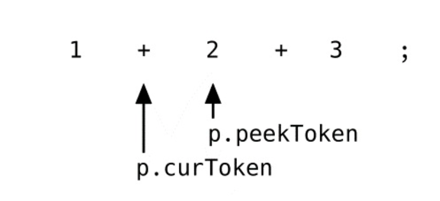

# Pratt 解析法如何工作的

`parseExpression`背后的算法和解析函数与优先级共同组合完整地描述了`Vaughan Pratt`在`Top Down Operator Precedence`论文中的主要思想，但是和我们的实现过程还是有一点点不同。

`Pratt`没有使用`Parser`结构而且也没有定义`*Parser`的相关方法，也没有使用字典，当然也没有使用`Go`语言。这边论文比go语言早发表36年。还有一些名称叫法上的不同：`prefixParseFns`在`Pratt`方法中叫做`nuds`(`null denotations`的简称)，`infixParseFns`叫做`leds`(`left denotations`的简称)。

Pratt方法虽然是由伪代码完成，但是我们的`parseExpression`方法看上去和Pratt论文中给出的十分相似。它几乎使用了同样的算法而没有任何改变。

我们打算跳过理论来解答为什么它能工作，仅仅展示它是怎么工作的和各个不同的组件（`parseExpression`,解析函数和优先级）如何组织在一起。假设我们将要解析如下的表达式语句：
```
1 + 2 + 3;
```
最大的挑战不是在于结果的抽象语法树如何表示每一个操作符和操作数，而是将不同的抽象语法树的节点嵌套在一起。我们想要的抽象语法树（序列化为字符串）看上去是这样的：
```
((1+2)+3)
```
这个抽象语法树需要两个`*ast.InfixExpression`节点，位置更高的`*ast.InfixExpression`节点做的右边是整数字面值`3`，左边应该是其他的`*ast.InfixExpression`。该节点做左有两边分别各自为整数字面值`1`和`2`。


当解析`1 + 2 + 3`的时候，这个就是我我们解析器的输出。但是如何做到的呢？我们将在接下来的几个段落中回答这个问题。我们将会近距离看看我们解析器如何工作的，尤其当`parseExpressionStatement`第一次被调用的时候。当阅读接下面段落的时候，可以翻看之前的代码。

让我们开始吧，当我们解析`1+2+3;`的时候将会发生什么？

`parseExpressionStatement`调用`parseExpression(LOWEST)`，`p.curToken`和`p.peekToken`当前指向`1`和第一个`+`。


首先`parseExpression`检查是否有`parseParseFn`关联当前的`p.curToken.Type`，因为它是`token.INT`，所以调用`parseIntegerLiteral`方法。 该方法返回一个`*ast.IntegerLiteral.Expression`并赋值给`leftExp`。

接下来是在`parseExpression`中的循环部分，这个条件结果为true。
```go
for !p.peekTokenIs(token.SEMICOLON) && precedence < p.peekPrecedence() { 
    // [...]
}
```
`p.peekToken`不是`token.SEMICOLON`而且`peekPrecedence`(它返回`+`的优先级)比当前函数传递过来的`LOWEST`要高。下面是我们已经定义好的优先级：
```go
// parser/parser.go
const (
    _ int = iota 
    LOWEST 
    EQUALS // ==
    LESSGREATER // > or <
    SUM // +
    PRODUCT // *
    PREFIX // -X or !X
    CALL // myFunction(X)
)
```
所以条件判断为true，并且`paseExpression`执行循环体部分，它看上去是这样的：
```go
infix := p.infixParseFns[p.peekToken.Type] 
if infix == nil {
    return leftExp 
}
p.nextToken()
leftExp = infix(leftExp)
```
它获取`p.peekToken.Type`关联的`infixParseFn`，它就是我们在`*Parser`中定义的`parseInfixExpression`方法，在调用该函数和将返回值赋给`leftExp`之前，将Token位置前进。


在当前`token`的状态下，它调用`parseInfixExpression`方法，将已经解析好的`*ast.IntegerLiteral`传递给它。 接下来的`parseInfixExpression`是最有趣的部分，下面是方法：
```go
func (p *Parser) parseInfixExpression(left ast.Expression) ast.Expression {
	expression := &ast.InfixExpression{
		Token:    p.curToken,
		Operator: p.curToken.Literal,
		Left:     left,
	}
	precedence := p.curPrecedence()
	p.nextToken()
	expression.Right = p.parseExpression(precedence)
	return expression
}
```
值得注意的是在`left`是我们已经解析的`*ast.IntegerLiteral`，它是字面值1。

`parseInfixExpression`保存了`p.curToken`的优先级（第一个`+`的优先级），然后前进`token`并且调用`parseExpression`方法，将之前保存的优先级作为参数传递给它。现在`parseExpression`第二次被调用，现在各个`token`看上去是这样的：


首先`parseExpression`再一次查询`p.curToken`的对应的`prefixParseFn`方法，再一次还是`parseIntegerLiteral`方法，但是现在循环体的执行并没有返回true：表达式`1+2+3`的第一个`+`的优先级并不比第二个`+`的优先级低，它们是相等的。所以循环体将不会被执行。`ast.IntegerLiteral`将代表`2`被返回。

现在回到`parseInfixExpression`中，`paseExpression`的返回值将赋值给新创建的`*ast.InfixExpression`的`Right`字段。就跟我们下面看到的：


`*ast.InfixExpression`通过调用`parseInfixExpression`方法返回，现在回到我们最外面调用的`parseExpression`方法，在这里的优先级仍然是`LOWEST`。我们回到我们开始执行的循环的部分，并且再次执行循环。
```go
for !p.peekTokenIs(token.SEMICOLON) && precedence < p.peekPrecedence() { 
    // [...]
}
```
现在执行结果为`true`，因为`precedence`是`LOWEST`，而且`peekPrecedence`返回表达式第二个加法的优先级。`parseExpression`再一次执行循环函数体。不同的是现在的`leftExp`不再是`*ast.IntegerLiteral`中的`1`，而是`*ast.InfixExpression`返回的`praseInfixExpression`，代表着1+2。

在`parseExpression`循环中获取`p.peekToek.Type`关联的`parseInfixExpression`，前进`token`并且调用`parseInfixExpression`方法，在这里使用`leftExp`组我诶参数。 `parseInfixExpression`再次调用`parseExpression`方法，这个时候返回最后的`*ast.IntegerLiteral`（代表着表达式中的3)。

最后，在循环体的最后，`leftExp`看上去是这样的

它的确就是我们想要的，操作符和操作数正确的嵌套在一起。我们的`token`看上去是这样的


循环的条件执行结果为`false`
```go
for !p.peekTokenIs(token.SEMICOLON) && precedence < p.peekPrecedence() { 
    // [...]
}
```
现在`p.peekTokenIs(token.SEMICOLON)`执行结果为`true`，它将停止执行循环体内部。（调用`p.peekTokenIs(token.SEMICOLON)`不是严格必须的，我们的`peekPrecedence`方法遇到默认值返回`LOWEST`。但是我认为分号作为表达式结束符更加清晰，更加容易明白）

循环部分已经完成`leftExp`被返回，我们回到`parseExpressionStatement`中，最终我们拥有了正确的`*ast.InfixExpression`，然后将他们当做`Expression`存放到`*ast.ExpressionStatement`中。

现在我们知道我们的解析器如何去正确的解析`1+2+3`，这相当神奇。我认为`precedence`和`peekPrecedence`的使用也是相当有趣。

