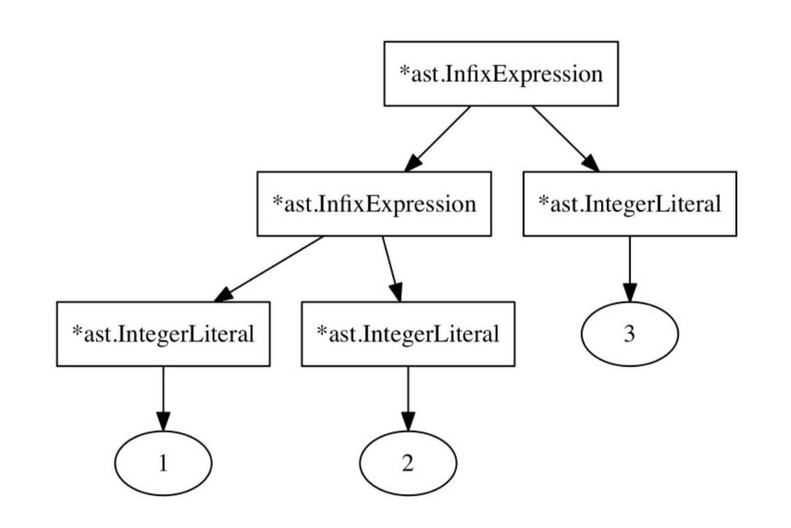
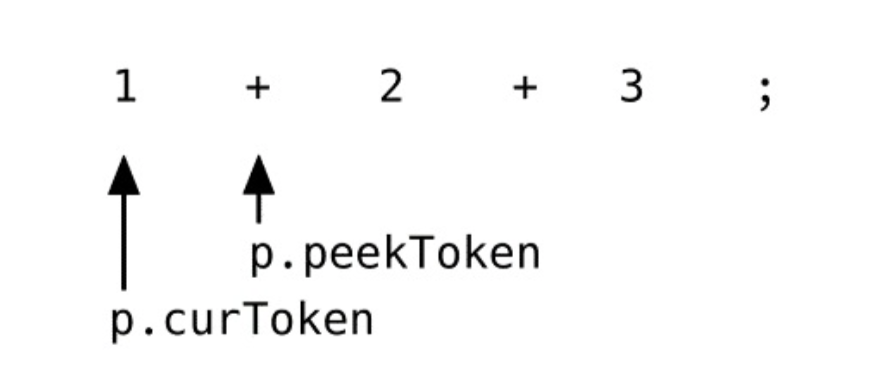
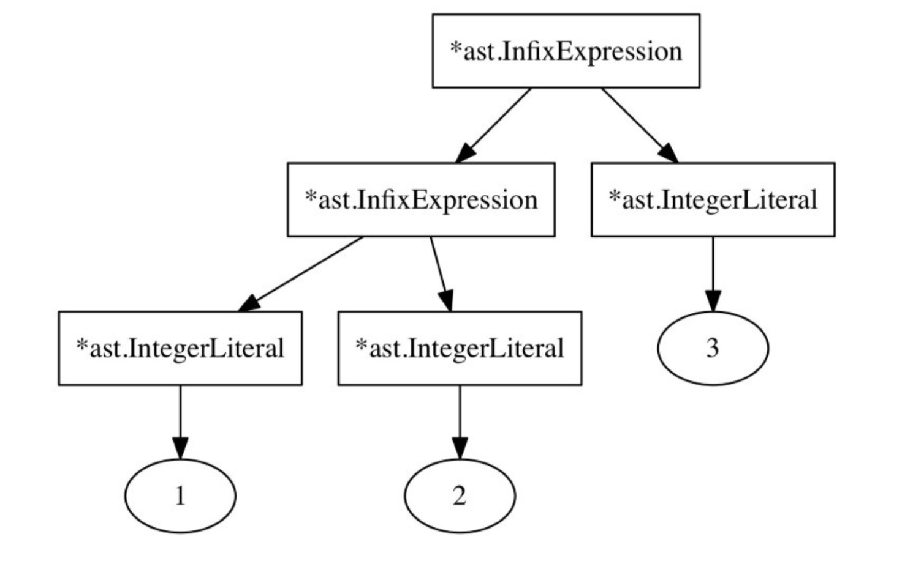

# Pratt 解析法如何工作的

`parseExpression`背后的算法和解析函数与优先级共同组合完整地描述了`Vaughan Pratt`在`Top Down Operator Precedence`论文中的主要思想，但是和我们的实现过程还是有一点点不同。

`Pratt`没有使用`Parser`结构而且也没有定义`*Parser`的相关方法，也没有使用字典，当然也没有使用`Go`语言。这边论文比go语言早发表36年。还有一些名称叫法上的不同：`prefixParseFns`在`Pratt`方法中叫做`nuds`(`null denotations`的简称)，`infixParseFns`叫做`leds`(`left denotations`的简称)。

Pratt方法虽然是由伪代码完成，但是我们的`parseExpression`方法看上去和Pratt论文中给出的十分相似。它几乎使用了同样的算法而没有任何改变。

我们打算跳过理论来解答为什么它能工作，仅仅展示它是怎么工作的和各个不同的组件（`parseExpression`,解析函数和优先级）如何组织在一起。假设我们将要解析如下的表达式语句：
```
1 + 2 + 3;
```
最大的挑战不是在于结果的抽象语法树如何表示每一个操作符和操作数，而是将不同的抽象语法树的节点嵌套在一起。我们想要的抽象语法树（序列化为字符串）看上去是这样的：
```
((1+2)+3)
```
这个抽象语法树需要两个`*ast.InfixExpression`节点，位置更高的`*ast.InfixExpression`节点做的右边是整数字面值`3`，左边应该是其他的`*ast.InfixExpression`。该节点做左有两边分别各自为整数字面值`1`和`2`。


当解析`1 + 2 + 3`的时候，这个就是我我们解析器的输出。但是如何做到的呢？我们将在接下来的几个段落中回答这个问题。我们将会近距离看看我们解析器如何工作的，尤其当`parseExpressionStatement`第一次被调用的时候。当阅读接下面段落的时候，可以翻看之前的代码。

让我们开始吧，当我们解析`1+2+3;`的时候将会发生什么？

`parseExpressionStatement`调用`parseExpression(LOWEST)`，`p.curToken`和`p.peekToken`当前指向`1`和第一个`+`。


首先`parseExpression`检查是否有`parseParseFn`关联当前的`p.curToken.Type`，因为它是`token.INT`，所以调用`parseIntegerLiteral`方法。 该方法返回一个`*ast.IntegerLiteral.Expression`并赋值给`leftExp`。

接下来是在`parseExpression`中的循环部分，这个条件结果为true。
```go
for !p.peekTokenIs(token.SEMICOLON) && precedence < p.peekPrecedence() { 
    // [...]
}
```
`p.peekToken`不是`token.SEMICOLON`而且`peekPrecedence`(它返回`+`的优先级)比当前函数传递过来的`LOWEST`要高。下面是我们已经定义好的优先级：
```go
// parser/parser.go
const (
    _ int = iota 
    LOWEST 
    EQUALS // ==
    LESSGREATER // > or <
    SUM // +
    PRODUCT // *
    PREFIX // -X or !X
    CALL // myFunction(X)
)
```
所以条件判断为true，并且`paseExpression`执行循环体部分，它看上去是这样的：
```go
infix := p.infixParseFns[p.peekToken.Type] 
if infix == nil {
    return leftExp 
}
p.nextToken()
leftExp = infix(leftExp)
```
它获取`p.peekToken.Type`关联的`infixParseFn`，它就是我们在`*Parser`中定义的`parseInfixExpression`方法，在调用该函数和将返回值赋给`leftExp`之前，将Token位置前进。


在当前`token`的状态下，它调用`parseInfixExpression`方法，将已经解析好的`*ast.IntegerLiteral`传递给它。 接下来的`parseInfixExpression`是最有趣的部分，下面是方法：
```go
func (p *Parser) parseInfixExpression(left ast.Expression) ast.Expression {
	expression := &ast.InfixExpression{
		Token:    p.curToken,
		Operator: p.curToken.Literal,
		Left:     left,
	}
	precedence := p.curPrecedence()
	p.nextToken()
	expression.Right = p.parseExpression(precedence)
	return expression
}
```
值得注意的是在`left`是我们已经解析的`*ast.IntegerLiteral`，它是字面值1。

`parseInfixExpression`保存了`p.curToken`的优先级（第一个`+`的优先级），然后前进`token`并且调用`parseExpression`方法，将之前保存的优先级作为参数传递给它。现在`parseExpression`第二次被调用，现在各个`token`看上去是这样的：


首先`parseExpression`再一次查询`p.curToken`的对应的`prefixParseFn`方法，再一次还是`parseIntegerLiteral`方法，但是现在循环体的执行并没有返回true：表达式`1+2+3`的第一个`+`的优先级并不比第二个`+`的优先级低，它们是相等的。所以循环体将不会被执行。`ast.IntegerLiteral`将代表`2`被返回。

现在回到`parseInfixExpression`中，`paseExpression`的返回值将赋值给新创建的`*ast.InfixExpression`的`Right`字段。就跟我们下面看到的：


`*ast.InfixExpression`通过调用`parseInfixExpression`方法返回，现在回到我们最外面调用的`parseExpression`方法，在这里的优先级仍然是`LOWEST`。我们回到我们开始执行的循环的部分，并且再次执行循环。
```go
for !p.peekTokenIs(token.SEMICOLON) && precedence < p.peekPrecedence() { 
    // [...]
}
```
现在执行结果为`true`，因为`precedence`是`LOWEST`，而且`peekPrecedence`返回表达式第二个加法的优先级。`parseExpression`再一次执行循环函数体。不同的是现在的`leftExp`不再是`*ast.IntegerLiteral`中的`1`，而是`*ast.InfixExpression`返回的`praseInfixExpression`，代表着1+2。

在`parseExpression`循环中获取`p.peekToek.Type`关联的`parseInfixExpression`，前进`token`并且调用`parseInfixExpression`方法，在这里使用`leftExp`组我诶参数。 `parseInfixExpression`再次调用`parseExpression`方法，这个时候返回最后的`*ast.IntegerLiteral`（代表着表达式中的3)。

最后，在循环体的最后，`leftExp`看上去是这样的

它的确就是我们想要的，操作符和操作数正确的嵌套在一起。我们的`token`看上去是这样的


循环的条件执行结果为`false`
```go
for !p.peekTokenIs(token.SEMICOLON) && precedence < p.peekPrecedence() { 
    // [...]
}
```
现在`p.peekTokenIs(token.SEMICOLON)`执行结果为`true`，它将停止执行循环体内部。（调用`p.peekTokenIs(token.SEMICOLON)`不是严格必须的，我们的`peekPrecedence`方法遇到默认值返回`LOWEST`。但是我认为分号作为表达式结束符更加清晰，更加容易明白）

循环部分已经完成`leftExp`被返回，我们回到`parseExpressionStatement`中，最终我们拥有了正确的`*ast.InfixExpression`，然后将他们当做`Expression`存放到`*ast.ExpressionStatement`中。

现在我们知道我们的解析器如何去正确的解析`1+2+3`，这相当神奇。我认为`precedence`和`peekPrecedence`的使用也是相当有趣。


但是优先级真正关系的是什么？在我们的例子中，每一个操作符(+)拥有相同的优先级。那么如果操作符拥有不同的优先级？我们能不能将`LOWEST`作为默认值，将所有的操作符作为`HIGHEST`。

不行，这样会导致错误的抽象语法树，含有操作符的表达式的目标是有更高的优先级的操作数的深度比低优先级的操作更深，而这些都是有个优先级完成的。

当`parseExpression`被调用的时候，`precedences`代表当前`parseExpression`的"右绑定"能力，什么叫做"右绑定"能力呢？也就是当前表达式的对右边的对`token`，操作数和操作符的绑定能力。

假设我们的当前的右绑定能力最高，那么我们目前解析的的部分（复制给`letfExp`)将不会传递给下一个操作数对应的`infixParseFn`方法。将不会终止与一个左孩子节点，因为循环条件将不会执行为True。

与之相反存在的能力也是有的，叫做左绑定能力。但是什么值能够展示左绑定能力呢？因为在`parseExpresion`方法中，我们`precedence`参数代表着当前右绑定能力，那么下一个操作数的左绑定能力来自哪里？简单来讲就是来自我们调用`peekPrecedence`。方法的返回值代表了下一个操作符的左绑定能力。

它们都来自于循环中的`precedence < p.peekPrecedence()`条件表达式，这个条件检查下一个操作符或者`token`的左绑定是否比当前的右绑定值高。如果是的，我们解析过程将陷入下一个操作符，从左到右，然后结束于下一个操作符对应的`infixParseFn`方法。

做一个例子来讲：比如我们解析`-1+2`,我们想要抽象语法树的表达是这样的`(-1)+2`而不是`-(1+2)`。第一个方法结束语`token.MINUS`绑定的`prefixParseFn`:`parsePrefixExpression`。让我们在看一看`parsePrefixExpression`方法的全部代码：
```go
func (p *Parser) parsePrefixExpression() ast.Expression {
	expression := &ast.PrefixExpression{
		Token:    p.curToken,
		Operator: p.curToken.Literal,
	}
	p.nextToken()
	expression.Right = p.parseExpression(PREFIX)
	return expression
}
```
它将`PREFIX`传递给`parseExpression`作为优先级，它也是当前`parseExpression`占据的右绑定能力。在我们先前定义中，`PREFIX`的优先级非常高。这也导致`parseExpression(PREFIX)`永远不会将`-1`的`1`传递个其他的`infixParseFn`。在这个例子中`precedence < p.peekPrecedence()`永远不会为`True`，也就意味着没有其他的`infixParseFn`将我们的`1`作为我们的左孩子节点。而是将`1`返回给我们前缀表达式的右孩子。

回到我们最外面的`parseExpression`方法，在第一个`leftExp := prefix()`之后，`precedence`仍然还是`LOWEST`，因为它仍然是我们最外面的调用。我们的右绑定能力仍然是`LOWEST`，而现在的`p.peekToken`是指向`1+2`中的`+`号。

我么现在是在循环的条件部分，并且执行来决定是否我们要执行我们的循环体。现在表明`+`操作数的优先级比当前的右绑定能力高，我们已经解析好了`-1`的前缀表达式，并且将它出的传递给`+`关联的`infixParseFn`. `+`的左绑定能力吸住了我们目前已经解析好的内容作为它在抽象语法树中的左孩子。

`+`关联的`infixParseFn`是`parseInfixExpression`，它现在使用`+`的优先级作为他的右绑定能力，而没有使用`LOWEST`，因为这样做的话将导致另外一个`+`的拥有更高的左绑定值，并且将它吸入。如果这样做的话，表达式`a+b+c`将会返回`(a+(b+c))`，而不是我们期望的`((a+b)+c)`。

将前缀操作符设置为高优先级是有用的，和中缀表达式很好的配合工作。在经典的优先级例子:`1+2*3`, `*`的左绑定能力比`+`的右绑定值高。所以解析的过程中将会`2`作为参数传递给`*`关联的`infixParseFn`方法。

值得注意的是我们的解析器中，每一个`token`都拥有相同的左右绑定值，我们仅仅是用同一个值赋给他们两个，具体的值这个取决于上下文环境。

如果我们的操作符必须右结合而不是左结合（在例子中`+`的结果是`(a+(b+c)`而不是`((a+b)+c)`），那么我们的必须使用较小的右绑定值在解析操作符表达式的右孩子的时候。 如果你考虑到其他语言`++`或者`--`的操作符，它们可以用在前缀和后缀的位置，你就可以看到区分左右绑定值的是非常有用的。

因为我们的没有分别为设置左绑定和右绑定值，仅仅使用了相同的值，我们不能仅仅通过改变定义来达到这一点。但是举个例子来讲，为了让`+`进行右结合，我们可以在调用`parseExpression`方法的时候减少其优先级。
```go
// parser/parser.go
func (p *Parser) parseInfixExpression(left ast.Expression) ast.Expression { 
    expression := &ast.InfixExpression{
        Token: p.curToken, 
        Operator: p.curToken.Literal, 
        Left: left,
    }
    precedence := p.curPrecedence()
    p.nextToken()
    expression.Right = p.parseExpression(precedence)
    //                                    ^^^decrement here for right-associativtiy
    return expression
}
```
为了示范的目的，让我们短暂地改变这个方法，然看将会发生什么？
```go
// parser/parser.go
func (p *Parser) parseInfixExpression(left ast.Expression) ast.Expression {
    expression := &ast.InfixExpression {
        Token: p.curToken,
        Operator: p.curToken.Literal,
        Left: left,
    }
    precedence := p.curPrecedence()
    p.nextToken()
    if expression.Operator == "+" {
        expression.Right = p.parseExpression(precedence - 1)
    }else{
        expresion.Right = p.parseExpression(precedence)
    }
    return expression
}
```
有着这些改变，我们的测试表明现在的`+`是右结合的：
```
$ go test -run TestOperatorPrecedenceParsing ./parser 
--- FAIL: TestOperatorPrecedenceParsing (0.00s)
parser_test.go:359: expected="((a + b) + c)", got="(a + (b + c))" 
parser_test.go:359: expected="((a + b) - c)", got="(a + (b - c))" 
parser_test.go:359: expected="(((a + (b * c)) + (d / e)) - f)",\
got="(a + ((b * c) + ((d / e) - f)))" 
FAIL
```
这个让我们更加深入的了解到了`parseExpression`方法，如果你现在还不确定是否掌握了它是如何工作的，别担心，我也是这样的。将我们每一个解析过程跟踪打印出来，它将会对我们非常有帮助。在随书的本章的代码中我将下面的代码放在了`./parser/parse_tracing.go`中，这个我们从来没有见过，该文件中包含了两个定义的函数`trace`和`untrace`很好地帮助我们去理解解析器所做的工作。使用如下：
```go 
// parser/parser.go
func (p *Parser) parseExpressionStatement() *ast.ExpressionStatement { 
    defer untrace(trace("parseExpressionStatement"))
// [...]
}
func (p *Parser) parseExpression(precedence int) ast.Expression { 
    defer untrace(trace("parseExpression"))
// [...]
}
func (p *Parser) parseIntegerLiteral() ast.Expression { 
    defer untrace(trace("parseIntegerLiteral"))
// [...]
}
func (p *Parser) parsePrefixExpression() ast.Expression { 
    defer untrace(trace("parsePrefixExpression"))
// [...]
}
func (p *Parser) parseInfixExpression(left ast.Expression) ast.Expression { 
    defer untrace(trace("parseInfixExpression"))
// [...]
}
```
通过这个记录的声明，现在使用解析器的时候可以看到他是如何工作的，下面是我们在解析`-1*2+3`的时候的输出
```
$ go test -v -run TestOperatorPrecedenceParsing ./parser 
=== RUN TestOperatorPrecedenceParsing
BEGIN parseExpressionStatement
    BEGIN parseExpression
        BEGIN parsePrefixExpression
            BEGIN parseExpression
                BEGIN parseIntegerLiteral
                END parseIntegerLiteral 
            END parseExpression
        END parsePrefixExpression 
        BEGIN parseInfixExpression
            BEGIN parseExpression
                BEGIN parseIntegerLiteral
                END parseIntegerLiteral 
            END parseExpression
        END parseInfixExpression 
        BEGIN parseInfixExpression
            BEGIN parseExpression
                BEGIN parseIntegerLiteral
                END parseIntegerLiteral 
            END parseExpression
        END parseInfixExpression 
    END parseExpression
END parseExpressionStatement
--- PASS: TestOperatorPrecedenceParsing (0.00s) PASS
ok monkey/parser 0.008s
```