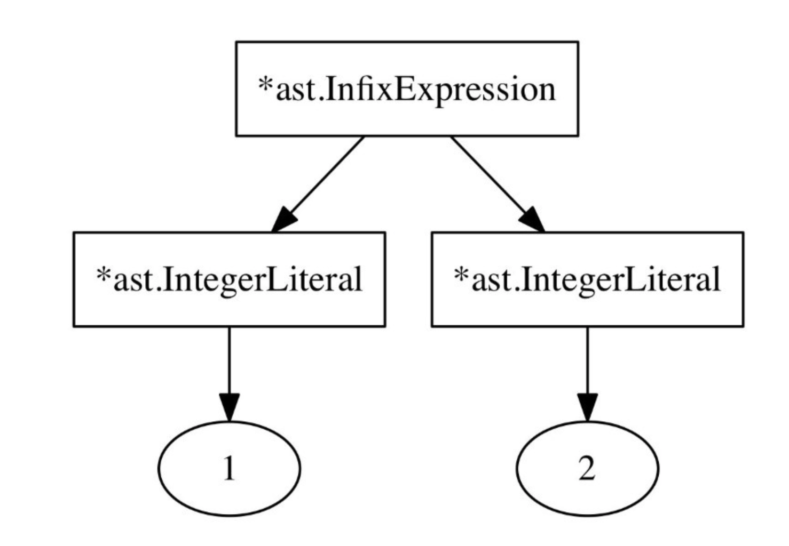

# `Pratt` 解析器如何工作的

`parseExpression` 背后的算法和解析函数与优先级共同组合完整描述了 `Vaughan Pratt` 在 `Top Down Operator Precedence` 论文中的主要思想，但是我们的实现与这个算法还是有一点点不同。

`Pratt` 没有使用 `Parser` 结构和 `*Parser` 相关的方法，没有使用字典，当然更不会使用 `Go` 语言。在名称上也有一点点不同： `prefixParserFn` 在 `Pratt` 方法中叫做 `nuds` (`null denotations` 的简称)，`infixParseFns` 叫做 `leds` (`left denoataions` 的简称)。

`Pratt` 方法虽然由伪代码完成，但是我们的 `parseExpression` 方法看上去和 `Pratt` 论文中给出的十分相似，它几乎没有做任何修改。

我们打算跳过它正确性的理论部分，而是说明它是如何工作的和不同组件是如何组织在一起的。假设我们要解析下面的表达式语句：

```monkey
1 + 2 + 3;
```

最大的难题是不是如何用抽象语法树表示每一个操作符和操作数，而是将不同的抽象语法树节点嵌套在一起，我们想要抽象语法树看上去是这样的（字符串表示）：

```monkey
((1+2) + 3)
```

这棵抽象语法树需要两个 `*ast.InfixExpression` 节点，位置更高的 `*ast.InfixExpression` 节点的右边是整数 `3`, 左边是另一个 `*ast.InfixExpression` 节点，该节点的左右两边分别为 `1` 和 `2` 。


上述结果就是解析器的输出，那么是如何做到的呢？接下来我们就一层层剥开这个问题的面纱。

`parseExressionStatement` 调用 `parseExpression(LOWEST)`，`p.curToken` 和 `p.peekToken` 分别指向当前的 `1` 和第一个 `+`


首先 `parseExpression` 检查是否有 `parseParseFn` 关联当前的 `p.curToken.Type`, 此时为 `Token.INT`，所以调用 `parseIntegerLiteral` 方法。该方法返回一个 `*ast.IntegerLiteral.Expression` 并赋值给 `leftExp`。

接下来是 `parseExpression` 中的循环部分，这个条件结果为 `true`。

```go
for !p.peekTokenIs(token.SEMICOLON) && precedence < p.peekPrecedence() {
    // [...]
}
```

`p.peekToken` 不是 `token.SEMICOLON` 而且 `peekPrecedence` （它返回 `+` 的优先级）比当前的函数的传递过来的 `LOWEST` 要高。下面是定义好的优先级：

```go
// parser/parser.go
const (
    _ int = iota
    LOWEST
    EQUALS // ==
    LESSGREATER // > or <
    SUM // +
    PRODUCT // *
    PREFIX // -X or !X
    CALL // myFunction(X)
)
```

所以判断条件为 `true`, 执行 `parseExpression` 循环体部分，看上去的结果是这样的：

```go
infix := p.infixParseFns[p.peekToken.Type]
if infix == nil {
    return leftExp
}
p.nextToken()
leftExp = infix(leftExp)
```

它获取 `p.peekToken.Type` 关联的 `infixParseFn`, 也就是在 `*Parser` 中定义的 `parseInfixExpression` 方法，在调用该函数和将返回值赋值给 `leftExp` 之前，将 `Token` 位置前进。


在当前 `token` 的状态下，它调用 `parseInfixExpression` 方法，将已经解析好的 `*ast.IntegerLiteral` 传递给它。接下就是 `parseInfixExpression` 中最有趣的部分：

```go
func (p *Parser) parseInfixExpression(left ast.Expression) ast.Expression {
    expression := &ast.InfixExpression{
        Token:    p.curToken,
        Operator: p.curToken.Literal,
        Left:     left,
    }
    precedence := p.curPrecedence()
    p.nextToken()
    expression.Right = p.parseExpression(precedence)
    return expression
}
```

值得注意的是 `left` 是我们已经解析的 `*ast.IntegerLiteral`，也就是字面值 `1`。

`parseInfixExpression` 保存了 `p.curToken` 的优先级，也就是第一个 `+` 的优先级，然后前进 `token` 并且调用 `parseExpression` 方法，将之前保存的优先级作为参数传递给 `parseExpression`，现在 `parseExression` 第二次被调用，此时的 `token` 状态是这样的


首先 `parseExpression` 再一次查询 `p.curToken` 对应的 `prefixParsefn` 方法，仍然是 `parseIntegerLiteral` 方法。但是现在循环判断条件不是 `true`, 因为 `1+2+3` 中第一个 `+` 的优先级并不比第二个 `+` 的优先级低，而是相同的。所以循环体不会被执行，`*ast.IntegerLiteral` 将代表 `2` 返回。

现在回到 `parseInfixExpression` 中，`parseExpression` 的返回值将赋值给新创建的 `*ast.InfixExpression` 中的 `Right` 字段。



`*ast.InfixExpression` 通过调用 `parseInfixExpression` 方法返回，现在回到我们最外面调用的 `parseExpression` 方法，在这里优先级仍然是 `LOWEST`，继续执行循环部分。

```go
for !p.peekTokenIs(token.SEMICOLON) && precedence < p.peekPrecedence() {
    // [...]
}
```

现在执行结果为 `true`，因为 `precedence` 是 `LOWEST`,而且 `peekPrecedence` 返回的表达式是第二个加法的优先级。`parseExression` 在一次执行循环体，不同的是现在 `leftExp` 不再是 `*ast.IntegerLiteral` 中的 `1`, 而是 `praseInfixExpression` 返回的 `*ast.InfixExpression`，表示 `1+2`。

在 `parseExpression` 循环中获取 `p.peekToken.Type` 关联的 `parseInfixExpression` 方法， 前进 `token` 并且调用该方法，这里的 `leftExp` 参数是上一步得到的 `*ast.InfixExpression`。 `parseInfixExpression` 再次调用 `parseExpression`方法，这个时候返回最后的 `*ast.IntegerLiteral`（表达式中的 `3`)。

在循环体的最后， `leftExp` 看上去是这样的：


这的确是我们想要的，操作符和操作数正确地嵌套在一起，我们的 `token` 看上去是这样的：


```go
for !p.peekTokenIs(token.SEMICOLON) && precedence < p.peekPrecedence() {
    // [...]
}
```

现在 `p.peekTokenIs(token.SEMICOLON)` 为 `true`，它将停止执行循环体内部。我们回到 `parseExpressionStatement` 中，拥有了正确的 `*ast.InfixExpression`，然后将它当做正确的 `Expression` 存放到 `ast.ExpressionStatement` 中去。

现在我们知道解析器如何去正确解析 `1+2+3`，看上去非常神奇，但是我认为最有趣的地方在于 `precedence` 和 `peekPrecedence` 的使用。

但是优先级的真正关系究竟是什么？在我们的例子中，每一个操作符 `+` 都有仙童的优先级，那么如果操作符拥有不同的优先级是怎样的？能不能将 `LOWEST` 作为默认值，将所有的操作符设置为 `HIGHEST` 呢？

当然不行，这样会导致生成错误的抽象语法树，表达式的抽象语法树中更高优先级的操作符的深度要比优先级低的操作符深度大。当 `parseExpression` 被调用的时候， `precedences` 代表当前 `parseExpression` 的*右绑定*能力，什么叫做*右绑定*能力呢？也就是当前表达式对右边的 `token`，操作数和操作符的绑定能力。

假设我们当前右绑定能力最高，那么当前解析的部分将不会传递给下一个操作数对应的 `infixParseFn` 方法。因为循环条件为 `false`，所以将会终止于一个左孩子节点。

与之相反的叫做*左绑定*能力，什么值能够表示*左绑定*能力呢？因为在 `parseExpression` 方法中，`precedence` 参数代表当前的右绑定能力，那么洗衣啊个操作数的*左绑定*能力来自哪里？简单来讲就是调用 `peekPrecedence` 方法得到的结果，表面下一个操作符的*左绑定*能力。

在循环判断条件 `precedence < p.peekPrecedence()` 中，我们检查下一个操作符或者 `token` 的*左绑定*是否比当前的*右绑定*值高。如果是，我们解析陷入下一个操作符，从左到右结束于下一个操作符对应的 `infixParseFn` 方法。

在解析 `-1+2` 的时候，我们想要的抽象语法树表达式是这样的 `(-1) + 2` 而不是 `-(1+2)`。第一个方法结束于 `token.MINUS` 绑定的 `prefixParseFn` 对应的 `parsePrefixExpression` 方法，让我们看看 `parsePrefixExpression` 方法的全部代码：

```go
func (p *Parser) parsePrefixExpression() ast.Expression {
    expression := &ast.PrefixExpression{
        Token:    p.curToken,
        Operator: p.curToken.Literal,
    }
    p.nextToken()
    expression.Right = p.parseExpression(PREFIX)
    return expression
}
```

它将 `PREFIX` 传递给 `parseExpresson`，它是当前的 `parseExpression` 占据的*右绑定*能力。在我们之前的定义中，`PREFIX` 的优先级非常高。这也导致了 `parseExpression(PREFIX)` 永远不会将 `-1` 中的 `1` 传递给其他的 `infixParseFn`，这里会将 `1` 返回给之前的前缀表达式的右孩子。

回到最外面的 `parseExpression` 方法，在第一个 `leftExp := prefix()` 之后，`precedence` 仍然是 `LOWEST`，而现在的 `p.peekToken` 是指向 `1+2` 中的 `+` 号。现在的 `+` 操作数的优先级比当前的*右绑定*值高，我们已经解析出 `-1` 表达式，并将它传递给 `+` 关联的 `infixParseFn`。 `+` 的*左绑定*能力吸住了目前我们已经解析好的的内容作为它在抽象语法树中的左孩子。

`+` 关联的 `infixParseFn` 是 `parseInfixExpression`，它现在使用 `+` 的优先级作为它的*右绑定*能力，而没有使用 `LOWEST`，避免另外一个 `+` 拥有更高的*左绑定*值。这样表达式 `a+b+c` 将会返回 `(a+(b+c))` 而不是期望的 `((a+b)+c)`。

将前缀操作符设置为高优先级是正确的，它和中缀表达式能够很好地配合工作。经典的例子中: `1+2*3`，`*` 的左绑定能力比 `+` 的又绑定能力高，所以在解析的过程中将 `2` 作为参数传递给 `*` 关联的 `infixParseFn` 方法。

值得注意的是我们的解析器中，每个 `token` *左右绑定值*是相同的，我们仅仅用同一个值赋给它们两个，具体的值取决于上下文环境。如果我们的操作符必须是右结合的而不是左结合，那么我们在解析操作符表达式右孩子的时候必须要用较小的右绑定值，比如在其他语言中的 `++` 或者 `--` 操作符，它们可以用在前缀和后缀表达式，在这里要区分*左右绑定值*是非常重要的。

```go
// parser/parser.go
func (p *Parser) parseInfixExpression(left ast.Expression) ast.Expression {
    expression := &ast.InfixExpression{
        Token: p.curToken,
        Operator: p.curToken.Literal,
        Left: left,
    }
    precedence := p.curPrecedence()
    p.nextToken()
    expression.Right = p.parseExpression(precedence)
    //decrement here for right-associativtiy
    return expression
}
```

为了让我们更加深入了解 `parseExpression` 方法，我们将解析的过程打印出来，在随书本章中的 `./parser/parse_tracing.go` 中包含下面的代码，这里面包含了两个定义函数 `trace` 和 `untrace` 函数可以很好的帮助我们掌握解释器所做的工作。

```go
// parser/parser.go
func (p *Parser) parseExpressionStatement() *ast.ExpressionStatement {
    defer untrace(trace("parseExpressionStatement"))
// [...]
}
func (p *Parser) parseExpression(precedence int) ast.Expression {
    defer untrace(trace("parseExpression"))
// [...]
}
func (p *Parser) parseIntegerLiteral() ast.Expression {
    defer untrace(trace("parseIntegerLiteral"))
// [...]
}
func (p *Parser) parsePrefixExpression() ast.Expression {
    defer untrace(trace("parsePrefixExpression"))
// [...]
}
func (p *Parser) parseInfixExpression(left ast.Expression) ast.Expression {
    defer untrace(trace("parseInfixExpression"))
// [...]
}
```

通过增加的输出的记录，可以清楚地看到解释器是如何工作的，下面是解析 `-1*2+3` 过程中的输出：

```shell
$ go test -v -run TestOperatorPrecedenceParsing ./parser
=== RUN TestOperatorPrecedenceParsing
BEGIN parseExpressionStatement
    BEGIN parseExpression
        BEGIN parsePrefixExpression
            BEGIN parseExpression
                BEGIN parseIntegerLiteral
                END parseIntegerLiteral
            END parseExpression
        END parsePrefixExpression
        BEGIN parseInfixExpression
            BEGIN parseExpression
                BEGIN parseIntegerLiteral
                END parseIntegerLiteral
            END parseExpression
        END parseInfixExpression
        BEGIN parseInfixExpression
            BEGIN parseExpression
                BEGIN parseIntegerLiteral
                END parseIntegerLiteral
            END parseExpression
        END parseInfixExpression
    END parseExpression
END parseExpressionStatement
--- PASS: TestOperatorPrecedenceParsing (0.00s) PASS
ok monkey/parser 0.008s
```
