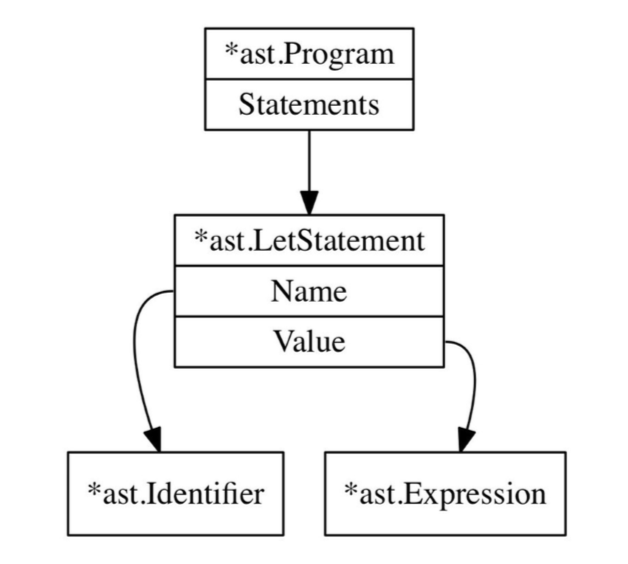

# 解析 `LET` 语句

在 `Monkey` 语言中，变量绑定语句的形式如下：

```monkey
let x = 5;
let y = 10;
let foobar = add(5, 5);
let barfoo = 5 * 5 / 10 + 18 - add(5, 5) + mulitply(12, 4);
let anotherName = barfoo;
```

上面的语句都叫做 `let` 语句，将一个值绑定到变量上， `let x = 5` 语句将值 `5` 绑定到变量名 `x` 上，本小节的目标就是能正确解析 `let` 语句。我们先跳过解析表达式的过程，它是通过给定的变量获得相应值的过程，在我们知道如何解析表达式之后再来关注这些。

什么叫做正确地解析 `let` 语句呢？它意味着解析能够正确得到一棵语法树，完全正确地表示原先的 `let` 语句的全部信息。听上去还不错，但是我们还没有任何抽象语法树，也不知道这东西看上去是怎样的。首先的任务是近距离看看 `Monkey` 语言，看看它的结构如何，定义抽象语法树的必要组成结构，以便它能正确表示 `let` 语句。

下面都是合法的 `Monkey` 语句：

```monkey
let x = 10;
let y = 15;
let add = fn(a, b){
    return a + b;
};
```

在上面的例子中都有三个语句，绑定到三个变量。 `let` 语句有如下的形式：

```monkey
let <identifier> = <expression>;
```

一个 `let` 语句包含两个可变部分：标识符和表达式。在上面的例子中，`x`, `y` 和 `add` 都是标识符；`10`， `5` 和函数都是表达式。

在继续之前还要进一步说明语句和表达式之间不同是必要的，表达式能够生成值，而语句则不会。`let x = 5` 不会生成值，然后 `5` 却可以生成值 `5`。`return 5` 是语句所以不会生成值，但是 `add(5, 5)` 可以生成 `10`。

语句和表达式区分在于是否生成值取决于编程语言，在一些编程语言中函数 `fn(x, y){return x+Y;}` 是表达式，它可以用在表达式可以使用的任何地方。在其他编程语言中，字面函数只能作为编程语言函数声明的一部分。一些编程语言有 `if` 表达式，它是条件表达式并且能够生成值。这些都取决于编程语言设计者怎么考虑的，正如你看到的，在 `Monkey` 语言中，大部分是表达式，包含字面函数。

回到我们的抽象语法树上，看看上述的例子，我们需要定义两种不同类型的节点：表达式和语句，让我们看看抽象语法树如何开始的：

```go
// ast/ast.go
package ast
type Node interface {
    TokenLiteral() string
}
type Statement interface {
    Node
    statementNode()
}
type Expression interface {
    Node
    expressionNode()
}
```

在这里定义了三个接口，分别为 `Node`, `Statement` 和 `Expression`。抽象语法树每一个节点必须实现 `Node` 接口，也就意味着它必须要提供 `TokenLiteral` 方法，返回该节点关联的 `token` 的字面值，它将会用在调试和测试中。抽象语法树全部由 `Node` 组成，它们互相连接在一起。其中一些节点实现了 `Statement` 接口，另外一些实现了 `Expression` 接口。这些接口包含了各自哑方法 `statementNode` 和 `expressionNode`。它们不是严格要求的，但是能够帮助我们知道 `Go` 编译器能够抛出可能的异常，如何在应该使用 `Expression` 地方使用了 `Statement`，反之同理。

下面是 `Node` 的第一个实现

```go
//ast/ast.go
type Program struct {
    Statements []Statement
}
func (p *Program) TokenLiteral() string {
    if len(p.Statements) > 0 {
        return p.Statement[0].TokenLiteral()
    }else{
        return ""
    }
}
```

`Program` 节点是抽象语法树的根节点，每一个合法的 `Monkey` 程序都是一系列语句，这些语句被保存在 `Program.Statement` 中，它是一系列实现 `Statement` 接口的节点组成的。

有了这些抽象语法树基础模块的定义，想想什么样的节点能够表示 `let x = 5;`，包含哪些字段？定义一个变量的名称，同样我们也需要一个字段来表示等号右边的表达式，它可以指向任何表达式。它不单单是字面值，任何合法的表达式都是合法的。比如 `let x = 5 * 5;` 和 `let y = add(2,2) * 5 / 10;` 都是有效的。为了记录抽象语法树中的每一个节点，还需要事项 `TokenLiteral()` 方法，它有三个字段构成：标识符、表达式和 `token`。

```go
// ast/ast.go
import "monkey/token"
// [...]
type LetStatement struct {
    Token token.Token
    Name *Identifier
    Value Expression
}
func (ls *LetStatement) statementNode() {}
func (ls *LetStatement) TokenLiteral() string { return ls.Token.Literal}

type Identifier struct {
    Token token.Token // the token.IDENT token
    Value string
}
func (i *Identifier) expressionNode() {}
func (i *Identifier) TokenLiteral() string { return i.Token.Literal }
```

`LetStatement` 拥有下面的字段：`Name` 用来保存绑定的标识符；`Value` 用来保存表达式生成的值，`statementNode` 和 `TokenLiteral` 方法用来实现 `Statement` 和 `Node` 接口。

为了保存标识符绑定的值，比如 `let x = 5;` 中的 `x`，我们需要定义 `Identifier` 结构，它实现 `Expression` 接口，但是在 `let` 语句中不生成值，那为什么我们定义成 `Expression` 接口呢？主要为了简化问题，标识符在 `Monkey` 语言其他地方会生成值，比如 `let x= valueProducingIndentifier;` 中，为了减少数据类型，我们使用 `Identifier` 来表示被绑定的值，以便后面重用它们，所以标识符实现了 `expression` 接口。

`Program`，`LetStatement` 和 `Identifier` 构成 `Monkey` 语言的源代码一部分。

```go
let x = 5;
```

用抽象语法树表示如下：


现在已经知道它应该长什么样，下一个任务就是构建一棵抽象语法树，首先我们的解析器是这样的：

```go
//parser/parser.go
package parser
import (
    "monkey/ast"
    "monkey/lexer"
    "monkey/token"
)
type Parser struct {
    l *lexer.Lexer
    curToken token.Token
    peekToken token.Token
}
func New(l *lexer.Lexer) *Parser {
    p := &Parser{l: l}
    //Read two tokens, so curToken and peekToken are both set
    p.nextToken()
    p.nextToken()
    return p
}
func (p *Parser) nextToken(){
    p.curToken = p.peekToken
    p.peekToken= p.l.NextToken()
}
func (p *Parser) ParserProgram() *ast.Program{
    return nil
}
```

`Parser` 拥有三个字段，分别为 `l`，`curToken` 和 `peekToken`。其中 `l` 指向词法分析器的一个实例，通过它可以不停调用 `NextToken` 方法获取输入的下一个 `token`。`curToken` 和 `peekToken`就像我们词法分析器中两个指针 `position` 和 `peekPosition`，但是它们不是指向输入字符而且指向当前的 `token` 和下一个 `token`。这些是非常重要的，我们需要检查当前输入的 `token` 确定下一步需要做什么；当当前的 `token` 不能确定做什么，需要检查检查下一个 `token` 来决策。比如考虑单行语句 `5;`，当前的 `curToken` 是 `token.INT`，我们需要 `peekToken` 来决定是处于一行代码的末尾还是仅仅是算术表达式的开始。

`New` 函数创建一个新的 `Parser` 实例，`nextToken`是一个辅助方法，用来前进 `curToken` 和 `peekToken` 指针，目前 `ParseProgram` 是空的。

在我们编写 `ParseProgram` 方法之前，我先向你展示一下递归下降分析背后的基础思想和结构。它可以帮助我们很好地理解后面的分析器，下面是解析器的伪代码，仔细阅读它们并且去理解 `parseProgram` 函数里究竟发生了什么。

```js
function parseProgram() {
    program = newProgramASTNode()
    advanceTokens()
    for (currentToken() != EOF_TOKEN) {
        statement = null
        if (currentToken() == LET_TOKEN) {
            statement = parseLetStatement()
        } else if (currentToken() == RETURN_TOKEN) { 
            statement = parseReturnStatement()
        } else if (currentToken() == IF_TOKEN) {
            statement = parseIfStatement()
        }
        if (statement != null) {
            program.Statements.push(statement)
        }
        advanceTokens()
    }
    return program
}
function parseLetStatement() {
    advanceTokens()
    identifier = parseIdentifier()
    advanceTokens()
    if currentToken() != EQUAL_TOKEN {
        parseError("no equal sign!")
        return null
    }
    advanceTokens()
    value = parseExpression()
    variableStatement = newVariableStatementASTNode()
    variableStatement.identifier = identifier
    variableStatement.value = value
    return variableStatement
function parseIdentifier() {
    identifier = newIdentifierASTNode()
    identifier.token = currentToken()
    return identifier
}
function parseExpression() {
    if (currentToken() == INTEGER_TOKEN) {
        if (nextToken() == PLUS_TOKEN) {
            return parseOperatorExpression()
        } else if (nextToken() == SEMICOLON_TOKEN) {
            return parseIntegerLiteral()
        }
    } else if (currentToken() == LEFT_PAREN) {
        return parseGroupedExpression()
    }
        // [...]
}
function parseOperatorExpression() {
    operatorExpression = newOperatorExpression()
    operatorExpression.left = parseIntegerLiteral()
    operatorExpression.operator = currentToken()
    operatorExpression.right = parseExpression()
    return operatorExpression()
}
// [...]
```

虽然上面的伪代码有很多省略的部分，但是足够理解递归下降解析的基础思想。入口是 `parseProgram` 函数，它构造抽象语法树的跟节点，然后通过调用其他函数构建孩子节点。这些抽象语法树是基于当前 `token`，其他函数也是相互调用递归执行。

递归调用的部分在 `parseExpression` 中，但是我们已经知道了解析表达式 `5 + 5`，我们首先解析 `5 +` 然后再一次调用 `parseExpression` 来解析剩下的部分，因为在 `+` 后面可能会有其他操作符表达式，比如 `5+5*10`。我们接下来会仔细查看解析该表达式的详细细节，它是解析中最复杂同样最精彩的部分，也就是 `Pratt` 解析。

目前为止，我们已经知道解析器需要做什么，它不停地读取 `token` 然后检查挡墙 `token` 来决定接下来需要做什么：是调用其他解析函数还是抛出一个异常，每一个解析函数都有各自的任务，来创建抽象语法树的节点。所以在 `parseProgram()` 中的主循环可以不停前进 `token` 来决定接下来工作。

在开始编写 `parseProgram` 方法之前，我们写编写测试，下面的测试可以确保我们的 `let` 语句正确解析。

```go
// parser/parser_test.go
package parser

import (
    "fmt"
    "monkey/ast"
    "monkey/lexer"
    "testing"
)

func TestLetStatements(t *testing.T) {
    tests := []struct {
        input              string
        expectedIdentifier string
        expectedValue      interface{}
    }{
        {"let x =5;", "x", 5},
        {"let z =1.3;", "z", 1.3},
        {"let y = true;", "y", true},
        {"let foobar=y;", "foobar", "y"},
    }
    for _, tt := range tests {
        l := lexer.New(tt.input)
        p := New(l)
        program := p.ParseProgram()
        checkParserErrors(t, p)
        if len(program.Statements) != 1 {
            t.Fatalf("program.Statements does not contain 1 statements. got=%d",
                len(program.Statements))
        }
        stmt := program.Statements[0]
        if !testLetStatement(t, stmt, tt.expectedIdentifier) {
            return
        }
        val := stmt.(*ast.LetStatement).Value
        if !testLiteralExpression(t, val, tt.expectedValue) {
            return
        }
    }
}

func testLetStatement(t *testing.T, s ast.Statement, name string) bool {
    if s.TokenLiteral() != "let" {
        t.Errorf("s.TokenLiteral not 'let'. got %q", s.TokenLiteral())
        return false
    }
    letStmt, ok := s.(*ast.LetStatement)
    if !ok {
        t.Errorf("s not *ast.LetStatement. got=%T", s)
        return false
    }
    if letStmt.Name.Value != name {
        t.Errorf("s.Name not '%s'. got=%s", name, letStmt.Name.Value)
        return false
    }
    if letStmt.Name.TokenLiteral() != name {
        t.Errorf("s.Name not '%s'. got=%s", name, letStmt.Name.Value)
        return false
    }
    return true
}
```
测试用例和我们之前词法解析器测试用例相同：我们提供 `Monkey` 源代码作为输入，然后设置我们想要的的抽象语法树的期待值，抽象语法树是由解析器生成，我们将会尽可能检查抽象语法树的节点，确保我们没有丢失任何东西。

使用源码而不是 `tokens` 作为输入的目的是增加我们测试的可读性。如果我们的词法解析器中有 `bug` 会让测试变得面目全非外加很多噪声，但是我尽量将这个风险降到最低。

测试用例中有两点需要特别注意，第一是我们忽略了 `*ast.LetStatement` 中的 `Value` 字段。为什么不去检查这个字段是否解析正确呢？答案是还是需要的，但是首先要保证 `let` 语句正确执行，所以忽略了 `Value` 字段；第二个是辅助函数 `testLetStatement`，它看上去使用独立的函数而且还有点过度设计，但是我们将来会重用这个函数，能够帮助我们的测试用例变得可读而不是一行行类型转换。

毫无疑问，目前运行测试是失败的

```shell
$ go test ./parser
--- FAIL: TestLetStatement (0.00s)
parser_test.go:20: ParseProgram() return nil
FAIL
FAIL monkey/parser 0.007s
```

开始填充我们的 `ParseProgram()` 方法！

```go
// parser/parser.go
func (p *Parser) ParseProgram() *ast.Program{
    program := &ast.Program{}
    program.Statements = []ast.Statement{}
    for p.curToken.Type != token.EOF {
        stmt := p.parseStatement()
        if stmt != nil {
            program.Statements = append(program.Statements, stmt)
        }
        p.nextToken()
    }
    return program
}
```

看上去是不是和 `parseProgram()` 伪代码很像？`ParseProgram()` 首先要构建抽象语法树的根节点：`*ast.Prgram`，然后他迭代每一个 `token` 直到遇到 `token.EOF`。它重复调用 `nextToken` 方法，前进 `p.curToken` 和 `p.peekToken` 两个指针。每次迭代调用 `parseStatement` 方法，它负责解析语句。如果返回值不是 `nil` 而是 `ast.Statement`，那么返回值就会添加到根节点 `Statements` 中， 当没有任何 `token` 可供解析，那么 `*ast.Program` 将会被返回。

那么 `parseStatement` 方法看上去是这样的

```go
// parser/parser.go
func (p *Parser) parseStatement() *ast.Statement{
    switch p.curToken.Type{
    case token.LET:
        return p.parseLetStatement()
    default:
        return nil
    }
}
```

接下来 `switch` 语句将会得到更多的分支，但是现在只调用了 `parseLetStatement` 方法来解析 `token.LET`。`parseLetStatement` 方法具体如下：

```go
//parser/parser.go
func (p *Parser) parseLetStatement() *ast.LetStatement {
    stmt := &ast.LetStatement{Token: p.curToken}
    if !p.expectPeek(Token.IDENT){
        return nil
    }
    stmt.Name = &ast.Identifer{Token:p.curToken, Value: p.curToken.Literal}
    if !p.expectPeek(toekn.ASSIGN) {
        return nil
    }
    // TODO: We're skipping the expression util we
    // encoutner a semicolon
    for !p.curTokenIs(token.SEMICOLON){
        p.nextToken()
    }
    return stmt
}
func (p *Parser) curTokenIs(t token.TokenType) bool {
    return p.curToken.Type == t
}
func (p *Parser) peekTokenIs(t token.TokenType) bool {
    return p.peekToken.Type == t
}
func (p *Parser) expectPeek(t token.TokenType) bool {
    if p.peekTokenIs(t) {
        p.nextToken()
        return true
    } else {
        return false
    }
}
```

现在我们的测试通过了

```shell
$ go test ./parser
ok monkey/parser 0.007s
```

现在可以解析 `let` 语句了，接下分析一下它是怎么工作的。从 `parseLetStatement` 开始，它使用当前指向的 `token(token.LET)` 构建了 `*ast.LetStatement` 节点，然后调用 `expectPeek` 方法确保下一个 `token` 是否符合预期。首先它首先期待 `token.IDENT`，然后使用它来构建 `*ast.Identifier` 节点，接着期待一个等号，最后挑错等号后买你的表达式解析，一直到达冒号。当我们知道如何解析表达式，跳过的内容就能补上。

`curTokenIs` 和 `peekTokenIs` 方法不需要太多解释，它们非常有用，以至于在解析器后面实现过程一次次看到它们。我们可以使用 `!p.curTokenIs(token.EOF)` 替换 `for` 循环中 `p.curToken.Type != token.EOF` 条件。

如果我们遇到的 `token` 在 `expectPeek` 方法中不是期待的类型该如何处理呢？目前直接返回 `nil`，在 `ParseProgram` 方法中就会忽略该空值，导致该语句被忽略。这样会调试变得非常困难，没有人想接触那些没有错误信息的解析器。

幸运地是我们可以做一些微小的改动解决这个问题：

```go
// parser/parser.go
type Parser struct { 
// [...]
errors []string 
// [...]
}
func New(l *lexer.Lexer) *Parser { 
    p := &Parser{
        l: l,
        errors: []string{}, 
    }
// [...]
}
func (p *Parser) Errors() []string { 
    return p.errors
}
func (p *Parser) peekError(t token.TokenType) {
    msg := fmt.Sprintf("expected next token to be %s, got %s instead", t, p.peekToken.Type)
    p.errors = append(p.errors, msg)
}
```

现在解析器有了 `errors` 字段，为字符串切片形式，该字段在 `New` 函数时候初始化。当 `peekToken` 不匹配的时候，辅助函数 `peekError` 将错误添加到 `errors` 中，通过 `Errors` 方法可以检查我们的解析器是否遇到错误。

拓展我们的测试用例来确保这个功能和我们期望地一样

```go
// parser/parser_test.go
func TestLetStatements(t *testing.T) {
// [...]
    program := p.ParseProgram() checkParserErrors(t, p)
// [...]
}
func checkParserErrors(t *testing.T, p *Parser) {
    errors := p.Errors()
    if len(errors) == 0 {
        return
    }
    t.Errorf("parser has %d errors", len(errors))
    for _, msg := range errors {
        t.Errorf("parser error: %q", msg)
    }
    t.FailNow()
}
```

新的 `checkParserErrors` 辅助函数仅仅是判断解析器中的错误，一旦发现错误就输出错误并且停止当前的测试。

现在解析器中没有生成任何错误，通过改变 `expectPeek` 函数当遇到错误的 `token` 就自动增加一个错误。

```go
// parser/parser.go
func (p *Parser) expectPeek(t token.TokenType) bool { 
    if p.peekTokenIs(t) {
        p.nextToken()
        return true
    } else {
        p.peekError(t)
        return false
    }
}
```
